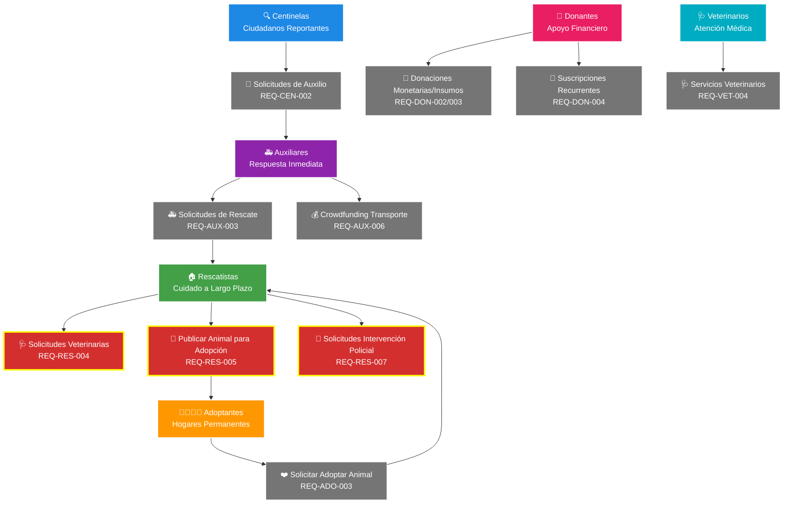
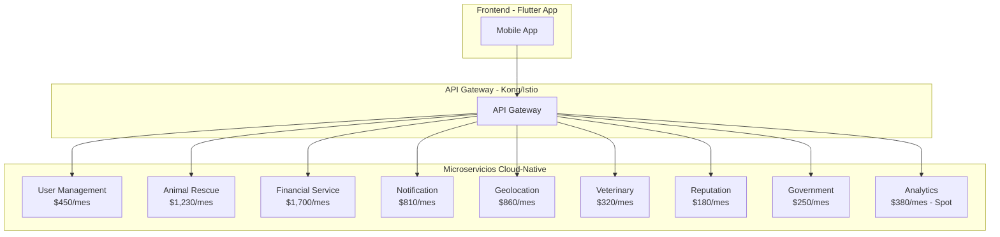

# AltruPets - Plataforma Cloud-Native de Protección Animal

[](https://aws.amazon.com/architecture/well-architected/)
[](https://www.pcisecuritystandards.org/)
[](https://kubernetes.io/)
[](https://aws.amazon.com/architecture/cost-optimization/)

Plataforma cloud-native que **reduce el tiempo de respuesta en rescates de animales vulnerables** conectando centinelas que reportan, auxiliares que responden y rescatistas con casas cuna. Implementa **geolocalización inteligente**, **subvención gubernamental para atención médica** y **transparencia financiera** para transformar la protección animal en **toda Latinoamérica**.

## 🎯 Problema que Resuelve

Rescates descoordinados, tiempo de respuesta lento, falta de transparencia financiera, comunicación fragmentada entre rescatistas.

## 🎯 Solución Implementada

Plataforma digital para coordinación de rescates animales y adopciones con **búsqueda automática por proximidad**, **notificaciones push inteligentes**, **subvención veterinaria gubernamental** y **trazabilidad completa de donaciones**.

### 👥 Roles de Usuario en la Plataforma

AltruPets conecta diferentes actores de la protección animal, cada uno con funciones específicas:

#### 🔍 **Centinelas** - Los Ojos de la Comunidad

Ciudadanos que **reportan animales en situación vulnerable**. Son los primeros en identificar casos que requieren auxilio inmediato.

- **Función principal**: Crear alertas de auxilio con ubicación GPS y fotografías
- **Perfil típico**: Cualquier persona con sensibilidad hacia los animales
- **Compromiso**: Reportar casos y hacer seguimiento básico

#### 🚑 **Auxiliares** - Respuesta Inmediata

Voluntarios que **responden rápidamente** a las alertas para brindar auxilio inmediato y evaluar la situación del animal.

- **Función principal**: Atender emergencias y coordinar con rescatistas
- **Perfil típico**: Personas con disponibilidad, transporte y experiencia básica
- **Compromiso**: Respuesta rápida (dentro de 30-60 minutos) y evaluación in-situ

#### 🏠 **Rescatistas** - Cuidado a Largo Plazo

Personas u organizaciones que **se hacen cargo del cuidado completo** del animal hasta encontrarle un hogar permanente.

- **Función principal**: Proporcionar casa cuna, evaluar necesidades médicas y gestionar adopciones
- **Perfil típico**: Experiencia en cuidado animal, conocimientos médicos básicos, espacio adecuado, recursos económicos
- **Compromiso**: Cuidado integral hasta adopción exitosa (semanas o meses)
- **Autonomía médica**: Evalúan si pueden manejar cuidados básicos o si requieren atención veterinaria profesional

#### 👨‍👩‍👧‍👦 **Adoptantes** - Hogares Permanentes

Familias o personas que **ofrecen un hogar definitivo** a los animales rescatados.

- **Función principal**: Adoptar animales que cumplan criterios de adoptabilidad
- **Perfil típico**: Familias estables con experiencia o disposición para cuidar mascotas
- **Compromiso**: Hogar permanente y cuidado de por vida

#### 💝 **Donantes** - Apoyo Financiero

Personas que **contribuyen económicamente** o con insumos para sostener las operaciones de rescate.

- **Función principal**: Donaciones monetarias o de insumos (alimento, medicinas, etc.)
- **Perfil típico**: Personas que quieren ayudar pero no pueden participar directamente
- **Compromiso**: Contribuciones puntuales o recurrentes

#### 🩺 **Veterinarios** - Atención Médica Especializada

Profesionales que **brindan atención médica** a los animales rescatados, muchas veces con tarifas preferenciales.

- **Función principal**: Diagnóstico, tratamiento y seguimiento médico
- **Perfil típico**: Veterinarios registrados con sensibilidad social
- **Compromiso**: Atención médica de calidad con tarifas accesibles

#### 🏛️ **Encargados Gubernamentales** - Autorización y Subvención

Funcionarios de gobiernos locales que **autorizan y financian** la atención veterinaria para animales callejeros.

- **Función principal**: Autorizar subvenciones veterinarias dentro de su jurisdicción
- **Perfil típico**: Funcionarios de departamentos de bienestar animal
- **Compromiso**: Respuesta oportuna a solicitudes de autorización

### Impacto Esperado

- ⚡ **Reducir tiempo de respuesta**: De horas a minutos mediante geolocalización automática
- 🤝 **Conectar actores**: Centinelas → Auxiliares → Rescatistas → Adoptantes en flujo coordinado
- 💰 **Transparencia financiera**: Trazabilidad completa del uso de donaciones
- 🏛️ **Cumplimiento legal**: Integración con gobiernos locales de cualquier país de LATAM para subvención de atención médica veterinaria

## 🎯 Principio de Responsabilidad Única en AltruPets

### ¿Qué es el Principio de Responsabilidad Única?

El **Principio de Responsabilidad Única** es una regla fundamental en el diseño de software que dice: **"Cada componente del sistema debe tener una sola razón para cambiar"**. En términos más simples, significa que cada tipo de usuario debería poder hacer **una sola cosa principal** en el sistema.

### ¿Por qué es importante este principio?

Si cada persona hace **solo una cosa**, es más fácil:

- **Entrenar** a cada persona en su especialidad
- **Encontrar problemas** cuando algo sale mal
- **Mejorar** cada área sin afectar las otras
- **Reemplazar** a alguien si es necesario

### ¿Cómo aplicamos este principio en AltruPets?

En nuestra plataforma, cada tipo de usuario tiene **una responsabilidad principal**:

- 🔍 **Centinelas**: Solo pueden crear **"solicitudes de auxilio"**
- 🚑 **Auxiliares**: Solo pueden crear **"solicitudes de rescate"**
- 👨‍👩‍👧‍👦 **Adoptantes**: Solo pueden solicitar adopciones
- 💝 **Donantes**: Solo pueden hacer donaciones
- 🩺 **Veterinarios**: Solo pueden brindar atención médica

### 🚨 La Excepción Necesaria: Los Rescatistas

Los **rescatistas son la única excepción** a esta regla porque pueden crear **tres tipos de solicitudes**:

1. **"Solicitudes de adopción"** - Cuando el animal está listo para adoptar
2. **"Solicitudes para atención veterinaria"** - Cuando evalúan que necesitan ayuda profesional
3. **"Solicitudes de intervención policial"** - Cuando identifican maltrato animal o necesitan escolta

### ¿Por qué violamos el principio con los rescatistas?

Esta violación es **necesaria y justificada** porque los rescatistas:

- 🏥 **Son médicos básicos**: Tienen conocimientos para evaluar si pueden manejar cuidados básicos (vendajes, medicamentos, alimentación especial) o si necesitan un veterinario
- 🏠 **Son cuidadores a largo plazo**: Viven con el animal día a día y conocen su estado real
- 🎯 **Tienen responsabilidad moral completa**: Deben garantizar el bienestar desde el rescate hasta la adopción
- 🧠 **Toman decisiones críticas**: Son los únicos que pueden evaluar cuándo un animal está listo para adopción
- 👮 **Identifican maltrato animal**: Por su experiencia, pueden reconocer casos de maltrato animal que requieran intervención legal y escolta policial

### Ejemplo práctico

Imagina que un rescatista recibe un gato herido:

1. **Evalúa la herida**: "¿Puedo curarlo con mis conocimientos y suministros?"

   - Si SÍ → Cura al gato con vendajes, ungüentos, medicamentos básicos
   - Si NO → Crea una **"solicitud para atención veterinaria"**

2. **Después de semanas de cuidado**: "¿El gato está listo para adopción?"

   - Verifica: ¿Usa arenero? ¿Come solo? ¿No está enfermo?
   - Si cumple todo → Crea una **"solicitud de adopción"**

3. **Si encuentra maltrato animal**: "¿Esta situación requiere intervención legal?"
   - Si ve animal amarrado sin agua/comida → Crea una **"solicitud de intervención policial"**
   - Si el propietario se resiste al rescate → Solicita **escolta policial**
   - Si hay evidencia de maltrato → Reporta con **respaldo legal**

### ¿Qué pasa si no violáramos el principio?

Si los rescatistas solo pudieran hacer una cosa, tendríamos problemas graves:

- ❌ **Demoras peligrosas**: Tendrían que esperar a que "alguien más" evalúe si el animal necesita veterinario
- ❌ **Pérdida de conocimiento**: Nadie más conoce tan bien el estado del animal
- ❌ **Burocracia innecesaria**: Más pasos = más tiempo = más sufrimiento animal
- ❌ **Responsabilidad diluida**: Si algo sale mal, ¿quién es responsable?

### Conclusión

Violamos intencionalmente el principio de responsabilidad única **solo con los rescatistas** porque es la única forma de garantizar el bienestar animal de manera eficiente y responsable. Esta excepción está cuidadosamente documentada y justificada en nuestro sistema.

## 🚨 Funcionalidades Principales Basadas en Requisitos

### Diagrama de Solicitudes por Rol de Usuario



**🚨 Nota Importante:** Los **rescatistas** son la única excepción al principio de responsabilidad única porque pueden crear **tres tipos de solicitudes diferentes**. Esta violación está justificada por su autonomía profesional y responsabilidad moral completa sobre el bienestar animal.

### 🔄 **Diferencia Clave en Adopciones:**

- **📢 Publicar Animal para Adopción (REQ-RES-005)**: Los **rescatistas** publican animales que tienen bajo su cuidado para que puedan ser adoptados
- **❤️ Solicitar Adoptar Animal (REQ-ADO-003)**: Los **adoptantes** solicitan adoptar un animal específico que vieron publicado

**Flujo completo:** Rescatista publica → Adoptante solicita → Rescatista evalúa → Adopción aprobada

### PRIORIDAD 1: Coordinación de Redes de Rescate Animal (REQ-COORD-001 a REQ-COORD-004)

#### Flujo Básico de Rescate (REQ-COORD-001)

**CUANDO un centinela identifique un animal vulnerable ENTONCES el sistema DEBERÁ:**

- ✅ Permitir crear alerta con ubicación GPS, descripción, fotografías y nivel de urgencia
- ✅ Notificar automáticamente a **auxiliares** en radio de **10km** desde el punto de auxilio (expandible según GEO-001 a GEO-004)
- ✅ Establecer comunicación directa entre centinela y auxiliar mediante chat interno

#### Respuesta de Auxiliares (REQ-COORD-002)

**CUANDO un auxiliar reciba una alerta ENTONCES el sistema DEBERÁ:**

- ✅ Mostrar notificación push inmediata con detalles del caso
- ✅ Permitir aceptar o declinar solicitud con justificación
- ✅ Proporcionar navegación GPS al lugar del incidente

#### Transferencia a Rescatistas (REQ-COORD-003)

**CUANDO un auxiliar brinde auxilio inmediato a un animal ENTONCES el sistema DEBERÁ:**

- ✅ Mostrar **rescatistas** disponibles con casa cuna en radio de **15km** desde el punto donde se brindó auxilio
- ✅ Permitir documentar estado del animal con fotografías
- ✅ Facilitar coordinación para transferencia del animal al rescatista

#### Seguimiento de Casos (REQ-COORD-004)

**CUANDO se inicie un proceso de rescate ENTONCES el sistema DEBERÁ:**

- ✅ Generar código de seguimiento único
- ✅ Mantener historial completo de todas las interacciones
- ✅ Permitir consultar estado del caso a todos los participantes

### Funciones por Tipo de Usuario (Según Requisitos REQ-CEN-001 a REQ-VET-005)

#### 🔍 Centinelas (REQ-CEN-001 a REQ-CEN-004)

**Responsabilidad Única: SOLO pueden enviar "solicitudes de auxilio" (BR-010)**

- **Registro Simplificado (REQ-CEN-001)**: Datos personales básicos, ubicación y motivación
- **Creación de Alertas (REQ-CEN-002)**: Con ubicación GPS obligatoria, descripción, fotos opcionales y urgencia
- **Seguimiento (REQ-CEN-003)**: Código único para consultar estado de alertas
- **Comunicación (REQ-CEN-004)**: Chat directo con auxiliares que respondan

#### 🚑 Auxiliares (REQ-AUX-001 a REQ-AUX-006)

**Responsabilidad Única: SOLO pueden enviar "solicitudes de rescate" (BR-020)**

- **Registro Verificado (REQ-AUX-001)**: Capacidad de transporte, disponibilidad horaria, experiencia
- **Recepción de Alertas (REQ-AUX-002)**: Notificaciones push con detalles y distancia
- **Aceptación de Rescates (REQ-AUX-003)**: Información de contacto y navegación GPS
- **Coordinación con Rescatistas (REQ-AUX-004)**: Mostrar rescatistas cercanos disponibles
- **Documentación (REQ-AUX-005)**: Fotografías y descripción del estado del animal
- **💰 Crowdfunding para Transporte (REQ-AUX-006)**: "Vaca" o "banca" para cubrir gastos de Uber/taxi cuando no tienen transporte propio (ida normal + vuelta con Uber Pets)

#### 🏠 Rescatistas (REQ-RES-001 a REQ-RES-007)

**Responsabilidades Múltiples: Pueden enviar "solicitudes para atención veterinaria", "solicitudes de adopción" Y "solicitudes de intervención policial"**

> **Nota:** Los rescatistas son la única excepción al principio de responsabilidad única. Ver explicación completa en la sección dedicada arriba.

- **Registro Completo (REQ-RES-001)**: Capacidad de casa cuna, experiencia, ubicación, recursos + **CONTACTOS DE EMERGENCIA OBLIGATORIOS** (familiar, rescatista padrino, acceso a instalaciones) + veterinario opcional con apoyo del sistema
- **Gestión de Casa Cuna (REQ-RES-002)**: Datos médicos, comportamiento, necesidades especiales
- **Gestión Financiera (REQ-RES-003)**: Registro de gastos por categorías (alimentación, veterinaria, medicamentos)
- **Coordinación Veterinaria (REQ-RES-004)**: Veterinarios cercanos y solicitudes de atención
- **Proceso de Adopción (REQ-RES-005)**: Publicar perfil del animal y gestionar solicitudes
- **Recepción de Donaciones (REQ-RES-006)**: Registro automático y agradecimientos
- **🚨 Intervención Policial (REQ-RES-007)**: Solicitar intervención policial para casos de maltrato animal, animales amarrados/encerrados, resistencia del propietario o escolta para rescates complejos

#### 👨‍👩‍👧‍👦 Adoptantes (REQ-ADO-001 a REQ-ADO-005)

- **Registro de Adoptantes (REQ-ADO-001)**: Datos personales, preferencias, experiencia con mascotas
- **Búsqueda de Animales (REQ-ADO-002)**: Filtros por especie, edad, tamaño, ubicación
- **Solicitud de Adopción (REQ-ADO-003)**: Información personal y motivación
- **Proceso de Adopción (REQ-ADO-004)**: Coordinación entre adoptante y rescatista
- **Seguimiento Post-Adopción (REQ-ADO-005)**: Seguimiento opcional del bienestar

#### 💝 Donantes (REQ-DON-001 a REQ-DON-005)

- **Registro KYC (REQ-DON-001)**: Información según tipo y monto de donación
- **Donaciones Monetarias (REQ-DON-002)**: Procesamiento a través de ONVOPay con PCI DSS
- **Donaciones de Insumos (REQ-DON-003)**: Necesidades actuales de casas cuna cercanas
- **Suscripciones Recurrentes (REQ-DON-004)**: Frecuencia, monto y beneficiarios
- **Transparencia (REQ-DON-005)**: Seguimiento del uso de fondos e impacto

#### 🩺 Veterinarios (REQ-VET-001 a REQ-VET-005)

- **Registro Profesional (REQ-VET-001)**: Credenciales, especialidades, tarifas preferenciales
- **Recepción de Solicitudes (REQ-VET-002)**: Notificaciones por especialidad requerida
- **Gestión de Casos (REQ-VET-003)**: Historial médico y contacto del rescatista
- **Registro Médico (REQ-VET-004)**: Diagnóstico, tratamiento, medicamentos, seguimiento
- **Facturación (REQ-VET-005)**: Registro de costos en sistema financiero del rescatista

## ❓ Preguntas Frecuentes (FAQ)

### Para Todos los Usuarios

#### ¿Qué pasa si un usuario no puede seguir con su rol (enfermedad, muerte, mudanza, etc.)?

AltruPets tiene **protocolos de continuidad** para garantizar que los animales nunca queden abandonados:

##### 🚨 **Situaciones de Emergencia Cubiertas:**

- **Enfermedad temporal o permanente**
- **Fallecimiento del usuario**
- **Mudanza fuera del área de cobertura**
- **Cambios económicos que impiden continuar**
- **Emergencias familiares**
- **Pérdida de capacidad física**

##### 🔄 **Sistema de Reemplazo por Rol:**

**🔍 Centinelas:**

- **Impacto**: Bajo (solo reportan casos)
- **Reemplazo**: Automático - otros centinelas en la zona toman el relevo
- **Acción requerida**: Ninguna, el sistema redistribuye alertas

**🚑 Auxiliares:**

- **Impacto**: Medio (respuesta inmediata)
- **Reemplazo**: Sistema busca automáticamente otros auxiliares en radio expandido
- **Escalamiento**: Si no hay auxiliares, se notifica a supervisores regionales
- **Backup**: Red de auxiliares voluntarios de emergencia

**🏠 Rescatistas (CRÍTICO):**

- **Impacto**: Alto (animales bajo su cuidado)
- **Protocolo de emergencia**:
  1. **Notificación inmediata** a red de rescatistas cercanos
  2. **Transferencia de animales** a casas cuna disponibles
  3. **Traspaso de historial médico** y documentación
  4. **Continuidad de donaciones** hacia nuevos cuidadores
- **Red de apoyo**: Rescatistas "padrinos" que pueden asumir casos de emergencia

**🩺 Veterinarios:**

- **Impacto**: Medio (atención médica)
- **Reemplazo**: Red de veterinarios colaboradores en la zona
- **Continuidad**: Historial médico transferible entre profesionales

##### 📋 **Proceso de Reporte y Transferencia:**

**1. Detección Automática:**

- Sistema detecta inactividad prolongada (>7 días sin respuesta)
- Alertas automáticas a contactos de emergencia
- Notificación a supervisores regionales

**2. Reporte Manual:**

- **Familiares/amigos** pueden reportar la situación
- **Otros usuarios** pueden alertar sobre casos abandonados
- **Contacto de emergencia** predefinido por cada usuario

**3. Proceso de Transferencia:**

```
Reporte → Verificación → Búsqueda de reemplazo → Transferencia → Seguimiento
```

##### 🆘 **Contactos de Emergencia Obligatorios:**

**Para Rescatistas (obligatorio):**

- **Contacto familiar** que pueda acceder a la casa cuna
- **Rescatista "padrino"** que pueda asumir los animales
- **Veterinario de confianza** con historial de los animales
- **Información de acceso** a instalaciones y suministros

**Para otros roles (recomendado):**

- **Contacto familiar** para notificación
- **Usuario backup** del mismo rol en la zona

##### 📞 **¿Cómo reportar una situación de emergencia?**

**Opciones de reporte:**

1. **Dentro de la app**: Botón "Reportar emergencia de usuario"
2. **Línea de emergencia**: Número telefónico 24/7 para casos críticos
3. **Email de emergencia**: continuidad@altrupets.org
4. **Chat de soporte**: Disponible en la aplicación

**Información requerida:**

- Nombre del usuario afectado
- Tipo de situación (enfermedad, fallecimiento, mudanza, etc.)
- Ubicación de animales (si aplica)
- Contacto del reportante
- Urgencia del caso

##### ⚰️ **Proceso Especial para Casos de Fallecimiento**

**¿Quién puede reportar un fallecimiento?**

- Cónyuge o pareja registrada civilmente
- Hijos mayores de edad
- Padres del usuario fallecido
- Hermanos mayores de edad
- Representante legal con poder notarial
- Albacea testamentario

**Documentación requerida:**

- **Acta de defunción oficial** (PDF, JPG o PNG)
- **Documento de identidad del reportante**
- **Comprobante de relación familiar** (acta de matrimonio, nacimiento, etc.)
- **Información de contacto** para verificación

**Proceso de verificación (similar a Facebook):**

1. **Reporte inicial**: Familiar presenta documentación
2. **Verificación temporal**: Cuenta suspendida por 72 horas máximo
3. **Validación cruzada**: Contacto con referencias de emergencia
4. **Confirmación oficial**: Validación de documentos con autoridades
5. **Activación de protocolo**: Transferencia inmediata de responsabilidades

**¿Qué pasa con la cuenta del usuario fallecido?**

- Se convierte en **cuenta memorial** (no se elimina)
- Se preserva el **legado de rescates** y contribuciones
- **Familiares autorizados** pueden acceder a información de animales
- Se mantiene **transparencia** para donantes y comunidad

**Acceso de emergencia para familiares:**

- Ubicación exacta de animales bajo cuidado
- Contactos de veterinarios tratantes
- Inventario de suministros y medicamentos
- Información de rescatistas padrinos asignados
- Códigos de acceso a instalaciones (si aplica)

##### 🔄 **Red de Continuidad Regional:**

**Supervisores Regionales:**

- Coordinan emergencias en su área geográfica
- Mantienen lista de usuarios backup disponibles
- Gestionan transferencias de casos críticos

**Rescatistas "Padrinos":**

- Rescatistas experimentados que pueden asumir casos de emergencia
- Capacidad adicional reservada para contingencias
- Entrenamiento especial en transferencias de animales

**Veterinarios de Emergencia:**

- Red de veterinarios disponibles para casos urgentes
- Acceso a historiales médicos de animales transferidos
- Tarifas preferenciales para casos de continuidad

##### 💰 **Continuidad Financiera:**

**Donaciones en curso:**

- Se transfieren automáticamente al nuevo cuidador
- Donantes son notificados del cambio
- Transparencia completa del proceso

**Gastos pendientes:**

- Se honran compromisos financieros existentes
- Fondo de emergencia para casos críticos
- Apoyo financiero temporal durante transiciones

##### 📊 **Métricas de Continuidad:**

- **Tiempo promedio de transferencia**: <24 horas para casos críticos
- **Tasa de éxito en reubicación**: >95% de animales reubicados exitosamente
- **Red de backup**: Mínimo 3 usuarios backup por cada rescatista activo
- **Cobertura geográfica**: 100% del territorio con supervisores regionales

Esta red de continuidad garantiza que **ningún animal quede abandonado** sin importar qué le pase a su cuidador actual.

### Para Rescatistas

#### ¿Cuál es la diferencia entre subsidio y subvención para atención veterinaria?

**Subsidio**: Es un apoyo económico directo que el gobierno otorga al rescatista para cubrir parte de los gastos veterinarios. El rescatista paga el costo total al veterinario y luego recibe el reembolso del gobierno.

**Subvención**: Es un pago directo que el gobierno hace al veterinario por los servicios prestados a animales rescatados. El rescatista no paga nada o paga solo una parte reducida del costo total.

En AltruPets, implementamos el sistema de **subvención** para simplificar el proceso:

- El gobierno autoriza la atención veterinaria
- El veterinario atiende al animal rescatado
- El gobierno paga directamente al veterinario según tarifas preferenciales
- El rescatista solo cubre costos adicionales si los hay

#### ¿Qué documentos necesito para solicitar subvención veterinaria?

Para que el sistema genere automáticamente la solicitud de subvención, el animal debe cumplir con:

- **Condición "Callejero"**: Marcada como VERDADERO
- **Ubicación dentro de jurisdicción**: El lugar del rescate debe estar dentro del territorio del gobierno local
- **Documentación del rescate**: Fotos y descripción del estado del animal

El sistema automáticamente envía la solicitud al encargado de bienestar animal correspondiente.

#### ¿Cuánto tiempo toma la autorización de subvención veterinaria?

Según nuestras reglas de negocio:

- **Casos urgentes** (animal herido/enfermo): Respuesta en máximo 24 horas
- **Casos rutinarios**: Respuesta en máximo 72 horas
- **Alertas automáticas**: Si no hay respuesta en 24 horas para casos urgentes

#### ¿Por qué es obligatorio tener contactos de emergencia para registrarse como rescatista?

**Es OBLIGATORIO porque los rescatistas tienen animales bajo su cuidado directo.** Sin contactos de emergencia verificados, los animales podrían quedar abandonados si algo le pasa al rescatista.

**Contactos obligatorios que NO puedes omitir:**

1. **Familiar directo**: Con acceso físico a tus instalaciones
2. **Rescatista "padrino"**: Otro rescatista que pueda asumir TODOS tus animales
3. **Contacto de acceso**: Con llaves, códigos y ubicación de suministros

**Contacto opcional (pero recomendado):**

4. **Veterinario de confianza**: Puedes agregarlo después con ayuda del sistema

**¿Qué pasa si no tengo estos contactos?**

- **No podrás completar tu registro** como rescatista
- El sistema **no activará tu cuenta** hasta que todos estén verificados
- **No podrás recibir animales** hasta cumplir este requisito

**¿Cómo se verifican estos contactos?**

- **Rescatista padrino**: Debe tener 2+ años de experiencia, 4.0+ estrellas, capacidad disponible
- **Familiar**: Debe confirmar que tiene acceso a tus instalaciones
- **Todos**: Reciben notificación y deben confirmar su disponibilidad

**¿Cómo encuentro un veterinario si no conozco ninguno?**

El sistema te ayuda de múltiples formas:

- **Recomendaciones automáticas**: Veterinarios registrados en tu zona con tarifas preferenciales
- **Comunidad de rescatistas**: Otros rescatistas cercanos comparten sus veterinarios de confianza
- **Apoyo gubernamental**: Tu oficina local de Bienestar Animal te proporciona lista oficial
- **Tiempo de gracia**: Tienes 90 días para encontrar uno, o hasta tu tercer animal rescatado
- **Recordatorios amigables**: El sistema te ayuda semanalmente a encontrar opciones

**¿Por qué es tan estricto?**

Porque **la vida de los animales depende de esto**. Si te enfermas, tienes un accidente o falleces, necesitamos garantizar que alguien pueda cuidar inmediatamente a los animales bajo tu responsabilidad.

#### ¿Qué pasa si no conozco ningún veterinario cuando me registro?

**¡No te preocupes!** Es completamente normal no conocer veterinarios antes de empezar como rescatista. El sistema te apoya de múltiples formas:

**🏛️ Apoyo Gubernamental:**

- Tu oficina local de **Bienestar Animal** te proporciona lista oficial de veterinarios colaboradores
- El gobierno puede **subsidiar parcialmente** tus primeras consultas veterinarias
- Acceso a veterinarios que participan en **programas gubernamentales** de rescate

**👥 Apoyo de la Comunidad:**

- **Otros rescatistas cercanos** comparten sus veterinarios de confianza
- **Calificaciones y comentarios** reales de la comunidad
- **Recomendaciones personalizadas** según tu ubicación y tipo de animales

**🔍 Búsqueda Inteligente del Sistema:**

- Lista automática de **veterinarios registrados** en radio de 25km
- Filtros por **especialidad** (felinos, caninos, exóticos)
- **Tarifas preferenciales** disponibles para rescatistas
- **Disponibilidad para emergencias** y horarios

**⏰ Tiempo Flexible:**

- Puedes operar **sin veterinario asignado** por máximo 90 días
- O hasta recibir tu **tercer animal rescatado**
- **Recordatorios semanales amigables** para ayudarte a encontrar opciones
- **Sin penalizaciones** mientras buscas el veterinario adecuado

**El objetivo es ayudarte, no ponerte obstáculos innecesarios.**

#### ¿Cuándo debo solicitar intervención policial?

Como rescatista, puedes solicitar intervención policial en estas situaciones:

**🚨 Casos de Maltrato Animal:**

- Animal amarrado sin acceso a agua o comida
- Animal encerrado en condiciones insalubres
- Evidencia visible de golpes, heridas o negligencia
- Animal en condiciones que violan la Ley de Maltrato Animal

**🛡️ Resistencia del Propietario:**

- Propietario se niega a entregar animal en situación crítica
- Amenazas o agresión hacia rescatistas o auxiliares
- Necesidad de escolta policial para acceder a la propiedad

**📋 Información Requerida:**

- Descripción detallada de la situación
- Ubicación GPS precisa del incidente
- Evidencia fotográfica o de video
- Referencia legal específica (artículo de la ley aplicable)
- Nivel de urgencia del caso

#### ¿Qué pasa si la policía se niega a actuar?

**Tu papel como referencia principal:**

- **Eres el contacto oficial** para cualquier queja sobre la falta de acción policial
- El sistema te proporciona **información legal de respaldo** sobre la Ley de Maltrato Animal
- Puedes **reportar la negativa** a través del sistema para escalamiento automático
- Se registra la falta de respuesta para **reportes de transparencia** gubernamental

**Escalamiento automático:**

- **Casos críticos**: Escalamiento a supervisores policiales después de 2 horas
- **Casos no críticos**: Escalamiento después de 24 horas
- **Notificación continua** sobre el estado del escalamiento
- **Métricas de efectividad** por estación policial para mejora del servicio

#### ¿Cómo funciona el seguimiento de casos policiales?

**Seguimiento en tiempo real:**

- Código único de seguimiento para cada solicitud
- Actualizaciones de estado automáticas (recibida, asignada, en progreso, completada)
- Registro de acciones tomadas por las autoridades
- Historial completo para auditoría y mejora de procesos

**Métricas de efectividad:**

- Tiempo promedio de respuesta por jurisdicción
- Tasa de resolución exitosa de casos
- Identificación de estaciones policiales más colaborativas
- Reportes de transparencia para autoridades superiores

### Para Auxiliares

#### ¿Qué pasa si no puedo llegar al lugar del rescate?

El sistema tiene búsqueda escalonada automática:

- **0-30 minutos**: Búsqueda en radio de 10km
- **30-60 minutos**: Expansión automática a 25km
- **60+ minutos**: Expansión a 50km y alerta a supervisores
- **Máximo**: Radio de 100km (nivel nacional)

Siempre puedes declinar una solicitud con justificación, y el sistema buscará otros auxiliares disponibles.

#### ¿Puedo responder a casos fuera de mi país?

Sí, en casos extremos los auxiliares pueden responder a casos transfronterizos. Sin embargo:

- Las donaciones solo funcionan dentro del mismo país
- La subvención veterinaria solo aplica dentro de la jurisdicción local
- Debes considerar los costos de transporte y documentación fronteriza

#### ¿Qué pasa si no tengo transporte propio para el rescate?

**¡No te preocupes!** AltruPets entiende que muchos auxiliares no tienen vehículo propio y enfrentan costos adicionales de transporte, especialmente para el viaje de regreso con el animal.

**Problema real identificado:**

- **Viaje de ida**: Uber/Didi/inDriver normal (más económico)
- **Viaje de regreso**: Uber Pets o taxi que acepte animales (más costoso)
- **Transporte público**: Muchas veces no permiten animales
- **Costo adicional**: Puede ser prohibitivo para auxiliares con recursos limitados

**Solución: Crowdfunding para Transporte (REQ-AUX-006)**

Puedes crear una **"vaca" o "banca"** (crowdfunding) para cubrir gastos de transporte:

**📋 Información requerida:**

- Descripción del caso específico y animal a rescatar
- Desglose de costos estimados (ida + vuelta con Uber Pets)
- Ubicaciones de origen y destino
- Fotografías del animal reportado

**💰 Validación automática:**

- Sistema calcula costos reales usando APIs de Uber/Didi
- Meta máxima: 150% del costo estimado
- Verificación de que no tienes transporte propio viable
- Distancia mínima: 2km de tu domicilio

**🎯 Gestión de fondos:**

- Transferencia automática al alcanzar la meta
- Devolución proporcional si no se alcanza en 24 horas
- Comprobantes de gasto requeridos en 48 horas
- Transparencia completa para donantes

**🚫 Límites de control:**

- Máximo 2 solicitudes por mes
- Límite máximo $50 USD por solicitud
- Historial de rescates exitosos requerido
- Suspensión si no presentas comprobantes

**👥 ¿Quién puede donar?**

- Donantes activos en tu zona geográfica
- Otros auxiliares y rescatistas cercanos
- El centinela que reportó el caso
- Comunidad general interesada en casos de transporte

**Ejemplo práctico:**

```
Caso: Gato herido en Zona Norte, auxiliar vive en Centro
- Uber ida: $8 USD
- Uber Pets vuelta: $15 USD
- Meta crowdfunding: $25 USD (incluye margen)
- Tiempo límite: 24 horas
- Donantes notificados automáticamente
```

### Para Centinelas

#### ¿Qué información debo incluir en una alerta de auxilio?

**Información obligatoria**:

- Ubicación GPS precisa (mínimo 10 metros de precisión)
- Descripción del estado del animal
- Nivel de urgencia (bajo, medio, alto, crítico)

**Información opcional pero recomendada**:

- Fotografías del animal
- Descripción del entorno
- Información de contacto adicional
- Observaciones sobre comportamiento del animal

#### ¿Puedo hacer seguimiento de mi reporte?

Sí, cada solicitud de auxilio genera un código único que te permite:

- Consultar el estado actual del caso
- Ver qué auxiliar respondió
- Conocer si el animal fue rescatado exitosamente
- Recibir actualizaciones sobre el proceso de adopción

### Para Adoptantes

#### ¿Qué significa que un animal sea "adoptable"?

Un animal es adoptable cuando cumple **TODOS** los requisitos:

- **Usa arenero**: Está entrenado para usar arenero
- **Come por sí mismo**: Puede alimentarse independientemente

Y **NO tiene NINGUNA** de estas restricciones:

- Arizco con humanos o animales
- Lactante o nodriza
- Enfermo o herido
- Recién parida o recién nacido

#### ¿Puedo adoptar un animal de otro país?

Actualmente no. El sistema está diseñado para adopciones locales dentro del mismo país debido a:

- Complejidad de documentación internacional
- Costos de transporte
- Regulaciones veterinarias diferentes
- Seguimiento post-adopción

### Para Donantes

#### ¿Cómo sé que mi donación se usa correctamente?

AltruPets implementa **transparencia financiera completa**:

- Trazabilidad de cada donación desde origen hasta uso final
- Reportes automáticos de gastos por categoría
- Fotografías y documentación de compras realizadas
- Auditorías regulares de casas cuna

#### ¿Puedo donar a rescatistas de otros países?

No, las donaciones están limitadas al mismo país por:

- Regulaciones financieras locales (KYC/AML)
- Complejidad de transferencias internacionales
- Diferentes monedas y sistemas de pago
- Cumplimiento con reguladores financieros locales

#### ¿Qué es ONVOPay y por qué lo usa AltruPets?

**ONVOPay** es la pasarela de pagos que utiliza AltruPets para procesar todas las donaciones con tarjetas de crédito y débito de forma segura.

**¿Por qué ONVOPay?**

- **Cumplimiento PCI DSS**: Maneja de forma segura la información de tarjetas
- **Cobertura regional**: Funciona en múltiples países de Latinoamérica
- **Tokenización**: No almacenamos datos sensibles de tarjetas
- **Transparencia**: Permite trazabilidad completa de donaciones

**Video explicativo de ONVOPay:**

[](https://www.youtube.com/watch?v=TlebJuUcRJg)

_Haz clic en la imagen para ver el video explicativo completo_

**Beneficios para donantes:**

- Donaciones seguras con cualquier tarjeta
- Recibos automáticos por email
- Seguimiento del uso de tu donación
- Suscripciones recurrentes fáciles de gestionar

#### ¿Por qué es importante el cumplimiento PCI DSS?

**PCI DSS (Payment Card Industry Data Security Standard)** es un conjunto de estándares de seguridad obligatorios para cualquier organización que procese, almacene o transmita información de tarjetas de crédito.

**¿Por qué AltruPets cumple con PCI DSS?**

- **Protección de datos**: Garantiza que la información de tu tarjeta esté completamente protegida
- **Cumplimiento legal**: Es obligatorio por ley para procesar pagos con tarjetas
- **Confianza**: Demuestra que tomamos en serio la seguridad de tus datos financieros
- **Prevención de fraude**: Reduce significativamente el riesgo de robo de información

**¿Cómo lo implementamos?**

- **Scope reducido**: Solo nuestro servicio financiero maneja datos de tarjetas (60% menos costo de compliance)
- **Tokenización completa**: Nunca almacenamos números de tarjeta reales
- **Encriptación**: Todos los datos se transmiten encriptados
- **Auditorías regulares**: Verificaciones constantes de seguridad
- **Segregación de red**: Los datos financieros están completamente aislados

**Resultado:** Tus donaciones están tan seguras como en cualquier banco o tienda online reconocida.

## 📚 Glosario para Usuarios No-Expertos

### Términos de Rescate Animal

**Auxiliar**
: Persona voluntaria que responde a alertas de animales en situación vulnerable. Su función es brindar auxilio inmediato y coordinar con rescatistas para el cuidado a largo plazo.

**Casa Cuna**
: Hogar temporal donde los rescatistas cuidan animales rescatados hasta que encuentren un hogar permanente. Puede ser la casa del rescatista o un espacio dedicado.

**Centinela**
: Ciudadano que reporta animales en situación vulnerable. Actúa como "ojos y oídos" de la comunidad para identificar casos que requieren auxilio.

**Rescatista**
: Persona o organización que se hace cargo del cuidado a largo plazo de animales rescatados, incluyendo atención médica, alimentación y búsqueda de adoptantes.

**Animal Callejero**
: Animal sin hogar identificado que vive en las calles. Esta condición es clave para acceder a subvención veterinaria gubernamental.

**Animal Arizco**
: Animal que muestra comportamiento temeroso, agresivo o antisocial hacia humanos u otros animales, generalmente debido a trauma o falta de socialización.

**Nodriza**
: Hembra que está amamantando crías. No puede ser adoptada hasta que las crías sean destetadas (aproximadamente 8 semanas).

### Términos Financieros

**Subsidio**
: Apoyo económico que el gobierno otorga al beneficiario después de que este haya pagado el gasto. Requiere reembolso posterior.

**Subvención**
: Pago directo que el gobierno hace al proveedor del servicio (ej: veterinario) sin que el beneficiario (rescatista) tenga que pagar primero.

**KYC (Know Your Customer)**
: Proceso de verificación de identidad requerido para donaciones grandes. Incluye validación de documentos de identidad y fuentes de ingresos.

**PCI DSS (Payment Card Industry Data Security Standard)**
: Conjunto de estándares de seguridad obligatorios para organizaciones que procesan, almacenan o transmiten información de tarjetas de crédito. Incluye 12 requisitos principales como encriptación de datos, control de acceso, monitoreo de redes y auditorías regulares. Su cumplimiento es legalmente obligatorio y garantiza que los datos financieros de los donantes estén protegidos al mismo nivel que bancos y grandes comercios.

**Tokenización**
: Proceso de reemplazar datos sensibles (como números de tarjeta) con tokens únicos que no tienen valor por sí mismos, mejorando la seguridad.

**ONVOPay**
: Pasarela de pagos regional especializada en Latinoamérica que procesa de forma segura las donaciones con tarjetas de crédito y débito. Cumple con estándares PCI DSS y permite tokenización para proteger datos sensibles de los donantes.

**Scope Reducido PCI DSS**
: Estrategia de arquitectura donde solo una pequeña parte del sistema (el servicio financiero) maneja datos de tarjetas, mientras el resto de la aplicación permanece fuera del alcance de PCI DSS. Esto reduce costos de compliance en un 60% y mejora la seguridad al minimizar la superficie de ataque.

### Términos Técnicos Simplificados

**API Gateway**
: Punto de entrada único que gestiona todas las comunicaciones entre la aplicación móvil y los servicios del sistema.

**Microservicio**
: Componente independiente del sistema que maneja una función específica (ej: notificaciones, pagos, geolocalización).

**Geolocalización**
: Tecnología que determina la ubicación geográfica exacta usando GPS del dispositivo móvil.

**Push Notification**
: Mensaje que aparece en tu dispositivo móvil para alertarte sobre eventos importantes, incluso cuando la app no está abierta.

**Offline-First**
: Diseño que permite usar la aplicación sin conexión a internet, sincronizando datos cuando la conexión se restablece.

**Circuit Breaker**
: Mecanismo de seguridad que detiene automáticamente las operaciones cuando un servicio falla, evitando errores en cascada.

**SaaS (Software como Servicio)**
: Modelo de distribución de software donde las aplicaciones se alojan en la nube y los usuarios acceden a ellas a través de internet, sin necesidad de instalar nada en sus dispositivos. Los usuarios pagan una suscripción mensual o anual por usar el servicio.

### Términos Gubernamentales

**Jurisdicción Territorial**
: Área geográfica específica donde un gobierno local tiene autoridad para tomar decisiones y otorgar autorizaciones.

**Encargado de Bienestar Animal**
: Funcionario gubernamental responsable de autorizar subvenciones veterinarias y supervisar el cumplimiento de leyes de protección animal.

**Entidad Ambiental Nacional**
: Organización gubernamental que regula zonas protegidas (ej: SINAC en Costa Rica, SEMARNAT en México).

**Regulador Financiero**
: Entidad que supervisa las operaciones financieras (ej: SUGEF en Costa Rica, CNBV en México).

### Términos de Adopción

**Adoptabilidad**
: Condición que indica si un animal está listo para ser adoptado, basada en criterios de salud, comportamiento y autonomía.

**Seguimiento Post-Adopción**
: Proceso opcional de verificar el bienestar del animal después de la adopción para asegurar una transición exitosa.

**Perfil de Adoptante**
: Información sobre preferencias, experiencia y capacidad de cuidado que ayuda a encontrar la mejor coincidencia animal-adoptante.

### Términos de Proceso

**Workflow (Flujo de Trabajo)**
: Secuencia automatizada de pasos que sigue cada caso desde el reporte inicial hasta la adopción final.

**Estado de Solicitud**
: Etapa actual en la que se encuentra una solicitud (ej: creada, en revisión, asignada, completada).

**Transición Automática**
: Cambio automático de estado que el sistema realiza cuando se cumplen ciertas condiciones predefinidas.

**Escalamiento**
: Proceso de expandir automáticamente la búsqueda de auxiliares o rescatistas cuando no hay respuesta inicial.

**Excepción al Principio de Responsabilidad Única**
: Violación intencional aplicada únicamente a los rescatistas, quienes pueden crear tanto solicitudes veterinarias como de adopción. Ver sección completa sobre este principio al inicio del documento.

**Rescatista "Padrino"**
: Rescatista experimentado con capacidad adicional reservada para asumir casos de emergencia cuando otro rescatista no puede continuar con su rol por enfermedad, fallecimiento, mudanza u otras circunstancias.

**Supervisor Regional**
: Coordinador que gestiona emergencias y continuidad operativa en un área geográfica específica. Mantiene redes de usuarios backup y coordina transferencias de casos críticos.

**Red de Continuidad**
: Sistema de usuarios backup, supervisores regionales y protocolos de emergencia que garantiza que ningún animal quede abandonado si un cuidador no puede continuar con su rol.

**Cuenta Memorial**
: Estado especial de una cuenta de usuario fallecido que preserva su legado de rescates y contribuciones, permite acceso familiar a información crítica de animales, pero no puede ser utilizada para nuevas actividades.

**Albacea Testamentario**
: Persona designada legalmente para administrar los bienes y asuntos de una persona fallecida. En AltruPets, puede reportar fallecimientos y gestionar la transferencia de responsabilidades sobre animales bajo cuidado.

## Reglas de Negocio Fundamentales Implementadas

### Asociaciones Rescatista-Casa Cuna (BR-001 a BR-003)

- **BR-001**: Un rescatista PUEDE tener múltiples casas cuna asociadas
- **BR-002**: Una casa cuna PUEDE estar asociada a múltiples rescatistas
- **BR-003**: Asociación requiere autorización explícita de ambas partes

### Subvención Veterinaria Automática (BR-040 a BR-070)

- **BR-060**: Sistema genera automáticamente solicitud de subvención veterinaria SI:
  - Animal Callejero = VERDADERO O
  - Animal Herido = VERDADERO O
  - Animal Enfermo = VERDADERO
- **BR-070**: Encargado gubernamental SOLO puede autorizar CUANDO:
  - Ubicación dentro de su jurisdicción territorial Y
  - Animal tiene condición "callejero" = VERDADERO

#### Excepción al Principio de Responsabilidad Única (BR-025 a BR-028)

- **BR-025**: Los rescatistas tienen permitido violentar el principio de responsabilidad única porque tienen autonomía profesional para evaluar el cuidado animal
- **BR-026**: Los rescatistas pueden crear "solicitudes para atención veterinaria" cuando evalúen que el caso requiere atención profesional que excede sus conocimientos/insumos disponibles
- **BR-027**: Los rescatistas pueden crear "solicitudes de adopción" cuando evalúen que el animal cumple todos los criterios de adoptabilidad
- **BR-028**: Los rescatistas pueden crear "solicitudes de intervención policial" cuando identifiquen maltrato animal, animales amarrados/encerrados, resistencia del propietario o necesidad de escolta legal
- **Justificación**: Esta violación es necesaria porque los rescatistas son los únicos con conocimiento directo del estado del animal, capacidad de evaluación médica básica, y experiencia para identificar situaciones que requieren intervención legal

#### Validación de Adoptabilidad (BR-050 a BR-051)

- **BR-050**: Animal adoptable DEBE cumplir TODOS los requisitos:
  - Usa arenero = VERDADERO Y
  - Come por sí mismo = VERDADERO
- **BR-051**: Animal NO adoptable si tiene CUALQUIER restricción:
  - Arizco con humanos/animales, lactante, nodriza, enfermo, herido, recién parida, recién nacido

### Reglas de Geolocalización Implementadas (GEO-001 a GEO-022)

#### Búsqueda Escalonada de Auxiliares

- **GEO-001**: Radio inicial 10km para buscar **auxiliares** desde el punto donde el **centinela** solicitó el auxilio
- **GEO-002**: Expansión automática a 25km si no hay respuesta de auxiliares en 30 minutos
- **GEO-003**: Expansión a 50km en 60 minutos + alerta a supervisores regionales
- **GEO-004**: Radio máximo 100km (nivel nacional) para búsqueda de auxiliares

#### Búsqueda de Rescatistas

- **GEO-010**: Radio inicial 15km para buscar **rescatistas** desde el punto donde el **auxiliar** brindó auxilio
- **GEO-011**: Priorizar rescatistas con casas cuna disponibles dentro de 25km del punto de rescate
- **GEO-012**: Considerar capacidad de transporte del rescatista para distancias >30km desde su ubicación

#### Búsqueda de Veterinarios

- **GEO-020**: Radio 20km para buscar **veterinarios** en casos de emergencia médica
- **GEO-021**: Radio 50km para consultas veterinarias rutinarias o no urgentes
- **GEO-022**: Priorizar veterinarios con tarifas preferenciales para rescatistas dentro del radio de búsqueda

### Estados de Workflow Automatizados (WF-001 a WF-042)

#### Transiciones Automáticas Implementadas

- **WF-040**: Auxilio completado → Crear automáticamente solicitud de rescate
- **WF-041**: Actualización de atributos → Evaluar adoptabilidad automáticamente
- **WF-042**: Animal cumple requisitos → Cambiar estado a "ADOPTABLE"

#### Estados por Tipo de Solicitud

```
Solicitud Auxilio: CREADA → EN_REVISION → ASIGNADA → EN_PROGRESO → COMPLETADA
Solicitud Rescate: CREADA → PENDIENTE_AUTORIZACION → AUTORIZADA → RESCATADO → COMPLETADA
Solicitud Adopción: CREADA → VALIDADA → PUBLICADA → EN_PROCESO → ADOPTADO
Solicitud Intervención Policial: CREADA → EN_REVISION → ASIGNADA → EN_PROGRESO → COMPLETADA
Crowdfunding Transporte: CREADA → ACTIVA → META_ALCANZADA → FONDOS_TRANSFERIDOS → COMPROBANTES_VALIDADOS
Animal: REPORTADO → EVALUADO → EN_RESCATE → EN_CUIDADO → ADOPTABLE → ADOPTADO
```

### Requisitos de Localización (REQ-LOC-001 a REQ-LOC-003)

#### Adaptación Multi-País Latinoamericano

- **REQ-LOC-001**: Interfaz en español adaptado al país de operación
- **REQ-LOC-002**: Soporte para moneda local + USD (CRC-Costa Rica, MXN-México, COP-Colombia, etc.)
- **REQ-LOC-003**: Fechas en formato DD/MM/YYYY según estándares locales

### Adaptabilidad Regional para LATAM

#### Entidades Gubernamentales por País

- **Costa Rica**: SINAC (zonas protegidas), SUGEF (regulación financiera), Ministerio de Hacienda (fiscal)
- **México**: SEMARNAT (medio ambiente), CNBV (regulación financiera), SHCP (hacienda pública)
- **Colombia**: ANLA (licencias ambientales), Superfinanciera (regulación financiera), MinHacienda (fiscal)
- **Argentina**: COFEMA (medio ambiente), BCRA (regulación financiera), AFIP (administración tributaria)

#### Regulaciones Locales Soportadas

- **Leyes de Maltrato Animal**: Adaptación automática a legislación local
- **KYC/AML**: Cumplimiento con reguladores financieros de cada país
- **Zonas Protegidas**: Integración con entidades ambientales nacionales
- **Monedas y Pagos**: Pasarelas de pago locales por región

### Requisitos de Notificaciones Automáticas (NOT-001 a NOT-005)

#### Notificaciones por Estados de Workflow

- **REQ-NOT-001**: Notificar **auxiliares** en radio 10km desde el punto de auxilio al crear solicitud de auxilio
- **REQ-NOT-002**: Expandir notificaciones a **auxiliares** en radio 25km si no hay respuesta en 30 minutos
- **REQ-NOT-003**: Notificar **rescatistas** disponibles en radio 15km al crear solicitud de rescate
- **REQ-NOT-004**: Notificar **encargado de bienestar animal** jurisdiccional para autorizar subvención veterinaria
- **REQ-NOT-005**: Notificar **adoptantes** con preferencias coincidentes cuando animal esté disponible para adopción

### Requisitos de Interfaces Externas (REQ-UI-001 a REQ-COM-003)

#### Interfaz de Usuario - Apl

#### Arquitectura de Costos Financieros

- **Scope PCI DSS Reducido**: Solo Financial Service (ahorro 60% en compliance)
- **Tokenización Completa**: Sin almacenamiento de datos sensibles
- **Reserved Instances**: 3 años all-upfront para máximo descuento
- **Multi-AZ**: Solo para datos financieros críticos

#### Integración ONVOPay Optimizada

- **Patrón Adapter**: Cambio de proveedor sin impacto
- **Circuit Breaker**: Fallback a transferencia bancaria
- **Batch Processing**: Reducir API calls y costos de transacción
- **Webhook Optimization**: Procesamiento asíncrono eficiente

### Requisitos de Seguridad (REQ-SEC-001 a REQ-SEC-005)

#### Autenticación y Autorización

- **REQ-SEC-001**: JWT con expiración 24 horas + refresh tokens
- **REQ-SEC-002**: Credenciales hasheadas con bcrypt + salt mínimo 12 rounds
- **REQ-SEC-003**: Bloqueo temporal de cuentas + notificación ante actividad sospechosa
- **REQ-SEC-005**: Rate limiting de 1000 requests por minuto por usuario

#### Protección de Datos Sensibles

- **REQ-SEC-004**: Datos KYC encriptados punto a punto + bases de datos segregadas

### Requisitos de Confiabilidad (REQ-REL-001 a REQ-REL-004)

#### Disponibilidad y Recuperación

- **REQ-REL-001**: Disponibilidad mínima 99.9% mensual
- **REQ-REL-002**: Circuit Breaker para evitar cascadas de errores
- **REQ-REL-003**: Backups automáticos cada 6 horas con retención 30 días
- **REQ-REL-004**: Reintentos automáticos con backoff exponencial

### Requisitos de Escalabilidad (REQ-ESC-001 a REQ-ESC-003)

#### Auto-Scaling y Distribución

- **REQ-ESC-001**: Escalado automático hasta 100 réplicas por microservicio
- **REQ-ESC-002**: Bases de datos con soporte para particionamiento horizontal
- **REQ-ESC-003**: Soporte para despliegue multi-región

### Requisitos de Mantenibilidad (REQ-MAN-001 a REQ-MAN-003)

#### Operaciones y Debugging

- **REQ-MAN-001**: Despliegue sin tiempo de inactividad usando rolling updates
- **REQ-MAN-002**: Métricas de salud y endpoints de diagnóstico por microservicio
- **REQ-MAN-003**: Pipeline CI/CD automatizado con pruebas unitarias e integración

### Geolocalización Avanzada

#### Validación de Ubicaciones (REQ-VAL-001 a REQ-VAL-012)

- **REQ-VAL-001**: Precisión mínima GPS 10 metros para solicitudes de auxilio
- **REQ-VAL-002**: Precisión mínima GPS 5 metros para confirmación de rescate
- **REQ-VAL-003**: Ubicación manual con confirmación posterior si no hay GPS
- **REQ-VAL-010**: Coordenadas dentro del territorio de Costa Rica
- **REQ-VAL-011**: Rechazo de coordenadas en océano (excepto islas habitadas)
- **REQ-VAL-012**: Validación de correspondencia coordenadas-dirección

#### Jurisdicciones Gubernamentales (JUR-001 a JUR-022)

- **JUR-001**: Jurisdicciones definidas mediante polígonos geográficos
- **JUR-002**: Solapamiento permitido para casos fronterizos
- **JUR-003**: Notificación a ambas jurisdicciones en solapamiento
- **JUR-020**: Carreteras nacionales → jurisdicción del cantón más cercano
- **JUR-021**: Zonas protegidas → autorización de entidad ambiental nacional (ej: SINAC en Costa Rica) + gobierno local

### Servicios Geoespaciales Optimizados

**PostGIS y caching inteligente para máximo rendimiento**

### Arquitectura Multi-Tenant Híbrida

#### Datos Centralizados (Toda Latinoamérica)

- **Core AltruPets**: Usuarios, animales, rescates, veterinarios, casas cuna de rescatistas
- **Donaciones**: Dentro de cada país únicamente (NO cross-border inicialmente)
- **Configuración Regional**: Países, monedas, entidades reguladoras, tasas de cambio
- **Red Colaborativa**: Auxiliares pueden responder casos transfronterizos extremos

#### Datos Multi-Tenant (Solo Gobiernos Locales)

- **Autorizaciones Veterinarias**: Segregadas por municipio/provincia con Row Level Security
- **Reportes Gubernamentales**: Específicos por jurisdicción administrativa
- **Políticas Locales**: Configuración específica del gobierno local (SAN_JOSE_CR, CDMX_MEX)
- **Mediación de Conflictos**: Casos jurisdiccionales específicos

#### Beneficios de la Arquitectura Híbrida

- **Colaboración Regional**: Auxiliares pueden responder a casos transfronterizos extremos
- **Donaciones Locales**: Solo dentro del mismo país (moneda local + USD)
- **Compliance Local**: Municipio de San José solo ve sus autorizaciones veterinarias
- **Escalabilidad**: Agregar Panamá sin afectar datos de Costa Rica/México
- **Eficiencia**: Evita duplicación de datos entre municipios del mismo país
  Móvil Flutter
- **REQ-UI-001**: Interfaz nativa iOS/Android con navegación intuitiva y consistente
- **REQ-UI-002**: Validación en tiempo real con mensajes de error claros en español
- **REQ-UI-003**: Mensajes informativos de conectividad + operación offline para funciones críticas

#### Interfaz con Hardware

- **REQ-HW-001**: Acceso GPS con precisión mínima de 10 metros
- **REQ-HW-002**: Cámara del dispositivo con compresión automática
- **REQ-HW-003**: Notificaciones push nativas del dispositivo

#### Interfaz con Software Externo

- **REQ-SW-001**: Integración ONVOPay con HTTPS y autenticación API keys
- **REQ-SW-002**: Google Maps API o MapBox para visualización y cálculos geoespaciales
- **REQ-SW-003**: Firebase Admin SDK para notificaciones push confiables

#### Interfaces de Comunicación

- **REQ-COM-001**: gRPC con encriptación TLS 1.3 entre microservicios
- **REQ-COM-002**: REST APIs a través de API Gateway con autenticación JWT
- **REQ-COM-003**: WebSockets para chat y notificaciones instantáneas

### Requisitos de Rendimiento (REQ-PER-001 a REQ-PER-007)

#### Capacidad y Escalabilidad

- **REQ-PER-001**: Soportar mínimo 10,000 usuarios concurrentes sin degradación
- **REQ-PER-002**: Procesar mínimo 100 transacciones financieras por segundo
- **REQ-PER-007**: Generar reportes financieros en <10 segundos (períodos hasta 1 año)

#### Tiempos de Respuesta

- **REQ-PER-003**: Notificaciones push entregadas en <5 segundos desde evento
- **REQ-PER-004**: Búsquedas geoespaciales mostrar resultados en <2 segundos
- **REQ-PER-006**: Sincronización de datos offline completada en <30 segundos

#### Optimización de Recursos

- **REQ-PER-005**: Compresión automática de imágenes a máximo 2MB

### Sistema Financiero PCI DSS Compliant

#### Cumplimiento Regulatorio (REQ-REG-001 a REQ-REG-004)

- **REQ-REG-001**: Controles KYC extendidos para donaciones >$1000 USD según SUGEF
- **REQ-REG-002**: Reportes automáticos para autoridades ante patrones sospechosos
- **REQ-REG-003**: Tokenización únicamente, sin almacenar PAN completo
- **REQ-REG-004**: Logs inmutables de transacciones financieras por 7 años

#### Arquitectura de Costos Financieros

- **Scope PCI DSS Reducido**: Solo Financial Service (ahorro 60% en compliance)
- **Tokenización Completa**: Sin almacenamiento de datos sensibles
- **Reserved Instances**: 3 años all-upfront para máximo descuento
- **Multi-AZ**: Solo para datos financieros críticos

#### Integración ONVOPay Optimizada (REQ-INT-001 a REQ-INT-003)

- **REQ-INT-001**: Patrón Adapter para facilitar cambios de proveedor
- **REQ-INT-002**: Métodos alternativos cuando ONVOPay no disponible
- **REQ-INT-003**: Soporte Google Maps y MapBox según disponibilidad

### Notificaciones Inteligentes

**Sistema de comunicación optimizado con Firebase y WebSockets**

#### Estrategia de Notificaciones Costo-Efectiva

- **Segmentación Inteligente**: Solo usuarios relevantes por geolocalización
- **Batch Delivery**: Agrupación de notificaciones para reducir costos
- **Firebase Optimization**: Pay-per-message con targeting preciso
- **WebSocket Pooling**: Conexiones compartidas para chat en tiempo real

### Analytics y ML Optimizado

**Procesamiento de datos con Spot Instances y ClickHouse**

#### Big Data Costo-Efectivo

- **Spot Instances**: 70% de ahorro en procesamiento analítico
- **ClickHouse**: Base de datos columnar optimizada para analytics
- **Batch Processing**: Jobs nocturnos en horarios de menor costo
- **Data Tiering**: Hot (7 días) → Warm (30 días) → Cold (1 año)

- **Regiones Verdes**: us-west-2 (95% energía renovable)
- **Graviton Processors**: 40% mejor performance/watt
- **Auto-Shutdown**: Entornos de desarrollo fuera de horario
- **Resource Tagging**: Lifecycle management automatizado

## 🏗️ Arquitectura Cloud-Native

### Microservicios Optimizados por Costo



## 🛠️ Stack Tecnológico Cloud-Native

### Frontend Optimizado

```yaml
flutter_app:
  framework: "Flutter 3.16+"
  state_management: "Riverpod"
  offline_storage: "Hive + SQLite"
  networking: "Dio + Retry Logic"
  maps: "Google Maps + OpenStreetMap fallback"
  push_notifications: "Firebase Messaging"
  cost_optimization:
    - "Bundle size optimization"
    - "Image compression"
    - "Lazy loading"
    - "Offline-first architecture"
```

### Backend Microservicios

```yaml
microservices:
  runtime: "Node.js 20 LTS"
  framework: "NestJS 11 + TypeScript"
  api:
    graphql: "Apollo Server 5.x"
    rest: "Express 5.2.1"
  
  databases:
    - "PostgreSQL 15 (Multi-AZ para críticos)"
    - "PostGIS (Geolocation Service)"
    - "MongoDB (Notification Service)"
    - "Redis (Distributed Cache)"
    - "ClickHouse (Analytics)"

  auth:
    jwt: "passport-jwt"
    hashing: "bcrypt (12 rounds)"
    
  frontend_integration:
    inertia: "@lapc506/nestjs-inertia@1.0.0"

  cost_optimizations:
    - "Graviton2 processors"
    - "Reserved Instances (60% base capacity)"
    - "Spot Instances (Analytics + Batch)"
    - "Auto-scaling (HPA + VPA)"
    - "Database right-sizing"
```

#### Backend API v1.0.0

| Endpoint | Method | Description |
|----------|--------|-------------|
| `/graphql` | POST | GraphQL API endpoint |
| `/health` | GET | Health check endpoint |
| `/admin/*` | GET | Admin panel (Inertia) |
| `/b2g/*` | GET | B2G panel (Inertia) |
| `/login` | GET/POST | Web login |
| `/logout` | POST | Web logout |

**GraphQL Operations:**

| Type | Operation | Auth |
|------|-----------|------|
| Query | `users`, `user(id)`, `currentUser`, `profile` | JWT |
| Query | `searchOrganizations`, `getCaptureRequests` | Varies |
| Mutation | `register`, `login` | Public |
| Mutation | `createUser`, `updateUser`, `deleteUser` | Admin |
| Mutation | `updateUserProfile`, `createCaptureRequest` | JWT |

**Key Dependencies:**

| Package | Version |
|---------|---------|
| @nestjs/common | ^11.0.1 |
| express | ^5.2.1 |
| @lapc506/nestjs-inertia | ^1.0.0 |
| @apollo/server | ^5.2.0 |
| typeorm | ^0.3.19 |

> See [`apps/backend/API.md`](apps/backend/API.md) for full API documentation.

### Infraestructura Cloud-Native

```yaml
infrastructure:
  orchestration: "Kubernetes 1.28+"
  service_mesh: "Istio"
  api_gateway: "NGINX Gateway Fabric + Istio"
  tls:
    provider: "cert-manager"
    issuer: "Let's Encrypt"
    challenge: "DNS-01 (Cloudflare)"
  monitoring: "Prometheus + Grafana"
  logging: "ELK Stack"
  tracing: "Jaeger"
  secrets: "Infisical (cloud-agnostic, funciona en Minikube y OVHCloud)"
  storage: "S3 with Intelligent Tiering"
  cdn: "CloudFront"
  gitops: "ArgoCD"
  registry: "GitHub Container Registry (GHCR)"

  cost_controls:
    - "Cluster Autoscaler"
    - "Vertical Pod Autoscaler"
    - "Spot Instance Termination Handler"
    - "Resource Quotas"
    - "Network Policies"
```

#### TLS/HTTPS Configuration

```yaml
tls_configuration:
  cert_manager:
    version: "v1.14.0"
    install: "Helm chart from charts.jetstack.io"
    
  lets_encrypt:
    staging: "https://acme-staging-v02.api.letsencrypt.org/directory"
    production: "https://acme-v02.api.letsencrypt.org/directory"
    
  dns_challenge:
    provider: "Cloudflare"
    required_variables:
      - "CLOUDFLARE_API_TOKEN"
      - "CLOUDFLARE_ZONE_ID"
      
  certificates:
    domains:
      - "altrupets.app"
      - "*.altrupets.app"
    secret_name: "altrupets-app-tls"
```

> See [`infrastructure/terraform/modules/kubernetes/cert-manager/`](infrastructure/terraform/modules/kubernetes/cert-manager/) for Terraform module.

## 🚀 Despliegue y Operaciones

### 🆕 Infraestructura como Código (IaC)

AltruPets implementa **Infrastructure as Code** completo con Terraform/OpenTofu, Helm y Kustomize para gestión multi-ambiente.

#### Arquitectura de Gateway API

```yaml
gateway_api:
  controller: "NGINX Gateway Fabric"
  version: "v1.4.1"
  features:
    - "HTTP/HTTPS Routing"
    - "TLS Termination"
    - "Path-based routing"
    - "Header-based routing"
  
  service_mesh:
    enabled: true
    platform: "Istio"
    version: "1.20.0"
    features:
      - "Sidecar injection automático"
      - "mTLS entre servicios"
      - "Observabilidad avanzada"
      - "Circuit breaking"

  deployment_methods:
    - "terraform-only: Solo CRDs"
    - "helm: CRDs + Helm charts"
    - "kustomize: CRDs + Kustomize overlays"
    - "helm-kustomize: Todo junto (prod)"
```

#### Ambientes de Despliegue

| Ambiente | Plataforma | PostgreSQL | Secrets | Características |
|----------|------------|------------|---------|-----------------|
| **DEV** | Minikube local | Container | Infisical | Desarrollo local |
| **QA** | OVHCloud K8s | Self-managed | Infisical | Efímero, auto-deploy |
| **STAGING** | OVHCloud K8s | Self-managed | Infisical | Prod-like, testers |
| **PROD** | OVHCloud K8s | OVH Managed | Infisical | Aprobación manual |

> **Nota**: Se usa Infisical (cloud-agnostic) en todos los ambientes porque OVHCloud no ofrece Secrets Manager.

#### Scripts de Deployment

```bash
# Setup inicial
make setup

# Despliegue a DEV (minikube)
make dev

# Despliegue a QA (OVHCloud)
make qa

# Despliegue a Staging
make stage

# Verificación post-deploy
make verify ENV=qa

# Destrucción controlada
make qa-destroy
```

#### Estrategia de Configuración: Kustomize + Helm

AltruPets usa una estrategia híbrida para gestión de configuración:

| Componente | Herramienta | Razón |
|------------|-------------|-------|
| **Apps** (Backend, Web) | Kustomize | Simple, parches declarativos entre environments |
| **Infraestructura** (Gateway, Istio, Infisical) | Helm | Dependencies, versioning, charts oficiales |

##### Kustomize para Aplicaciones

```
k8s/
├── base/                    # Manifests comunes (sin environment)
│   ├── backend/
│   ├── web-superusers/
│   └── web-b2g/
│
└── overlays/                # Parches por ambiente
    ├── dev/                 # namespace: altrupets-dev
    │   └── kustomization.yaml
    ├── qa/                  # namespace: altrupets-qa
    ├── staging/             # namespace: altrupets-staging
    └── prod/                # namespace: altrupets-prod
```

**Ventajas:**
- Sin templating complejo
- GitOps-friendly con ArgoCD
- Cambios auditables entre environments
- `kustomize build overlays/dev/` genera el manifiesto final

##### Helm para Infraestructura

```
infrastructure/helm-charts/
├── gateway-api/             # NGINX Gateway Fabric
├── infisical/               # Secrets Operator
└── nginx-gateway/           # Gateway configuration
```

**Ventajas:**
- Gestión de releases y rollbacks
- Dependencies entre charts
- Values por ambiente (`values-dev.yaml`, `values-prod.yaml`)
- Charts oficiales de Infisical, NGINX, Istio

##### Flujo de Despliegue

```
┌─────────────────────────────────────────────────────────┐
│                    ArgoCD (GitOps)                       │
├─────────────────────────────────────────────────────────┤
│                                                          │
│   Applications (Kustomize)     Infrastructure (Helm)    │
│   ┌─────────────────────┐      ┌─────────────────────┐  │
│   │ k8s/overlays/dev/   │      │ helm-charts/        │  │
│   │ ├── backend         │      │ ├── gateway-api     │  │
│   │ ├── web-superusers  │      │ ├── infisical       │  │
│   │ └── web-b2g         │      │ └── nginx-gateway   │  │
│   └─────────────────────┘      └─────────────────────┘  │
│            │                            │                │
│            ▼                            ▼                │
│   ┌─────────────────────────────────────────────────┐   │
│   │              Kubernetes Cluster                  │   │
│   │         namespace: altrupets-dev                 │   │
│   └─────────────────────────────────────────────────┘   │
└─────────────────────────────────────────────────────────┘
```

#### Entorno de Desarrollo Local (DEV)

El entorno DEV utiliza Minikube con Infisical para gestión centralizada de secrets.

##### Requisitos de Hardware para DEV

| Recurso | Valor |
|---------|-------|
| CPU | 8 cores |
| Memoria | 16 GB |
| Disco | 50 GB |

##### Configuración de Infisical

Los secrets se gestionan centralizadamente en [Infisical](https://app.infisical.com):

1. **Crear Machine Identity**:
   - Proyecto: `altrupets-monorepo`
   - Nombre: `minikube-dev`
   - Rol: `Viewer`
   - Ambiente: `dev`

2. **Configurar credenciales en Kubernetes**:
   ```bash
   kubectl create secret generic infisical-operator-credentials \
     --namespace infisical-operator-system \
     --from-literal=clientId=<CLIENT_ID> \
     --from-literal=clientSecret=<CLIENT_SECRET>
   ```

3. **Secrets sincronizados automáticamente**:
   - `DB_USERNAME` - Usuario PostgreSQL
   - `DB_PASSWORD` - Contraseña PostgreSQL
   - `DB_NAME` - Nombre de base de datos
   - `JWT_SECRET` - Secret para JWT
   - `SEED_ADMIN_USERNAME` - Usuario admin seed
   - `SEED_ADMIN_PASSWORD` - Contraseña admin seed

##### Despliegue Rápido DEV

```bash
# Setup completo paso a paso:
make dev-minikube-deploy      # 1. Crear cluster Minikube y namespace
make dev-gateway-deploy       # 2. Desplegar Gateway API (instala CRDs)
make dev-backend-build        # 3. Build backend image
make dev-superusers-deploy    # 4. Deploy CRUD Superusers
make dev-b2g-deploy           # 5. Deploy B2G
make dev-gateway-start        # 6. Iniciar port-forward al Gateway
```

##### Verificación del Entorno

```bash
# Verificar secrets sincronizados
kubectl get infisicalsecret -n altrupets-dev
kubectl get secret backend-secret -n altrupets-dev -o jsonpath='{.data}' | jq 'keys'

# Verificar servicios
kubectl get pods -n altrupets-dev
kubectl get gateway -n altrupets-dev
kubectl get httproute -n altrupets-dev

# Endpoints disponibles
# http://localhost:3001/graphql       - GraphQL API
# http://localhost:3001/admin/login   - Admin Panel
# localhost:30432                     - PostgreSQL (NodePort)
```

##### Arquitectura de Secrets

```
Infisical Cloud
       │
       ▼
Infisical Secrets Operator (Kubernetes)
       │
       ▼
┌─────────────────────────────────┐
│     backend-secret              │
│     (altrupets-dev namespace)   │
├─────────────────────────────────┤
│ • DB_USERNAME                   │
│ • DB_PASSWORD                   │
│ • DB_NAME                       │
│ • JWT_SECRET                    │
│ • SEED_ADMIN_USERNAME           │
│ • SEED_ADMIN_PASSWORD           │
└─────────────────────────────────┘
       │
       ├──────────────┬───────────────┐
       ▼              ▼               ▼
  PostgreSQL      Backend API     ArgoCD Scripts
```

##### Troubleshooting DEV

```bash
# Ver logs del operator Infisical
kubectl logs -n infisical-operator-system -l app.kubernetes.io/name=secrets-operator

# Forzar sincronización de secrets
kubectl annotate infisicalsecret infisical-backend-secret -n altrupets-dev \
  secrets.infisical.com/resync="$(date +%s)" --overwrite

# Reiniciar backend para cargar nuevos secrets
kubectl rollout restart deployment/backend -n altrupets-dev

# Ver estado de ArgoCD
kubectl get applications -n argocd
argocd app get altrupets-backend-dev --grpc-web
```

#### GitHub Actions Workflows

- **`.github/workflows/ci-build-push.yml`**: Build y push a GHCR
- **`.github/workflows/deploy-qa.yml`**: Auto-deploy a QA (push a main)
- **`.github/workflows/deploy-staging.yml`**: Deploy manual a Staging
- **`.github/workflows/deploy-prod.yml`**: Deploy a PROD (PR + 2 aprobaciones)

### Estrategia Multi-Región Costo-Efectiva

```yaml
regions:
  primary:
    region: "us-east-1"
    services: "all"
    cost_benefit: "Lowest AWS pricing"

  secondary:
    region: "us-west-2"
    services: "critical only (Financial + User Management)"
    deployment: "warm standby"
    cost_savings: "70% vs full deployment"
```

### CI/CD Optimizado

```yaml
cicd_pipeline:
  source_control: "GitHub"
  build: "GitHub Actions with self-hosted runners"
  security: "SAST + DAST + Container scanning"
  deployment: "ArgoCD (GitOps)"
  testing: "Automated testing with cost controls"
  images: "ghcr.io/altrupets/backend, ghcr.io/altrupets/frontend"
  
  cost_optimizations:
    - "Spot instances for CI runners"
    - "Parallel builds"
    - "Incremental builds"
    - "Test environment auto-shutdown"
```

## 💰 Optimización de Costos - AWS Well-Architected

### Principios AWS Well-Architected Implementados

#### 💰 Optimización de Costos

- **Right-Sizing Automático**: HPA/VPA por microservicio
- **Reserved Instances**: 60% de capacidad base con descuentos
- **Spot Instances**: 70% para analytics, 90% para batch processing
- **Storage Tiering**: S3 Standard → IA → Glacier → Deep Archive
- **Cost Monitoring**: Budgets y alertas automáticas por servicio

#### 🔧 Excelencia Operacional

- **Automatización Completa**: Auto-remediation y operaciones programadas
- **GitOps**: ArgoCD para despliegue continuo
- **IaC**: Terraform para infraestructura reproducible
- **Observabilidad**: Prometheus + Grafana + ELK Stack

#### 🛡️ Seguridad

- **Zero Trust**: mTLS entre todos los servicios
- **Secrets Management**: AWS Secrets Manager con rotación automática
- **WAF Inteligente**: Bloqueo geográfico y rate limiting
- **PCI DSS Compliance**: Scope reducido solo a Financial Service

#### 🚀 Performance

- **CDN Global**: CloudFront con edge caching
- **Database Optimization**: Read replicas y particionamiento
- **Caching Strategy**: Redis distribuido con TTL inteligente
- **Compression**: Gzip/Brotli para todas las respuestas

#### 🔄 Confiabilidad

- **Multi-AZ**: Para servicios críticos únicamente
- **Circuit Breakers**: Tolerancia a fallos automática
- **Backup Strategy**: Tiered por criticidad de datos
- **Disaster Recovery**: Warm standby en región secundaria

#### 🌱 Sostenibilidad

### Proyección de Costos Optimizada

- **Costo mensual optimizado**: $6,184 USD (vs $8,560 sin optimización)
- **Ahorro anual**: $28,512 USD (33% de reducción)
- **ROI proyectado**: 55% con payback de 18 meses
- **Break-even point**: Mes 8 de operación

### Estrategias de Optimización Implementadas

- ✅ **Reserved Instances**: 25% de ahorro en compute
- ✅ **Spot Instances**: 15% de ahorro en cargas no críticas
- ✅ **Right-Sizing**: 10% de ahorro por dimensionamiento correcto
- ✅ **Storage Tiering**: 20% de ahorro en almacenamiento
- ✅ **Auto-Scaling**: Escalado inteligente por demanda

## 📊 Monitoreo de Costos y Performance

### Dashboards Automatizados

- **Cost Explorer**: Breakdown por servicio y recurso
- **Budget Alerts**: Alertas automáticas al 80% del presupuesto
- **Anomaly Detection**: ML para detectar picos de costo inesperados
- **Right-Sizing Recommendations**: Sugerencias automáticas de optimización

### KPIs de Costo-Beneficio

- **Cost per Rescue**: $12.50 por rescate completado
- **Cost per Donation**: $0.85 por donación procesada
- **Infrastructure Efficiency**: 85% utilización promedio
- **Availability**: 99.9% SLA con costos optimizados

## 💳 Cumplimiento Regulatorio Optimizado

### PCI DSS Nivel 1 - Scope Reducido

```yaml
pci_compliance:
  scope: "Financial Service únicamente"
  cost_savings: "60% vs full-scope compliance"
  controls:
    - "Tokenización completa"
    - "Network segmentation"
    - "Encrypted data at rest/transit"
    - "Regular vulnerability scans"
    - "Penetration testing"

  annual_compliance_cost: "$50,000"
  vs_full_scope: "$125,000 (ahorro $75,000)"
```

### KYC/AML Automatizado

- **Automated Screening**: Listas de sanciones internacionales
- **Risk Scoring**: ML para detección de patrones sospechosos
- **Document Verification**: OCR + AI para validación de identidad
- **Regulatory Reporting**: Generación automática de reportes SUGEF

## 📈 Roadmap de Optimización

### Q1 2024: Fundación Cloud-Native

- ✅ Arquitectura de microservicios
- ✅ Kubernetes deployment
- ✅ Cost monitoring básico
- ✅ PCI DSS compliance

### Q2 2024: Optimización Avanzada

- 🔄 Reserved Instances strategy
- 🔄 Spot Instances para analytics
- 🔄 Storage tiering automático
- 🔄 Advanced monitoring

### Q3 2024: Expansión Latinoamericana

- ⏳ Multi-región deployment (México, Colombia, Argentina)
- ⏳ Adaptación a regulaciones locales por país
- ⏳ Integración con entidades ambientales nacionales
- ⏳ Soporte para monedas locales adicionales

### Q4 2024: Excelencia Operacional

- ⏳ Chaos engineering
- ⏳ Advanced automation
- ⏳ Cost optimization ML
- ⏳ Carbon footprint tracking

## 🔧 Desarrollo Local Optimizado

### Prerrequisitos

```bash
# Herramientas esenciales
- Node.js 18 LTS
- Flutter SDK 3.16+
- kubectl
- helm

# Container runtime (elegir uno)
- Podman 4.0+ (recomendado) + containerd
- O Docker Desktop 4.0+
```

#### Configuración de Minikube (Recomendado)

Minikube debe configurarse con **Podman driver** y **containerd runtime** para evitar archivos huérfanos con permisos de root:

```bash
# Instalar Podman (si no está instalado)
sudo apt install podman

# Configurar Minikube en modo rootless
minikube config set rootless true

# Iniciar Minikube con Podman y containerd
minikube start --driver=podman --container-runtime=containerd

# Verificar configuración
minikube status
```

**Nota:** Esta configuración evita la creación de archivos temporales `.csm_*` y `.s3_*` con permisos de root.

### Setup Rápido con Costos Mínimos

```bash
# Clonar repositorio
git clone <repository-url>
cd altrupets

# Setup con Docker Compose (desarrollo local)
docker-compose -f docker-compose.dev.yml up -d

# Instalar dependencias
make install-deps

# Configurar variables de entorno
cp .env.example .env
# Editar .env con configuraciones locales

# Ejecutar migraciones
make db-migrate

# Iniciar servicios en modo desarrollo
make dev-start

# Monitoreo de costos local
make cost-monitor
```

### Comandos de Desarrollo

```bash
# Backend (NestJS)
cd apps/backend
npm run start:dev         # Desarrollo con hot-reload
npm run test              # Tests unitarios + integración
npm run build             # Build optimizado para producción

# Frontend (Flutter)
cd apps/mobile
flutter run               # Desarrollo en dispositivo/emulador
flutter test              # Tests unitarios + widgets
flutter build apk         # Build Android
flutter build ios         # Build iOS (requiere macOS)

# Base de datos
npm run migration:run     # Ejecutar migraciones
npm run seed:run          # Sembrar datos de prueba
npm run db:reset          # Reset completo de BD

# Docker (desarrollo local)
docker-compose up -d      # Levantar servicios (PostgreSQL, Redis)
docker-compose down       # Detener servicios
docker-compose logs -f    # Ver logs en tiempo real

# Infraestructura (IaC completo disponible)
make setup                # Setup inicial de desarrollo
make dev                  # Deploy completo a DEV (minikube)
make qa                   # Deploy a QA (OVHCloud)
make stage                # Deploy a Staging
make verify ENV=qa        # Verificar deployment
make clean                # Limpiar archivos temporales

# Comandos Terraform/OpenTofu directos
cd infrastructure/terraform/environments/dev
tofu init                 # Inicializar
make dev                  # Deploy con make (recomendado)
```

## 📊 Métricas de Éxito

### KPIs Técnicos

- **Availability**: 99.9% SLA
- **Response Time**: p95 < 200ms
- **Error Rate**: < 0.1%
- **Cost per Request**: $0.0001

### KPIs de Negocio

- **Rescues Completed**: 1,000+ mensuales
- **Donations Processed**: $50,000+ mensuales
- **User Growth**: 20% mensual
- **Cost Efficiency**: 33% ahorro vs arquitectura tradicional

### KPIs de Sostenibilidad

- **Carbon Footprint**: 40% reducción vs instancias x86
- **Energy Efficiency**: 95% energía renovable
- **Resource Utilization**: 85% promedio
- **Waste Reduction**: Auto-shutdown de recursos no utilizados

## 📋 Changelog

### [2025-02-19] - Backend v1.0.0 + TLS/HTTPS

#### ✨ Nuevas Características
- **Backend v1.0.0**: API estable con Express 5.2.1 y NestJS 11
- **TLS/HTTPS**: Let's Encrypt con DNS-01 challenge via Cloudflare
- **cert-manager**: Módulo Terraform para gestión automática de certificados
- **Infisical Sync**: Script para sincronizar secrets desde Infisical CLI

#### 🔄 Cambios Importantes
- **Express 5.x**: Migración desde Express 4.x (restaurado `app.router`)
- **@lapc506/nestjs-inertia**: Fork propio con fixes para NestJS 11 + Express 5
  - Publicado en: https://www.npmjs.com/package/@lapc506/nestjs-inertia
  - Fix: entrypoint `dist/src/index.js` (original tenía `dist/index.js`)
  - Fix: peer dependencies para NestJS 11.x

#### 🏗️ Infraestructura
- Módulo Terraform `cert-manager` para Let's Encrypt
- Gateway API con soporte HTTPS (variable `enable_https`)
- ClusterIssuers para staging y producción

#### 🔧 Scripts
- `infisical-sync.sh`: Sincroniza secrets desde Infisical a Kubernetes
- `infisical-sync.sh --cli`: Modo CLI (sin operator)

Ver detalles en [`apps/backend/CHANGELOG.md`](apps/backend/CHANGELOG.md)

### [2025-02-16] - Infraestructura Gateway API v1.0.0

#### ✨ Nuevas Características
- **Gateway API Infrastructure**: Implementación completa con Terraform + Helm + Kustomize
- **Arquitectura Híbrida**: NGINX Gateway Fabric + Istio Service Mesh
- **Multi-Ambiente**: Soporte para DEV (minikube), QA, STAGING y PROD (OVHCloud)
- **GitHub Actions**: Workflows de CI/CD para build, deploy y verificación
- **Scripts de Deployment**: Automatización completa con Makefile

#### 🏗️ Infraestructura
- Módulo Terraform para Gateway API con soporte dual (NGINX + Istio)
- Helm charts para configuración de Gateways y Routes
- Kustomize overlays por ambiente (dev, qa, staging, prod)
- PostgreSQL self-managed para QA/Staging, OVH Managed para PROD

#### 🚀 DevOps
- GitHub Actions workflows (4 workflows)
- GitHub Container Registry (GHCR) integration
- Automated deployment a QA en push a main
- Manual deployment a Staging con verificación
- PR-based deployment a PROD con aprobaciones

Ver detalles completos en [`infrastructure/terraform/modules/kubernetes/gateway-api/CHANGELOG.md`](infrastructure/terraform/modules/kubernetes/gateway-api/CHANGELOG.md)

## 📚 Documentación

La documentación completa del proyecto está disponible en [GitHub Pages](https://altrupets.github.io/monorepo).

### Características de la Documentación

- **🎨 Branding AltruPets**: Diseño personalizado con paleta de colores oficial y tipografías Poppins y Lemon Milk
- **📊 Diagramas Interactivos**: Todos los diagramas Mermaid incluyen funcionalidad de zoom/pan para mejor exploración
- **🌓 Modo Oscuro**: Soporte completo para tema claro y oscuro
- **🔍 Búsqueda Avanzada**: Motor de búsqueda integrado en español
- **📱 Responsive**: Optimizada para desktop, tablet y móvil

### Secciones Principales

- **Mobile**: Arquitectura, features, Widgetbook, y guías de desarrollo Flutter
- **Backend**: API GraphQL, autenticación, y servicios NestJS
- **Infraestructura**: Kubernetes, Gateway API, Terraform/OpenTofu
- **Paquetes**: Documentación de paquetes compartidos como `latam_payments`

### Interacción con Diagramas

Los diagramas Mermaid en la documentación son completamente interactivos:

- **Click**: Hacer zoom in
- **Arrastrar**: Mover el diagrama cuando está ampliado
- **Scroll**: Zoom continuo con la rueda del mouse
- **Hint visual**: Aparece al hacer hover sobre cualquier diagrama

### Desarrollo Local

```bash
# Instalar dependencias
pip install -r docs/requirements.txt

# Servir documentación localmente
cd docs && mkdocs serve

# Acceder en http://localhost:8000
```

### Changelog de Documentación

Ver [docs/CHANGELOG.md](docs/CHANGELOG.md) para historial completo de cambios en la documentación.

## 📄 Licencia

Business Source License 1.1 - Ver archivo [LICENSE](https://github.com/altrupets/monorepo/blob/main/LICENSE) para detalles completos.

## 🤝 Contribución

Ver [CONTRIBUTING.md](https://github.com/altrupets/monorepo/blob/main/CONTRIBUTING.md) para guías de contribución y estándares de código.

## 📞 Soporte

- **Documentación**: [GitHub Pages](https://altrupets.github.io/monorepo)
- **Issues**: [GitHub Issues](https://github.com/altrupets/monorepo/issues)
- **Discusiones**: [GitHub Discussions](https://github.com/altrupets/monorepo/discussions)
- **Wiki**: [GitHub Wiki](https://github.com/altrupets/monorepo/wiki)

---

**AltruPets** - Conectando centinelas, auxiliares y rescatistas para transformar el rescate animal en Latinoamérica 🐾scate animal en Latinoamérica 🐾
