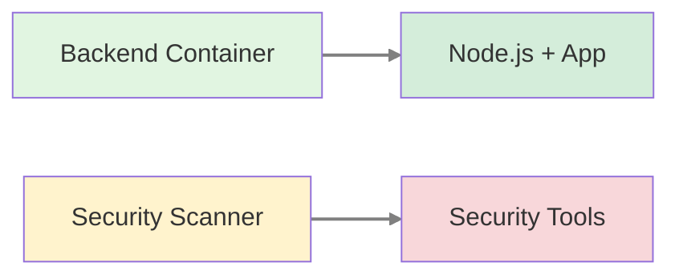
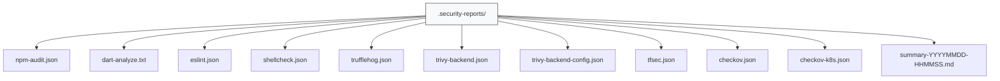

# Security Scanner

## Descripción

El **Security Scanner** es un contenedor Docker dedicado que contiene todas las herramientas necesarias para realizar análisis de seguridad en el proyecto AltruPets. Se ejecuta como Kubernetes Jobs o CronJobs para escanear código, dependencias, imágenes y configuraciones de infraestructura.

## Arquitectura

### Separación de Responsabilidades



### ¿Por qué un contenedor separado?

| Aspecto | Backend Container | Security Scanner |
|---------|-------------------|------------------|
| **Propósito** | Ejecutar la aplicación | Escanear seguridad |
| **Tamaño** | ~150MB (alpine) | ~2GB (con herramientas) |
| **Entorno** | Producción | CI/CD + Dev |
| **Contenido** | Solo runtime necesario | Todas las herramientas de seguridad |
| **Principio** | Mínima superficie de ataque | Máxima cobertura de análisis |

!!! success "Beneficios de la Separación"
    - ✅ Imágenes de producción más pequeñas y seguras
    - ✅ Despliegues más rápidos del backend
    - ✅ Herramientas de seguridad aisladas de producción
    - ✅ Escaneos programables independientes
    - ✅ Versionado único de herramientas de seguridad

!!! danger "Anti-patrón (lo que NO hacemos)"
    - ❌ Instalar herramientas de seguridad en el Dockerfile del backend
    - ❌ Mezclar dependencias de runtime con herramientas de análisis
    - ❌ Exponer herramientas de seguridad en contenedores de producción

## Herramientas Incluidas

### Análisis de Vulnerabilidades

| Herramienta | Versión | Propósito |
|-------------|---------|-----------|
| **Trivy** | 0.69.1 | Escaneo de contenedores y filesystem |
| **npm audit** | (Node 20.x) | Vulnerabilidades en dependencias Node.js |
| **Safety** | latest | Vulnerabilidades en dependencias Python |

### Análisis Estático (SAST)

| Herramienta | Versión | Propósito |
|-------------|---------|-----------|
| **dart analyze** | (Flutter stable) | Análisis estático de código Dart |
| **ESLint** | (via npm) | Análisis de código TypeScript/JavaScript |
| **Bandit** | latest | Análisis de seguridad en código Python |

### Detección de Secretos

| Herramienta | Versión | Propósito |
|-------------|---------|-----------|
| **Trufflehog** | 2.2.1 | Detección de secretos en código y commits |

### Infrastructure as Code (IaC)

| Herramienta | Versión | Propósito |
|-------------|---------|-----------|
| **tfsec** | 1.28.14 | Análisis de seguridad para Terraform |
| **Checkov** | 3.2.504 | Análisis de IaC multi-cloud (Terraform, K8s, Docker) |

## Uso

### Build Local

```bash
docker build -t altrupets/security-scanner:1.0.0 \
  -f infrastructure/docker/security-scanner/Dockerfile .
```

### Ejecución Local

```bash
# Escaneo completo
docker run --rm \
  -v $(pwd):/workspace \
  -v $(pwd)/.security-reports:/reports \
  altrupets/security-scanner:1.0.0 all

# Escaneo específico
docker run --rm \
  -v $(pwd):/workspace \
  -v $(pwd)/.security-reports:/reports \
  altrupets/security-scanner:1.0.0 deps
```

### Makefile Commands

```bash
# Escaneo completo
make dev-security-scan

# Escaneos específicos
make dev-security-deps        # Dependencias
make dev-security-sast        # Análisis estático
make dev-security-secrets     # Detección de secretos
make dev-security-container   # Imágenes de contenedor
make dev-security-iac         # Infrastructure as Code

# Auto-fix vulnerabilidades
make dev-security-fix
```

### Kubernetes Job (On-Demand)

```bash
# Ejecutar escaneo manual
kubectl create job security-scan-manual \
  --from=cronjob/security-scanner \
  -n altrupets-dev

# Ver logs
kubectl logs -f job/security-scan-manual -n altrupets-dev

# Ver reportes
kubectl exec -it security-scan-manual-xxxxx -n altrupets-dev \
  -- ls -la /reports
```

### Kubernetes CronJob (Programado)

El scanner se ejecuta automáticamente todos los días a las 2:00 AM:

```yaml
# k8s/base/security-scanner/cronjob.yaml
schedule: "0 2 * * *"  # Diario a las 2 AM
```

```bash
# Ver próximas ejecuciones
kubectl get cronjob security-scanner -n altrupets-dev

# Ver historial de Jobs
kubectl get jobs -n altrupets-dev -l app=security-scanner

# Ver logs del último escaneo
kubectl logs -f $(kubectl get pods -n altrupets-dev \
  -l app=security-scanner --sort-by=.metadata.creationTimestamp \
  -o jsonpath='{.items[-1].metadata.name}')
```

## Tipos de Escaneo

### 1. Dependencias (`deps`)

Escanea vulnerabilidades en dependencias de paquetes:

```bash
make dev-security-deps
```

**Herramientas:**
- `npm audit` para Node.js
- `safety` para Python
- `flutter pub outdated --mode=security` para Dart

**Salida:**
- `.security-reports/npm-audit.json`
- Reporte en consola con severidades

### 2. Análisis Estático (`sast`)

Analiza el código fuente en busca de problemas de seguridad:

```bash
make dev-security-sast
```

**Herramientas:**
- `dart analyze` para Flutter/Dart
- `eslint` para TypeScript/JavaScript
- `bandit` para Python
- `shellcheck` para scripts Bash

**Salida:**
- `.security-reports/dart-analyze.txt`
- `.security-reports/eslint.json`
- `.security-reports/shellcheck.json`

### 3. Secretos (`secrets`)

Detecta secretos hardcodeados en el código:

```bash
make dev-security-secrets
```

**Herramientas:**
- `trufflehog` con verificación de secretos

**Patrones detectados:**
- API keys
- Passwords
- Tokens (JWT, OAuth, etc.)
- Private keys (RSA, EC, DSA)
- Cloud credentials (AWS, GCP, Azure)

**Salida:**
- `.security-reports/trufflehog.json`

### 4. Contenedores (`container`)

Escanea imágenes Docker y Dockerfiles:

```bash
make dev-security-container
```

**Herramientas:**
- `trivy` para análisis de imágenes y configuración

**Escanea:**
- Vulnerabilidades en imágenes base
- Vulnerabilidades en dependencias
- Configuración de Dockerfiles
- Best practices de Docker

**Salida:**
- `.security-reports/trivy-backend.json`
- `.security-reports/trivy-backend-config.json`

### 5. Infrastructure as Code (`iac`)

Escanea configuraciones de infraestructura:

```bash
make dev-security-iac
```

**Herramientas:**
- `tfsec` para Terraform/OpenTofu
- `checkov` para Terraform, Kubernetes, Docker

**Escanea:**
- Configuraciones de Terraform
- Manifiestos de Kubernetes
- Dockerfiles
- Helm charts

**Salida:**
- `.security-reports/tfsec.json`
- `.security-reports/checkov.json`
- `.security-reports/checkov-k8s.json`

### 6. Auto-Fix (`fix`)

Intenta corregir automáticamente vulnerabilidades:

```bash
make dev-security-fix
```

**Acciones:**
- `npm audit fix --force` para Node.js
- `flutter pub upgrade --major-versions` para Dart
- `dart fix --apply` para código Dart
- `eslint --fix` para TypeScript/JavaScript

## Reportes

### Ubicación

Todos los reportes se guardan en:



### Reporte Resumen

Cada ejecución genera un reporte resumen en Markdown:

```markdown
# DevSecOps Scan Report

**Date:** 2025-02-19 14:30:00
**Environment:** DEV Local (Minikube)

## Scans Performed

| Scan | Status | Report |
|------|--------|--------|
| Dependencies | ✅ | .security-reports/npm-audit.json |
| SAST | ✅ | .security-reports/dart-analyze.txt |
| Secrets | ✅ | .security-reports/trufflehog.json |
| Containers | ✅ | .security-reports/trivy-backend.json |
| IaC | ✅ | .security-reports/tfsec.json |
```

## CI/CD Integration

### GitHub Actions

```yaml
# .github/workflows/security-scan.yml
name: Security Scan

on:
  push:
    branches: [main, develop]
  pull_request:
  schedule:
    - cron: '0 2 * * *'  # Diario a las 2 AM

jobs:
  security-scan:
    runs-on: ubuntu-latest
    steps:
      - uses: actions/checkout@v4
      
      - name: Build Security Scanner
        run: |
          docker build -t security-scanner:latest \
            -f infrastructure/docker/security-scanner/Dockerfile .
      
      - name: Run Security Scan
        run: |
          docker run --rm \
            -v ${{ github.workspace }}:/workspace \
            -v ${{ github.workspace }}/.security-reports:/reports \
            security-scanner:latest all
      
      - name: Upload Reports
        uses: actions/upload-artifact@v4
        with:
          name: security-reports
          path: .security-reports/
```

## Configuración

### Variables de Entorno

```bash
# Nivel de severidad mínimo
SEVERITY_THRESHOLD=HIGH

# Fallar el build en vulnerabilidades
FAIL_ON_VULNERABILITIES=true

# Directorio de reportes
REPORT_DIR=/reports
```

### Exclusiones

Crear `.trivyignore` para excluir vulnerabilidades conocidas:

```
# .trivyignore
CVE-2024-12345  # False positive, no aplica a nuestro caso
```

Crear `.tfsec-ignore` para Terraform:

```yaml
# .tfsec-ignore
- rule: aws-s3-enable-bucket-encryption
  expiry: 2025-12-31
  reason: Bucket temporal para desarrollo
```

## Troubleshooting

### Error: Trivy database update failed

```bash
# Actualizar manualmente la base de datos
docker run --rm aquasec/trivy:latest image --download-db-only
```

### Error: Flutter SDK not found

```bash
# Verificar que Flutter esté en el PATH
docker run --rm security-scanner:latest flutter --version
```

### Falsos Positivos

Usar archivos de configuración para suprimir:

- `.trivyignore` para Trivy
- `.tfsec-ignore` para tfsec
- `.checkov.yml` para Checkov

## Mejores Prácticas

!!! tip "Recomendaciones"
    1. **Ejecutar escaneos antes de cada commit**
       ```bash
       make dev-security-scan
       ```
    
    2. **Revisar reportes regularmente**
       ```bash
       cat .security-reports/summary-*.md
       ```
    
    3. **Priorizar vulnerabilidades CRITICAL y HIGH**
    
    4. **Mantener herramientas actualizadas**
       ```bash
       docker build --no-cache -t security-scanner:latest \
         -f infrastructure/docker/security-scanner/Dockerfile .
       ```
    
    5. **Integrar en CI/CD pipeline**

## Referencias

- [Trivy Documentation](https://aquasecurity.github.io/trivy/)
- [tfsec Documentation](https://aquasecurity.github.io/tfsec/)
- [Checkov Documentation](https://www.checkov.io/)
- [Trufflehog Documentation](https://github.com/trufflesecurity/trufflehog)
- [OWASP Top 10](https://owasp.org/www-project-top-ten/)

---

**Última actualización:** 19 de febrero de 2025
