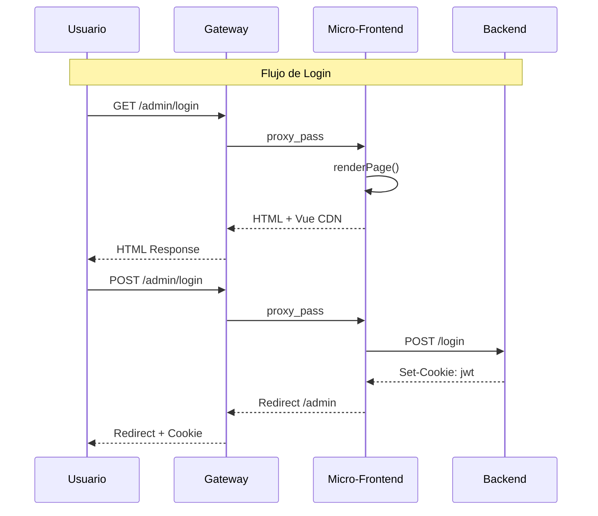
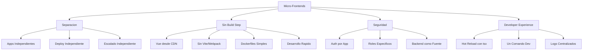
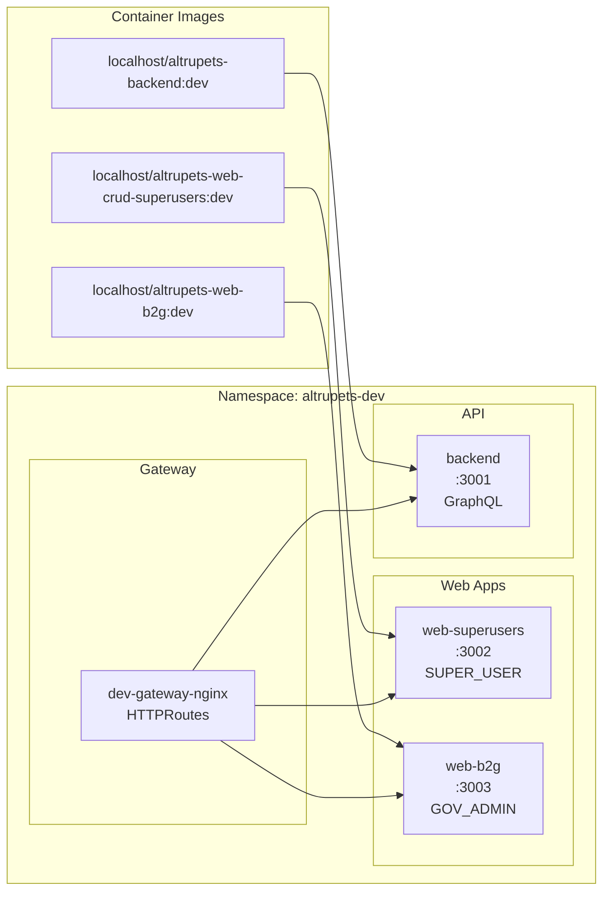

# 🎨 Micro-Frontends

AltruPets utiliza una arquitectura de **micro-frontends** donde cada aplicación web tiene su propio servidor Express.js independiente con Vue.js renderizado vía Inertia.js.

## Arquitectura de Micro-Frontends

```mermaid
flowchart TB
    subgraph Clients[Clientes]
        Browser[Browser<br/>Usuarios]
        Mobile[Flutter App<br/>Mobile]
        API[API Clients<br/>Integraciones]
    end

    subgraph Gateway[Gateway Layer]
        NGINX[NGINX Gateway API<br/>HTTPRoutes]
        Routes[Route /admin -> web-superusers:3002<br/>Route /b2g -> web-b2g:3003<br/>Route /graphql -> backend:3001]
    end

    subgraph Superusers[CRUD Superusers]
        Express1[Express.js<br/>puerto 3002]
        Vue1[Vue 3 + Inertia<br/>CDN]
        Express1 --> Vue1
    end

    subgraph B2G[B2G Government]
        Express2[Express.js<br/>puerto 3003]
        Vue2[Vue 3 + Inertia<br/>CDN]
        Express2 --> Vue2
    end

    subgraph Backend[Backend API]
        NestJS[NestJS + GraphQL<br/>puerto 3001]
        Modules[Auth | Users | Pets<br/>Rescues | Adoptions | Donations]
        NestJS --> Modules
    end

    subgraph Data[Data Layer]
        Postgres[(PostgreSQL)]
        Valkey[(Valkey<br/>Cache)]
    end

    Browser --> NGINX
    Mobile --> NGINX
    API --> NGINX
    NGINX --> Routes
    Routes --> Express1
    Routes --> Express2
    Routes --> NestJS
    NestJS --> Postgres
    NestJS --> Valkey
```

## Flujo de Request



## Tecnologías por Micro-Frontend

### CRUD Superusers (`/admin/*`)

| Componente | Tecnología | Descripción |
|------------|------------|-------------|
| Servidor | Express.js | Servidor Node.js minimalista |
| Frontend | Vue 3 (CDN) | Sin build step, carga desde CDN |
| SPA | Inertia.js | Navegación sin recargar página |
| Estilos | CSS inline | Sin Tailwind, estilos básicos |
| Puerto | 3002 | Puerto interno del contenedor |
| Roles | `SUPER_USER` | Solo administradores |

### B2G Government (`/b2g/*`)

| Componente | Tecnología | Descripción |
|------------|------------|-------------|
| Servidor | Express.js | Servidor Node.js minimalista |
| Frontend | Vue 3 (CDN) | Sin build step, carga desde CDN |
| SPA | Inertia.js | Navegación sin recargar página |
| Estilos | CSS inline | Tema azul/cyan para gobierno |
| Puerto | 3003 | Puerto interno del contenedor |
| Roles | `GOVERNMENT_ADMIN`, `SUPER_USER` | Funcionarios gubernamentales |

## Ventajas de esta Arquitectura



## Despliegue en Kubernetes



## Estructura de Código

```mermaid
flowchart TB
    subgraph Monorepo[Monorepo]
        Mobile[mobile<br/>Flutter App]

        Super[crud-superusers<br/>Express + Vue CDN]
        B2G[b2g<br/>Express + Vue CDN]
        Shared[shared<br/>Utilidades]

        Backend[backend<br/>NestJS + GraphQL]

        TF[terraform<br/>IaC]
        Scripts[scripts<br/>Build & Deploy]

        Base[base<br/>Manifests]
        Overlays[overlays<br/>dev|qa|stage|prod]
    end

    Mobile -.-> Backend
    Super -.-> Backend
    B2G -.-> Backend
```

## Comandos de Desarrollo

```bash
# Iniciar entorno local completo
make dev-minikube-deploy      # 1. Crear cluster
make dev-gateway-deploy       # 2. Deploy Gateway API
make dev-backend-build        # 3. Build backend
make dev-superusers-deploy    # 4. Deploy Admin
make dev-b2g-deploy           # 5. Deploy B2G
make dev-gateway-start        # 6. Port-forward

# URLs locales
http://localhost:3001/admin/login   # CRUD Superusers
http://localhost:3001/b2g/login     # B2G Government
http://localhost:3001/graphql       # GraphQL Playground
```
