# 🎨 Micro-Frontends

AltruPets utiliza una arquitectura de **micro-frontends** donde cada aplicación web tiene su propio servidor Express.js independiente con Vue.js renderizado vía Inertia.js.

## Arquitectura de Micro-Frontends

```mermaid
flowchart TB
    subgraph Clients["👥 Clientes"]
        Browser["🖥️ Navegador<br/>(Usuarios)"]
        Mobile["📱 Flutter App<br/>(Mobile)"]
        API["🔌 API Clients<br/>(Integraciones)"]
    end

    subgraph Gateway["🚪 Gateway Layer"]
        NGINX["NGINX Gateway API<br/>(HTTPRoutes)"]
        Routes["/admin/* → web-superusers:3002<br/>/b2g/* → web-b2g:3003<br/>/graphql → backend:3001"]
    end

    subgraph MicroFrontends["🎨 Micro-Frontends"]
        subgraph Superusers["📋 CRUD Superusers"]
            Express1["Express.js<br/>(puerto 3002)"]
            Vue1["Vue 3 + Inertia<br/>(CDN)"]
            Express1 --> Vue1
        end
        
        subgraph B2G["🏛️ B2G Government"]
            Express2["Express.js<br/>(puerto 3003)"]
            Vue2["Vue 3 + Inertia<br/>(CDN)"]
            Express2 --> Vue2
        end
    end

    subgraph Backend["⚙️ Backend API"]
        NestJS["NestJS + GraphQL<br/>(puerto 3001)"]
        Modules["Auth | Users | Pets<br/>Rescues | Adoptions | Donations"]
        NestJS --> Modules
    end

    subgraph Data["💾 Data Layer"]
        Postgres[("PostgreSQL")]
        Valkey[("Valkey<br/>Cache")]
    end

    Browser --> NGINX
    Mobile --> NGINX
    API --> NGINX
    NGINX --> Routes
    Routes --> Superusers
    Routes --> B2G
    Routes --> NestJS
    NestJS --> Postgres
    NestJS --> Valkey
    Superusers -.->|HTTP fetch| NestJS
    B2G -.->|HTTP fetch| NestJS
```



## Flujo de Request

```mermaid
sequenceDiagram
    participant U as 👤 Usuario
    participant G as 🚪 Gateway
    participant MF as 🎨 Micro-Frontend
    participant B as ⚙️ Backend

    Note over U,B: Flujo de Login
    U->>G: GET /admin/login
    G->>MF: proxy_pass
    MF->>MF: renderPage()
    MF-->>G: HTML + Vue CDN
    G-->>U: HTML Response
    
    U->>G: POST /admin/login
    G->>MF: proxy_pass
    MF->>B: POST /login
    B-->>MF: Set-Cookie: jwt
    MF-->>G: Redirect /admin
    G-->>U: Redirect + Cookie
```



## Tecnologías por Micro-Frontend

### CRUD Superusers (`/admin/*`)

| Componente | Tecnología | Descripción |
|------------|------------|-------------|
| Servidor | Express.js | Servidor Node.js minimalista |
| Frontend | Vue 3 (CDN) | Sin build step, carga desde CDN |
| SPA | Inertia.js | Navegación sin recargar página |
| Estilos | CSS inline | Sin Tailwind, estilos básicos |
| Puerto | 3002 | Puerto interno del contenedor |
| Roles | `SUPER_USER` | Solo administradores |

### B2G Government (`/b2g/*`)

| Componente | Tecnología | Descripción |
|------------|------------|-------------|
| Servidor | Express.js | Servidor Node.js minimalista |
| Frontend | Vue 3 (CDN) | Sin build step, carga desde CDN |
| SPA | Inertia.js | Navegación sin recargar página |
| Estilos | CSS inline | Tema azul/cyan para gobierno |
| Puerto | 3003 | Puerto interno del contenedor |
| Roles | `GOVERNMENT_ADMIN`, `SUPER_USER` | Funcionarios gubernamentales |

## Ventajas de esta Arquitectura

```mermaid
mindmap
  root((Micro-Frontends))
    Separación
      Apps independientes
      Deploy independiente
      Escalado independiente
    Sin Build Step
      Vue desde CDN
      Sin Vite/Webpack
      Dockerfiles simples
      Desarrollo rápido
    Seguridad
      Auth por app
      Roles específicos
      Backend como fuente de verdad
    Developer Experience
      Hot reload con tsx watch
      Un comando para dev
      Logs centralizados
```



## Despliegue en Kubernetes


## Estructura de Código

```mermaid
graph TB
    subgraph Monorepo["📁 Monorepo"]
        subgraph Apps["apps/"]
            Mobile["mobile/<br/>Flutter App"]
            subgraph Web["web/"]
                Super["crud-superusers/<br/>Express + Vue CDN"]
                B2G["b2g/<br/>Express + Vue CDN"]
                Shared["shared/<br/>Utilidades"]
            end
            Backend["backend/<br/>NestJS + GraphQL"]
        end
        
        subgraph Infra["infrastructure/"]
            TF["terraform/<br/>IaC"]
            Scripts["scripts/<br/>Build & Deploy"]
        end
        
        subgraph K8s["k8s/"]
            Base["base/<br/>Manifests"]
            Overlays["overlays/<br/>dev|qa|stage|prod"]
        end
    end
```



## Comandos de Desarrollo

```bash
# Iniciar entorno local completo
make dev-minikube-deploy      # 1. Crear cluster
make dev-gateway-deploy       # 2. Deploy Gateway API
make dev-backend-build        # 3. Build backend
make dev-superusers-deploy    # 4. Deploy Admin
make dev-b2g-deploy           # 5. Deploy B2G
make dev-gateway-start        # 6. Port-forward

# URLs locales
http://localhost:3001/admin/login   # CRUD Superusers
http://localhost:3001/b2g/login     # B2G Government
http://localhost:3001/graphql       # GraphQL Playground
```
