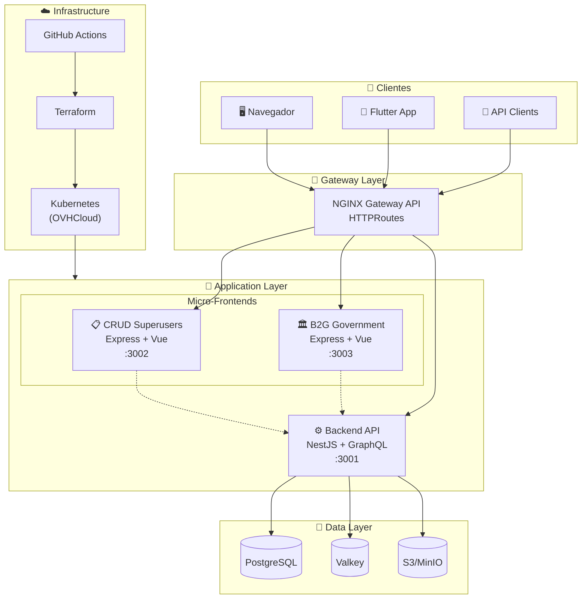
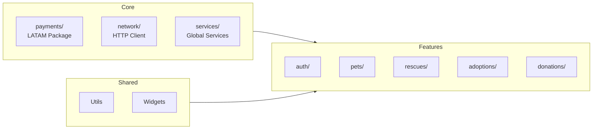
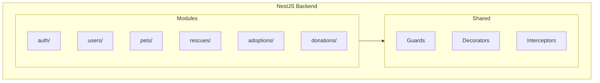
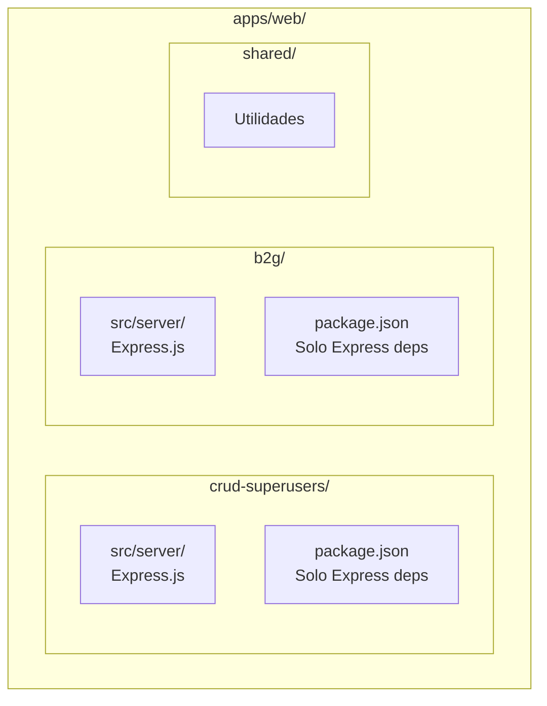
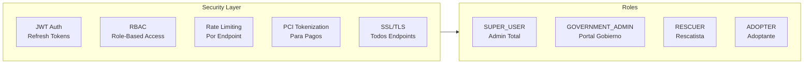

# 🏗️ Arquitectura - Visión General

## Arquitectura Completa

## Capas de la Arquitectura

### 1. Presentation Layer (Micro-Frontends)

Ver documentación detallada en [Micro-Frontends](micro-frontends.md).

| Aplicación | Tecnología | Puerto | Roles |
|------------|------------|--------|-------|
| CRUD Superusers | Express.js + Vue 3 + Inertia.js | 3002 | `SUPER_USER` |
| B2G Government | Express.js + Vue 3 + Inertia.js | 3003 | `GOVERNMENT_ADMIN`, `SUPER_USER` |
| Flutter Mobile | Flutter + Riverpod | - | Todos los usuarios |

### 2. Gateway Layer

| Componente | Tecnología | Función |
|------------|------------|---------|
| Ingress | NGINX Gateway API | Routing, SSL, Rate Limiting |
| HTTPRoutes | Gateway API | Path-based routing |

### 3. API Layer (Backend)

| Componente | Tecnología | Función |
|------------|------------|---------|
| Framework | NestJS | Dependency Injection, Modules |
| API | GraphQL (Apollo) | Query unificada, Subscriptions |
| ORM | Prisma | Database access |

### 4. Data Layer

| Componente | Tecnología | Función |
|------------|------------|---------|
| Database | PostgreSQL | Almacenamiento persistente |
| Cache | Valkey | Sesiones, Rate Limiting |
| Storage | S3/MinIO | Archivos, imágenes |

### 5. Infrastructure Layer

Ver documentación detallada en [Infrastructure](../deployment/infrastructure.md).

| Componente | Tecnología | Función |
|------------|------------|---------|
| Orchestration | Kubernetes | Container orchestration |
| IaC | Terraform/OpenTofu | Infrastructure as Code |
| CI/CD | GitHub Actions | Pipelines automatizados |
| GitOps | ArgoCD | Declarative deployments |

## Principios Arquitectónicos

### Clean Architecture (Flutter)

### Modular Monolith (Backend)

### Micro-Frontends (Web Apps)

## 🛡️ Seguridad

## Próximos Pasos

- [Micro-Frontends](micro-frontends.md) - Detalle de cada web app
- [Tecnologías](technologies.md) - Stack tecnológico completo
- [Data Flow](data-flow.md) - Flujo de datos entre servicios
