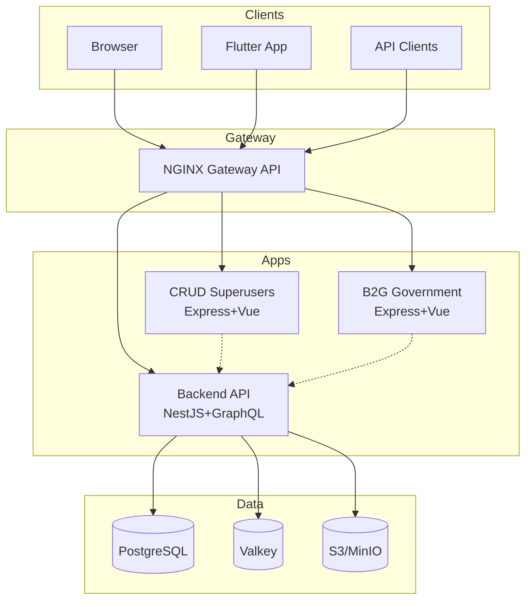
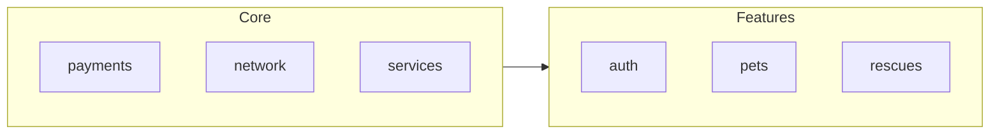
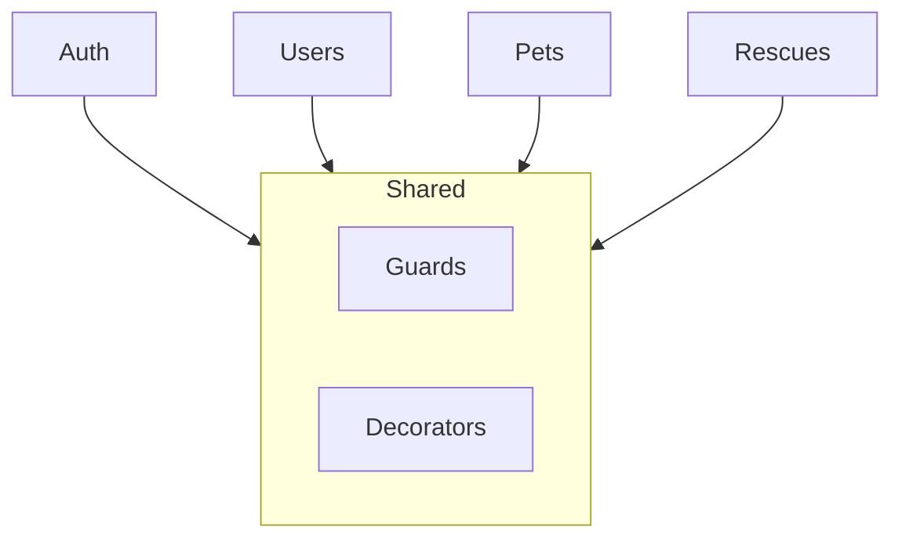
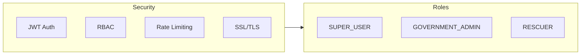

# Arquitectura - Visión General

## Arquitectura Completa

## Capas de la Arquitectura

### 1. Presentation Layer

| Aplicación | Tecnología | Puerto | Roles |
|------------|------------|--------|-------|
| CRUD Superusers | Express+Vue+Inertia | 3002 | `SUPER_USER` |
| B2G Government | Express+Vue+Inertia | 3003 | `GOVERNMENT_ADMIN` |
| Flutter Mobile | Flutter+Riverpod | - | Todos |

### 2. Gateway Layer

| Componente | Tecnología |
|------------|------------|
| Ingress | NGINX Gateway API |
| HTTPRoutes | Gateway API |

### 3. API Layer

| Componente | Tecnología |
|------------|------------|
| Framework | NestJS |
| API | GraphQL |
| ORM | Prisma |

### 4. Data Layer

| Componente | Tecnología |
|------------|------------|
| Database | PostgreSQL |
| Cache | Valkey |
| Storage | S3/MinIO |

### 5. Infrastructure Layer

| Componente | Tecnología |
|------------|------------|
| Orchestration | Kubernetes |
| IaC | Terraform |
| CI/CD | GitHub Actions |
| GitOps | ArgoCD |

## Principios Arquitectónicos

### Clean Architecture

### Backend Modules

## Seguridad

