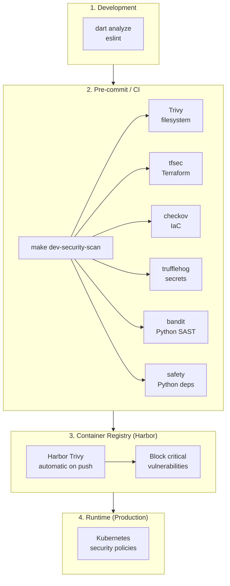

# Harbor Registry

## ¿Qué es Harbor?

[Harbor](https://goharbor.io/) es un registry de contenedores open source (CNCF Graduated) que proporciona:

- Docker Registry privado
- Helm Chart repository
- Vulnerability scanning (Trivy integrado)
- RBAC (Role-Based Access Control)
- Replication a otros registries
- Image signing (Notary)
- Web UI

## Instalación en DEV

```bash
make dev-harbor-deploy
```

Esto instala Harbor via Helm en Minikube con NodePort.

## Acceso

| Campo | Valor |
|-------|-------|
| **URL** | https://localhost:30003 |
| **Username** | admin |
| **Password** | Harbor12345 |

## Configurar Docker/Podman

### 1. Confiar en el certificado

```bash
# Crear directorio de certificados
sudo mkdir -p /etc/docker/certs.d/localhost:30003

# Obtener certificado de Harbor
kubectl get secret -n harbor harbor-ingress -o jsonpath='{.data.ca\.crt}' | base64 -d | sudo tee /etc/docker/certs.d/localhost:30003/ca.crt
```

### 2. Login

```bash
# Podman
echo 'Harbor12345' | podman login localhost:30003 -u admin --password-stdin

# Docker
echo 'Harbor12345' | docker login localhost:30003 -u admin --password-stdin
```

## Push de Imágenes

### Taggear imagen

```bash
# Backend
podman tag localhost/altrupets-backend:dev localhost:30003/altrupets/backend:dev

# Web apps
podman tag localhost/altrupets-web-superusers:dev localhost:30003/altrupets/web-superusers:dev
podman tag localhost/altrupets-web-b2g:dev localhost:30003/altrupets/web-b2g:dev
```

### Push

```bash
podman push localhost:30003/altrupets/backend:dev
podman push localhost:30003/altrupets/web-superusers:dev
podman push localhost:30003/altrupets/web-b2g:dev
```

## Proyectos

Por defecto, Harbor crea un proyecto `library`. Crea proyectos para organizar:

```bash
# Via CLI
curl -X POST "https://localhost:30003/api/v2.0/projects" \
  -u "admin:Harbor12345" \
  -H "Content-Type: application/json" \
  -d '{"project_name": "altrupets", "public": false}'
```

O via Web UI: Projects → New Project

## Configurar Kubernetes

Para que Minikube pueda pull de Harbor:

```bash
# Crear secret de Docker registry
kubectl create secret docker-registry harbor-registry \
  --docker-server=localhost:30003 \
  --docker-username=admin \
  --docker-password=Harbor12345 \
  -n altrupets-dev

# Patchear service account
kubectl patch serviceaccount default -n altrupets-dev \
  -p '{"imagePullSecrets": [{"name": "harbor-registry"}]}'
```

## Vulnerability Scanning

Harbor incluye Trivy para escaneo automático:

1. Push una imagen
2. Harbor escanea automáticamente
3. Ver resultados en Web UI → Project → Repositories → Tag

### Harbor vs Security Scanner

El proyecto tiene dos herramientas de escaneo de vulnerabilidades que son **complementarias, no redundantes**:

| Aspecto | Security Scanner | Harbor Trivy |
|---------|------------------|--------------|
| **Cuándo escanea** | Antes del push (CI/CD) | Después del push (Registry) |
| **Qué escanea** | Código, dependencias, IaC, imágenes | Solo imágenes |
| **Ubicación** | Kubernetes Job/CronJob | Integrado en Harbor |
| **Propósito** | Pre-push, shift-left | Post-push, defense-in-depth |
| **Herramientas** | Trivy, tfsec, checkov, trufflehog, bandit, safety | Trivy |

**Flujo de seguridad recomendado:**



> **Beneficio:** Vulnerabilidades detectadas en paso 2 nunca llegan al paso 3.

## Comparación con Alternativas

| Feature | Harbor | GHCR | Docker Registry 2 |
|---------|--------|------|-------------------|
| Costo | GRATIS | 500MB gratis | GRATIS |
| Docker Registry | ✅ | ✅ | ✅ |
| Helm Charts | ✅ | ❌ | ❌ |
| Vulnerability Scan | ✅ Trivy | ✅ Dependabot | ❌ |
| RBAC | ✅ | ✅ | ❌ |
| UI Web | ✅ | ✅ | ❌ |
| On-premise | ✅ | ❌ | ✅ |

## Comandos Makefile

```bash
make dev-harbor-deploy    # Desplegar Harbor
make dev-harbor-destroy   # Eliminar Harbor
```

## Troubleshooting

### Error: x509: certificate signed by unknown authority

```bash
# Agregar certificado al trust store
sudo cp /etc/docker/certs.d/localhost:30003/ca.crt /usr/local/share/ca-certificates/harbor.crt
sudo update-ca-certificates
```

### Error: connection refused

Verificar que Harbor esté corriendo:

```bash
kubectl get pods -n harbor
```

### Reiniciar Harbor

```bash
kubectl rollout restart deployment -n harbor
```

## Referencias

- [Harbor Documentation](https://goharbor.io/docs/)
- [Harbor Helm Chart](https://github.com/goharbor/harbor-helm)
- [Trivy Scanner](https://trivy.dev/)
