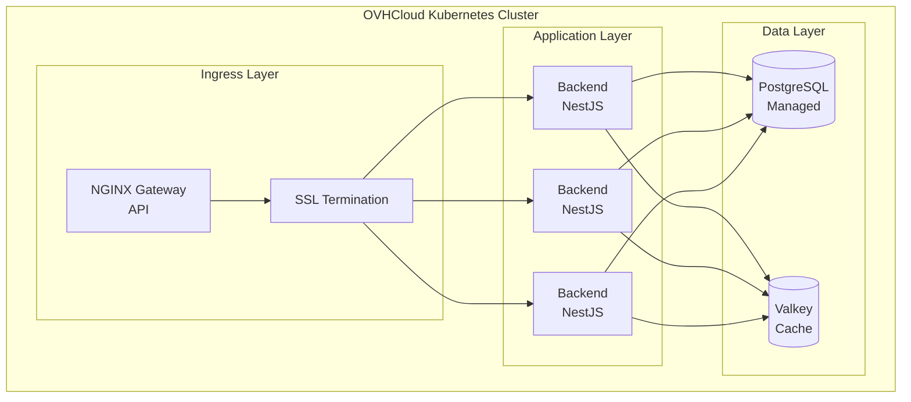
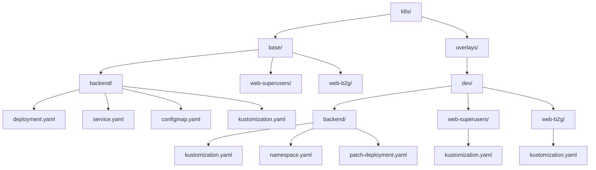

# ☸️ Kubernetes

## Arquitectura de Despliegue

AltruPets se despliega en **OVHCloud Managed Kubernetes** para QA, STAGING y PROD.



## Flujos de Deployment

### Manual (sin ArgoCD)

Para desarrollo local con Minikube:

```bash
make setup && make dev-minikube-deploy && make dev-terraform-deploy && \
make dev-images-build && make dev-backend-tf-deploy && \
make dev-superusers-tf-deploy && make dev-b2g-tf-deploy && make dev-gateway-start
```

### GitOps (con ArgoCD)

Para ambientes QA, Staging y Production:

```bash
make setup && make dev-minikube-deploy && make dev-terraform-deploy && \
make dev-images-build && make dev-argocd-deploy && make dev-gateway-start
```

## Kustomize Structure

Los manifiestos usan **Kustomize overlays** para diferenciar ambientes:



> **Nota:** Cada ambiente (dev, qa, staging) tiene su propio overlay que hereda de `base/`

### Targets de Deploy

| Target | Descripción | Path |
|--------|-------------|------|
| `dev-backend-tf-deploy` | Backend API | `k8s/overlays/dev/backend` |
| `dev-superusers-tf-deploy` | CRUD Superusers | `k8s/overlays/dev/web-superusers` |
| `dev-b2g-tf-deploy` | B2G Frontend | `k8s/overlays/dev/web-b2g` |

## Entornos

| Entorno | Propósito | Kubeconfig Secret |
|---------|-----------|-------------------|
| **DEV** | Local Minikube | N/A (local) |
| **QA** | Ephemeral testing | `OVH_QA_KUBECONFIG` |
| **STAGING** | Pre-production | `OVH_STAGING_KUBECONFIG` |
| **PROD** | Production | `OVH_PROD_KUBECONFIG` |

## Comandos Útiles

```bash
# Ver pods
kubectl get pods -n altrupets-dev

# Ver servicios
kubectl get services -n altrupets-dev

# Logs
kubectl logs -f deployment/backend -n altrupets-dev

# Escalar
kubectl scale deployment/backend --replicas=3 -n altrupets-dev

# Aplicar manifiestos manualmente
kubectl apply -k k8s/overlays/dev/backend
```

## OVH Managed PostgreSQL

Producción utiliza **OVH Managed PostgreSQL** en lugar de PostgreSQL self-managed:
- Alta disponibilidad
- Backups automáticos
- SSL habilitado
