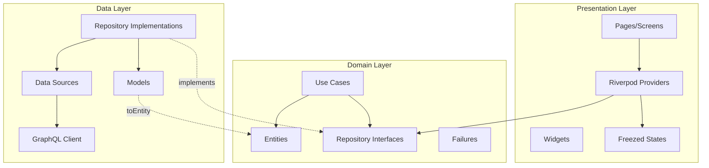
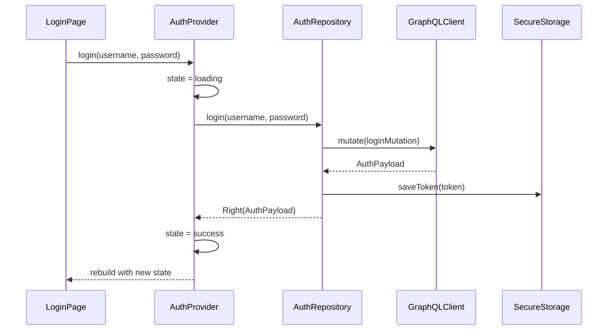

# 🏗️ Arquitectura

AltruPets Mobile implementa **Clean Architecture** con **Riverpod** como solución de state management, siguiendo principios SOLID y programación funcional con `dartz`.

## Principios de Diseño

1. **Dependency Inversion**: Las capas internas no dependen de las externas
2. **Single Responsibility**: Cada clase tiene una única razón para cambiar
3. **Testability**: Inyección de dependencias facilita mocking
4. **Immutability**: Estados inmutables con Freezed evitan side effects

## Diagrama de Capas



## Domain Layer

La capa de dominio es el núcleo de la aplicación. No tiene dependencias externas.

### Entities con Freezed

Las entidades son objetos inmutables que representan conceptos del negocio:

```dart
// lib/features/auth/domain/entities/user.dart
import 'package:freezed_annotation/freezed_annotation.dart';

part 'user.freezed.dart';
part 'user.g.dart';

@freezed
class User with _$User {
  const factory User({
    required String id,
    required String username,
    @JsonKey(fromJson: _rolesFromJson) List<String>? roles,
    String? email,
    String? firstName,
    String? lastName,
    String? phone,
    String? identification,
    String? country,
    String? province,
    String? canton,
    String? district,
    String? occupation,
    String? incomeSource,
    bool? isActive,
    bool? isVerified,
    String? avatarBase64,
    @JsonKey(fromJson: _dateTimeFromJson) DateTime? createdAt,
    @JsonKey(fromJson: _dateTimeFromJson) DateTime? updatedAt,
  }) = _User;

  factory User.fromJson(Map<String, dynamic> json) => _$UserFromJson(json);
}

// Custom JSON converters
List<String>? _rolesFromJson(dynamic json) {
  if (json == null) return null;
  if (json is List) {
    return json.map((e) => e.toString()).toList();
  }
  return null;
}

DateTime? _dateTimeFromJson(dynamic json) {
  if (json == null) return null;
  if (json is String) {
    return DateTime.tryParse(json);
  }
  return null;
}
```

### Repository Interfaces

Definen el contrato que deben cumplir las implementaciones:

```dart
// lib/features/auth/domain/repositories/auth_repository_interface.dart
import 'package:dartz/dartz.dart';
import 'package:altrupets/core/error/failures.dart';
import 'package:altrupets/features/auth/domain/entities/user.dart';
import 'package:altrupets/features/auth/data/models/auth_payload.dart';
import 'package:altrupets/features/auth/data/models/register_input.dart';

abstract class AuthRepositoryInterface {
  /// Registra un nuevo usuario
  Future<Either<Failure, User>> register(RegisterInput input);

  /// Inicia sesión y retorna el payload con token
  Future<Either<Failure, AuthPayload>> login(
    String username,
    String password,
  );

  /// Obtiene el usuario actual desde el token
  Future<Either<Failure, User>> getCurrentUser();

  /// Cierra la sesión
  Future<Either<Failure, void>> logout();
}
```

### Manejo de Errores con Either

Usamos `Either<Failure, T>` para representar operaciones que pueden fallar:

```dart
// lib/core/error/failures.dart
import 'package:equatable/equatable.dart';

/// Clase base para todos los tipos de fallos
abstract class Failure extends Equatable {
  const Failure(this.message);
  final String message;

  @override
  List<Object> get props => [message];
}

/// Fallo del servidor (HTTP 5xx, GraphQL errors)
class ServerFailure extends Failure {
  const ServerFailure([super.message = 'Error del servidor']);
}

/// Fallo de caché (lectura/escritura local)
class CacheFailure extends Failure {
  const CacheFailure([super.message = 'Error de caché']);
}

/// Fallo de red (sin conexión, timeout)
class NetworkFailure extends Failure {
  const NetworkFailure([super.message = 'Sin conexión a internet']);
}
```

## Presentation Layer con Riverpod

### State con Freezed

```dart
// lib/features/auth/presentation/providers/auth_provider.dart
import 'package:flutter_riverpod/flutter_riverpod.dart';
import 'package:freezed_annotation/freezed_annotation.dart';

part 'auth_provider.freezed.dart';

@freezed
class AuthState with _$AuthState {
  const factory AuthState({
    @Default(false) bool isLoading,
    AuthPayload? payload,
    User? user,
    String? error,
  }) = _AuthState;
}
```

### StateNotifier

```dart
class AuthNotifier extends StateNotifier<AuthState> {
  AuthNotifier(this._repository) : super(const AuthState());
  final AuthRepositoryInterface _repository;

  Future<void> login(String username, String password) async {
    // 1. Set loading state
    state = state.copyWith(
      isLoading: true,
      error: null,
      payload: null,
      user: null,
    );

    // 2. Call repository
    final result = await _repository.login(username, password);

    // 3. Handle result with fold
    result.fold(
      (failure) {
        state = state.copyWith(
          isLoading: false,
          error: failure.message,
          payload: null,
        );
      },
      (payload) {
        state = state.copyWith(
          isLoading: false,
          payload: payload,
          error: null,
        );
      },
    );
  }

  Future<void> logout() async {
    final result = await _repository.logout();
    result.fold((_) {}, (_) {});
    // Siempre limpiamos el estado local de auth al cerrar sesión
    state = const AuthState();
  }
}
```

### Providers

```dart
// Repository provider
final authRepositoryProvider = Provider<AuthRepositoryInterface>((ref) {
  return AuthRepository();
});

// StateNotifier provider
final authProvider = StateNotifierProvider<AuthNotifier, AuthState>((ref) {
  final repository = ref.watch(authRepositoryProvider);
  return AuthNotifier(repository);
});

// Derived providers
final isAuthenticatedProvider = FutureProvider<bool>((ref) async {
  final hasActiveSession = await GraphQLClientService.hasActiveSession();
  if (!hasActiveSession) return false;

  final repository = ref.read(authRepositoryProvider);
  final currentUserResult = await repository.getCurrentUser();

  final isValid = currentUserResult.fold(
    (_) => false,
    (_) => true,
  );

  if (!isValid) {
    await GraphQLClientService.clearToken();
  }

  return isValid;
});

// Stream provider para sesión expirada
final sessionExpiredProvider = StreamProvider<void>((ref) {
  return GraphQLClientService.sessionExpiredStream;
});
```

### Uso en Widgets

```dart
class LoginPage extends ConsumerWidget {
  @override
  Widget build(BuildContext context, WidgetRef ref) {
    final authState = ref.watch(authProvider);

    // React to state changes
    ref.listen<AuthState>(authProvider, (previous, next) {
      if (next.error != null) {
        ScaffoldMessenger.of(context).showSnackBar(
          SnackBar(content: Text(next.error!)),
        );
      }
      if (next.payload != null) {
        Navigator.pushReplacement(context, ...);
      }
    });

    return Scaffold(
      body: authState.isLoading
        ? const CircularProgressIndicator()
        : LoginForm(
            onSubmit: (username, password) {
              ref.read(authProvider.notifier).login(username, password);
            },
          ),
    );
  }
}
```

## Data Layer

### Repository Implementation

```dart
// lib/features/auth/data/repositories/auth_repository.dart
class AuthRepository implements AuthRepositoryInterface {
  final GraphQLClient _client = GraphQLClientService.getClient();

  @override
  Future<Either<Failure, AuthPayload>> login(
    String username,
    String password,
  ) async {
    try {
      final result = await _client.mutate(
        MutationOptions(
          document: gql(loginMutation),
          variables: {'username': username, 'password': password},
        ),
      );

      if (result.hasException) {
        return Left(ServerFailure(result.exception.toString()));
      }

      final payload = AuthPayload.fromJson(result.data!['login']);

      // Save token
      await GraphQLClientService.saveToken(payload.accessToken);

      return Right(payload);
    } catch (e) {
      return Left(ServerFailure(e.toString()));
    }
  }
}
```

## Estructura de Feature Completa

```
features/auth/
├── domain/
│   ├── entities/
│   │   ├── user.dart
│   │   ├── user.freezed.dart
│   │   └── user.g.dart
│   └── repositories/
│       └── auth_repository_interface.dart
├── data/
│   ├── models/
│   │   ├── auth_payload.dart
│   │   ├── auth_payload.freezed.dart
│   │   ├── auth_payload.g.dart
│   │   ├── register_input.dart
│   │   ├── register_input.freezed.dart
│   │   └── register_input.g.dart
│   └── repositories/
│       └── auth_repository.dart
└── presentation/
    ├── pages/
    │   ├── login_page.dart
    │   └── register_page.dart
    ├── providers/
    │   ├── auth_provider.dart
    │   └── auth_provider.freezed.dart
    └── widgets/
        ├── login_form.dart
        └── register_form.dart
```

## Flujo de Datos



## Best Practices

### DO

```dart
// ✅ Usar Either para operaciones fallibles
Future<Either<Failure, User>> getUser();

// ✅ Inyectar dependencias vía constructor
class AuthNotifier extends StateNotifier<AuthState> {
  AuthNotifier(this._repository);
  final AuthRepositoryInterface _repository;
}

// ✅ Usar copyWith para actualizar estado
state = state.copyWith(isLoading: true);

// ✅ Manejar ambos casos de Either
result.fold(
  (failure) => handleError(failure),
  (success) => handleSuccess(success),
);
```

### DON'T

```dart
// ❌ Lanzar excepciones desde repositories
throw Exception('Error'); // Use Left(Failure) instead

// ❌ Mutar estado directamente
state.isLoading = true; // States are immutable

// ❌ Acceder a providers sin ref
final repo = AuthRepository(); // Use ref.watch()

// ❌ Ignorar el lado Left de Either
result.getOrElse(() => defaultValue); // Handle errors properly
```
