# 📦 Features

Documentación detallada de cada feature de la aplicación AltruPets Mobile.

## Mapa de Features

```mermaid
graph TB
    Auth[🔐 Auth<br/>Login/Registro]
    Home[🏠 Home<br/>Dashboard]
    Profile[👤 Profile<br/>Perfil Usuario]
    Orgs[🏢 Organizations<br/>Organizaciones]
    Rescues[🐾 Rescues<br/>Rescates]
    Settings[⚙️ Settings<br/>Configuración]
    Onboarding[📝 Onboarding<br/>Registro Inicial]
    
    Auth --> Home
    Onboarding --> Home
    Home --> Profile
    Home --> Orgs
    Home --> Rescues
    Home --> Settings
    
    Profile -.->|usa| Auth
    Orgs -.->|usa| Auth
    Rescues -.->|usa| Auth
    
    style Auth fill:#e1f5ff
    style Home fill:#fff4e1
    style Profile fill:#f0e1ff
    style Orgs fill:#e1ffe1
    style Rescues fill:#ffe1e1
    style Settings fill:#f5f5f5
    style Onboarding fill:#ffe1f5
```



## Estructura de un Feature

Cada feature sigue la estructura de Clean Architecture:


Estructura de carpetas:

```
features/<feature_name>/
├── domain/                    # Capa de dominio
│   ├── entities/              # Entidades de negocio (Freezed)
│   └── repositories/          # Interfaces de repositorio
├── data/                      # Capa de datos
│   ├── models/                # DTOs y modelos de datos
│   └── repositories/          # Implementaciones de repositorio
└── presentation/              # Capa de presentación
    ├── pages/                 # Páginas/Screens
    ├── providers/             # Riverpod StateNotifiers
    └── widgets/               # Widgets específicos del feature
```

---

## Auth

Gestiona la autenticación de usuarios con JWT.

### Funcionalidades

- **Login**: Autenticación con username/password
- **Registro**: Creación de nuevos usuarios
- **Sesión persistente**: Token almacenado en secure storage
- **Auto-logout**: Detección de token expirado con redirección automática
- **Refresh token**: Renovación automática de sesión (cuando el backend lo soporte)

### Estructura

```
features/auth/
├── domain/
│   ├── entities/
│   │   ├── user.dart               # Entidad User con todos los campos
│   │   ├── user.freezed.dart
│   │   └── user.g.dart
│   └── repositories/
│       └── auth_repository_interface.dart
├── data/
│   ├── models/
│   │   ├── auth_payload.dart       # Token + User response
│   │   └── register_input.dart     # Input para registro
│   └── repositories/
│       └── auth_repository.dart
└── presentation/
    ├── pages/
    │   ├── login_page.dart
    │   └── register_page.dart
    └── providers/
        ├── auth_provider.dart
        └── auth_provider.freezed.dart
```

### Providers

```dart
// Estado de autenticación principal
final authProvider = StateNotifierProvider<AuthNotifier, AuthState>((ref) {
  final repository = ref.watch(authRepositoryProvider);
  return AuthNotifier(repository);
});

// Verificación de sesión activa
final isAuthenticatedProvider = FutureProvider<bool>((ref) async {
  final hasActiveSession = await GraphQLClientService.hasActiveSession();
  if (!hasActiveSession) return false;

  final repository = ref.read(authRepositoryProvider);
  final currentUserResult = await repository.getCurrentUser();
  return currentUserResult.isRight();
});

// Stream para sesión expirada (401/403)
final sessionExpiredProvider = StreamProvider<void>((ref) {
  return GraphQLClientService.sessionExpiredStream;
});
```

### Uso en la App

```dart
// En main.dart - Escuchar expiración de sesión
ref.listen<AsyncValue<void>>(sessionExpiredProvider, (previous, next) {
  next.whenData((_) async {
    await ref.read(authProvider.notifier).logout();
    navigation.navigateAndRemoveAllGlobal(const LoginPage());
  });
});

// Decidir pantalla inicial
home: isAuthenticatedAsync.when(
  data: (isAuthenticated) =>
      isAuthenticated ? const HomePage() : const LoginPage(),
  loading: () =>
      const Scaffold(body: Center(child: CircularProgressIndicator())),
  error: (_, __) => const LoginPage(),
),
```

### Entidad User

```dart
@freezed
class User with _$User {
  const factory User({
    required String id,
    required String username,
    @JsonKey(fromJson: _rolesFromJson) List<String>? roles,
    String? email,
    String? firstName,
    String? lastName,
    String? phone,
    String? identification,
    String? country,
    String? province,
    String? canton,
    String? district,
    String? occupation,
    String? incomeSource,
    bool? isActive,
    bool? isVerified,
    String? avatarBase64,
    @JsonKey(fromJson: _dateTimeFromJson) DateTime? createdAt,
    @JsonKey(fromJson: _dateTimeFromJson) DateTime? updatedAt,
  }) = _User;

  factory User.fromJson(Map<String, dynamic> json) => _$UserFromJson(json);
}
```

---

## Home

Dashboard principal que sirve como hub de navegación.

### Funcionalidades

- **Welcome header**: Saludo personalizado con nombre del usuario
- **Quick actions**: Accesos directos a funciones principales
- **Navigation**: Navegación a Organizations, Profile, Settings, Rescues
- **Sync status**: Indicador de cambios pendientes por sincronizar

### Estructura

```
features/home/
└── presentation/
    ├── pages/
    │   └── home_page.dart
    └── widgets/
        ├── home_welcome_header.dart
        └── quick_action_card.dart
```

---

## Organizations

Gestión completa de organizaciones de protección animal.

### Funcionalidades

- **Búsqueda**: Filtrado por nombre, ubicación, tipo
- **Detalle**: Vista completa de organización con información de contacto
- **Registro**: Formulario para crear nueva organización
- **Membresías**: Gestión de miembros y roles dentro de organizaciones

### Estructura

```
features/organizations/
├── data/
│   ├── models/
│   │   ├── organization.dart
│   │   ├── organization_membership.dart
│   │   ├── register_organization_input.dart
│   │   └── search_organizations_input.dart
│   └── repositories/
│       └── organizations_repository.dart
└── presentation/
    ├── pages/
    │   ├── search_organizations_page.dart
    │   ├── organization_detail_page.dart
    │   ├── register_organization_page.dart
    │   └── manage_memberships_page.dart
    └── providers/
        └── organizations_provider.dart
```

### Modelo Organization

```dart
@freezed
class Organization with _$Organization {
  const factory Organization({
    required String id,
    required String name,
    String? description,
    String? legalId,           // Cédula jurídica
    String? email,
    String? phone,
    String? website,
    String? address,
    String? province,
    String? canton,
    String? district,
    String? logoBase64,
    bool? isVerified,
    DateTime? createdAt,
  }) = _Organization;

  factory Organization.fromJson(Map<String, dynamic> json) =>
      _$OrganizationFromJson(json);
}
```

---

## Profile

Gestión del perfil de usuario con soporte offline.

### Funcionalidades

- **Ver/Editar**: Información personal completa
- **Avatar**: Subida y visualización de foto de perfil
- **Ubicación**: Selector cascada de Costa Rica (provincia → cantón → distrito)
- **Hogares de acogida**: Gestión de foster homes
- **Offline**: Cache local con sincronización en segundo plano

### Estructura

```
features/profile/
├── data/
│   ├── models/
│   │   ├── update_profile_input.dart
│   │   └── foster_home.dart
│   └── repositories/
│       └── profile_repository.dart
└── presentation/
    ├── pages/
    │   ├── profile_page.dart
    │   └── edit_profile_page.dart
    ├── providers/
    │   └── profile_provider.dart
    └── widgets/
        ├── profile_header.dart
        └── profile_menu_option.dart
```

### Sincronización Offline

El sistema de sincronización offline permite que los cambios se guarden localmente y se sincronicen cuando hay conexión.


Uso en código:

```dart
// Ver estado de sincronización
final syncStatus = ref.watch(syncStatusProvider);

if (syncStatus.pendingCount > 0) {
  // Mostrar indicador de cambios pendientes
  SyncStatusIndicator(status: syncStatus);
}

// Texto descriptivo
syncStatus.statusText; // "Sincronizando...", "2 cambio(s) pendiente(s)", "Sincronizado"
syncStatus.timeSinceLastSync; // "Hace 5 min", "Hace 1 h"
```

---

## Rescues

Coordinación de rescates de animales con geolocalización.

### Funcionalidades

- **Crear rescate**: Reportar animal en situación de emergencia
- **Geolocalización**: Ubicación exacta del animal
- **Asignación**: Match con rescatistas cercanos
- **Seguimiento**: Estado del rescate en tiempo real
- **Historial**: Rescates completados

### Estructura

```
features/rescues/
├── domain/
│   ├── entities/
│   │   └── rescue.dart
│   └── repositories/
│       └── rescue_repository_interface.dart
├── data/
│   └── repositories/
│       └── rescue_repository.dart
└── presentation/
    ├── pages/
    │   ├── create_rescue_page.dart
    │   ├── rescue_detail_page.dart
    │   └── rescue_history_page.dart
    └── providers/
        └── rescue_provider.dart
```

### Geolocalización

El sistema de geolocalización permite ubicar rescates con precisión.


Uso en código:

```dart
// Obtener ubicación actual
final position = await ref.read(geolocationProvider.notifier).getCurrentPosition();

// Usar en formulario de rescate
CreateRescueInput(
  latitude: position.latitude,
  longitude: position.longitude,
  description: 'Perro abandonado en...',
);
```

---

## Settings

Configuración de preferencias de la aplicación.

### Funcionalidades

- **Tema**: Modo claro, oscuro, o seguir sistema
- **Idioma**: Español, Inglés
- **Notificaciones**: Preferencias de push notifications
- **Cuenta**: Cerrar sesión, eliminar cuenta

### Estructura

```
features/settings/
└── presentation/
    ├── pages/
    │   └── settings_page.dart
    └── widgets/
        ├── theme_selector.dart
        └── language_selector.dart
```

### Cambiar Tema

El sistema de temas permite cambiar entre modo claro, oscuro o seguir el sistema.


Uso en código:

```dart
// Leer tema actual
final themeMode = ref.watch(themeModeProvider);

// Cambiar tema
final notifier = await ref.read(themeNotifierInstanceProvider.future);
await notifier.setThemeMode(AppThemeMode.dark);
```

---

## Onboarding

Flujo de registro paso a paso para nuevos usuarios.

### Funcionalidades

- **Selección de rol**: Adoptante, Rescatista, Organización
- **Información básica**: Nombre, email, teléfono
- **Ubicación**: País, provincia, cantón, distrito
- **Verificación**: Email o teléfono

### Flujo de Onboarding

```mermaid
stateDiagram-v2
    [*] --> RoleSelection: Iniciar
    RoleSelection --> PersonalInfo: Seleccionar rol
    PersonalInfo --> Location: Completar info
    Location --> Verification: Seleccionar ubicación
    Verification --> Complete: Verificar
    Complete --> [*]: Registro exitoso
    
    RoleSelection --> RoleSelection: Cambiar rol
    PersonalInfo --> RoleSelection: Volver
    Location --> PersonalInfo: Volver
    Verification --> Location: Volver
```



### Estructura

```
features/onboarding/
└── presentation/
    ├── pages/
    │   ├── onboarding_page.dart
    │   ├── role_selection_page.dart
    │   ├── personal_info_page.dart
    │   └── verification_page.dart
    └── providers/
        └── onboarding_provider.dart
```

---

## Crear Nueva Feature

### 1. Generar Estructura de Carpetas

```bash
mkdir -p lib/features/nueva_feature/{domain/{entities,repositories},data/{models,repositories},presentation/{pages,providers,widgets}}
```

### 2. Crear Entidad

```dart
// lib/features/nueva_feature/domain/entities/mi_entidad.dart
import 'package:freezed_annotation/freezed_annotation.dart';

part 'mi_entidad.freezed.dart';
part 'mi_entidad.g.dart';

@freezed
class MiEntidad with _$MiEntidad {
  const factory MiEntidad({
    required String id,
    required String nombre,
  }) = _MiEntidad;

  factory MiEntidad.fromJson(Map<String, dynamic> json) =>
      _$MiEntidadFromJson(json);
}
```

### 3. Crear Interface de Repositorio

```dart
// lib/features/nueva_feature/domain/repositories/mi_repositorio_interface.dart
import 'package:dartz/dartz.dart';
import 'package:altrupets/core/error/failures.dart';

abstract class MiRepositorioInterface {
  Future<Either<Failure, List<MiEntidad>>> getAll();
  Future<Either<Failure, MiEntidad>> getById(String id);
  Future<Either<Failure, MiEntidad>> create(CreateInput input);
}
```

### 4. Implementar Repositorio

```dart
// lib/features/nueva_feature/data/repositories/mi_repositorio.dart
class MiRepositorio implements MiRepositorioInterface {
  final GraphQLClient _client = GraphQLClientService.getClient();

  @override
  Future<Either<Failure, List<MiEntidad>>> getAll() async {
    try {
      final result = await _client.query(...);
      if (result.hasException) {
        return Left(ServerFailure(result.exception.toString()));
      }
      return Right(...);
    } catch (e) {
      return Left(ServerFailure(e.toString()));
    }
  }
}
```

### 5. Crear Provider

```dart
// lib/features/nueva_feature/presentation/providers/mi_provider.dart
@freezed
class MiState with _$MiState {
  const factory MiState({
    @Default(false) bool isLoading,
    @Default([]) List<MiEntidad> items,
    String? error,
  }) = _MiState;
}

class MiNotifier extends StateNotifier<MiState> {
  MiNotifier(this._repository) : super(const MiState());
  final MiRepositorioInterface _repository;

  Future<void> loadItems() async {
    state = state.copyWith(isLoading: true);
    final result = await _repository.getAll();
    result.fold(
      (failure) => state = state.copyWith(
        isLoading: false,
        error: failure.message,
      ),
      (items) => state = state.copyWith(
        isLoading: false,
        items: items,
      ),
    );
  }
}

final miProvider = StateNotifierProvider<MiNotifier, MiState>((ref) {
  return MiNotifier(ref.watch(miRepositorioProvider));
});
```

### 6. Generar Código

```bash
flutter pub run build_runner build --delete-conflicting-outputs
```

### 7. Crear Páginas

```dart
// lib/features/nueva_feature/presentation/pages/mi_page.dart
class MiPage extends ConsumerWidget {
  const MiPage({super.key});

  @override
  Widget build(BuildContext context, WidgetRef ref) {
    final state = ref.watch(miProvider);
    
    if (state.isLoading) {
      return const Center(child: CircularProgressIndicator());
    }
    
    if (state.error != null) {
      return Center(child: Text(state.error!));
    }
    
    return ListView.builder(
      itemCount: state.items.length,
      itemBuilder: (context, index) => ListTile(
        title: Text(state.items[index].nombre),
      ),
    );
  }
}
```
