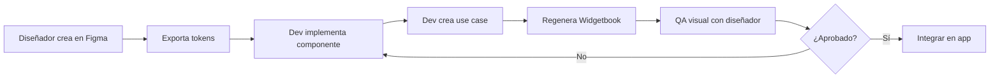

# 📖 Widgetbook - Catálogo de Componentes UI

Guía completa para usar Widgetbook como herramienta de QA de diseño UI en AltruPets.

## ¿Qué es Widgetbook?

Widgetbook es un catálogo interactivo de componentes UI que permite:

- 🎨 **Visualizar componentes** en aislamiento sin ejecutar la app completa
- 🔧 **Probar variaciones** de props, estados y temas en tiempo real
- 📱 **Validar diseño** antes de integrar en la aplicación
- 🤝 **Colaborar con diseñadores** mostrando componentes implementados
- 📚 **Documentar** el Design System de forma visual e interactiva

## Ubicación

```
apps/widgetbook/
├── lib/
│   ├── main.dart                    # Entry point con tabs
│   ├── main.directories.g.dart      # Generado por build_runner
│   ├── showcase/                    # Showcase del Design System
│   │   ├── design_system_showcase.dart
│   │   ├── tonal_palette_generator.dart
│   │   ├── typography_showcase.dart
│   │   └── elevation_showcase.dart
│   └── use_cases/                   # Use cases de componentes
│       ├── atoms/                   # Componentes básicos
│       ├── molecules/               # Componentes compuestos
│       └── organisms/               # Componentes complejos
├── pubspec.yaml
└── README.md
```

## Arquitectura

Widgetbook en AltruPets tiene dos secciones principales:

### 1. Widgetbook (Tab 1)
Catálogo interactivo de componentes individuales con controles (knobs) para modificar props en tiempo real.

### 2. Showcase (Tab 2)
Visualización completa del Design System:
- **Colors**: Paletas tonales, colores primarios, secundarios, etc.
- **Typography**: Escalas tipográficas (Display, Headline, Body, Label)
- **Elevation**: Niveles de sombra y profundidad

## Lanzar Widgetbook

### Opción 1: Script Automatizado (Recomendado)

```bash
# Desde la raíz del monorepo
make dev-mobile-widgetbook
```

El script automáticamente:
1. Ejecuta `flutter pub get`
2. Genera código con `build_runner`
3. Abre Widgetbook en Chrome (o desktop si Chrome no está disponible)

### Opción 2: Manual

```bash
cd apps/widgetbook

# Instalar dependencias
flutter pub get

# Generar directorios (IMPORTANTE)
dart run build_runner build -d

# Ejecutar en Chrome
flutter run -d chrome

# O en desktop
flutter run -d linux   # macOS: macos, Windows: windows
```

## Flujo de Trabajo para QA de UI

### 1. Diseñador crea mockups en Figma

El diseñador trabaja en Figma y define:
- Colores (tokens de diseño)
- Tipografías
- Espaciados
- Componentes

### 2. Desarrollador implementa componente

```dart
// apps/mobile/lib/core/widgets/atoms/app_circular_button.dart
class AppCircularButton extends StatelessWidget {
  final IconData icon;
  final VoidCallback onTap;
  final double size;
  final Color? iconColor;
  final double iconSize;
  final Gradient? gradient;
  final List<BoxShadow>? boxShadow;

  const AppCircularButton({
    super.key,
    required this.icon,
    required this.onTap,
    this.size = 56,
    this.iconColor,
    this.iconSize = 24,
    this.gradient,
    this.boxShadow,
  });

  @override
  Widget build(BuildContext context) {
    // Implementación...
  }
}
```

### 3. Crear Use Case en Widgetbook

```dart
// apps/widgetbook/lib/use_cases/atoms/app_circular_button_use_case.dart
import 'package:flutter/material.dart';
import 'package:widgetbook/widgetbook.dart';
import 'package:widgetbook_annotation/widgetbook_annotation.dart' as widgetbook;
import 'package:altrupets/core/widgets/atoms/app_circular_button.dart';

@widgetbook.UseCase(name: 'Default', type: AppCircularButton)
Widget buildAppCircularButtonUseCase(BuildContext context) {
  return AppCircularButton(
    icon: Icons.add,
    onTap: () {},
    size: context.knobs.double.slider(
      label: 'Size',
      initialValue: 56,
      min: 32,
      max: 80,
    ),
    iconColor: context.knobs.color(
      label: 'Icon Color',
      initialValue: Colors.white,
    ),
    iconSize: context.knobs.double.slider(
      label: 'Icon Size',
      initialValue: 24,
      min: 16,
      max: 40,
    ),
  );
}

@widgetbook.UseCase(name: 'With Gradient', type: AppCircularButton)
Widget buildAppCircularButtonGradientUseCase(BuildContext context) {
  return AppCircularButton(
    icon: Icons.home_rounded,
    onTap: () {},
    size: 56,
    iconSize: 30,
    gradient: LinearGradient(
      colors: [
        Theme.of(context).colorScheme.secondary,
        Theme.of(context).colorScheme.primary,
      ],
    ),
  );
}
```

### 4. Regenerar Widgetbook

```bash
cd apps/widgetbook
dart run build_runner build -d
```

Esto genera `main.directories.g.dart` que registra automáticamente todos los use cases.

### 5. QA Visual con Diseñador

1. **Abrir Widgetbook**: `make dev-mobile-widgetbook`
2. **Navegar al componente** en el árbol de la izquierda
3. **Probar variaciones** usando los knobs (controles)
4. **Cambiar tema** (Light/Dark) con el addon de tema
5. **Validar** que coincida con el diseño de Figma
6. **Iterar** si hay diferencias

### 6. Capturar Screenshots (Opcional)

```bash
# Mientras Widgetbook está corriendo
flutter screenshot --out=screenshots/button_default.png
```

## Anatomía de un Use Case

### Estructura Básica

```dart
import 'package:widgetbook_annotation/widgetbook_annotation.dart' as widgetbook;

@widgetbook.UseCase(name: 'Nombre del Caso', type: MiWidget)
Widget buildMiWidgetUseCase(BuildContext context) {
  return MiWidget(
    // Props del widget
  );
}
```

### Knobs Disponibles

Los knobs permiten controlar props en tiempo real:

```dart
// Slider numérico
context.knobs.double.slider(
  label: 'Size',
  initialValue: 56,
  min: 32,
  max: 80,
)

// Input de texto
context.knobs.string(
  label: 'Title',
  initialValue: 'Hello World',
)

// Selector de color
context.knobs.color(
  label: 'Background Color',
  initialValue: Colors.blue,
)

// Boolean (checkbox)
context.knobs.boolean(
  label: 'Enabled',
  initialValue: true,
)

// Lista de opciones
context.knobs.list(
  label: 'Size',
  options: ['small', 'medium', 'large'],
  initialOption: 'medium',
)
```

### Múltiples Variantes

Puedes crear múltiples use cases para el mismo widget:

```dart
@widgetbook.UseCase(name: 'Default', type: AppButton)
Widget buildDefaultButton(BuildContext context) {
  return AppButton(text: 'Click me');
}

@widgetbook.UseCase(name: 'Loading', type: AppButton)
Widget buildLoadingButton(BuildContext context) {
  return AppButton(text: 'Loading...', isLoading: true);
}

@widgetbook.UseCase(name: 'Disabled', type: AppButton)
Widget buildDisabledButton(BuildContext context) {
  return AppButton(text: 'Disabled', enabled: false);
}
```

## Organización por Atomic Design

Widgetbook en AltruPets sigue Atomic Design:

### Atoms (Átomos)
Componentes básicos e indivisibles:
- `AppCircularButton`
- `AppRoleBadge`
- `AppAccentBar`

**Ubicación:**
- Implementación: `apps/mobile/lib/core/widgets/atoms/`
- Use cases: `apps/widgetbook/lib/use_cases/atoms/`

### Molecules (Moléculas)
Combinación de átomos:
- `HomeWelcomeHeader`
- `SectionHeader`
- `AppInputCard`
- `ProfileMenuOption`

**Ubicación:**
- Implementación: `apps/mobile/lib/core/widgets/molecules/`
- Use cases: `apps/widgetbook/lib/use_cases/molecules/`

### Organisms (Organismos)
Componentes complejos:
- `MainNavigationBar`
- `ProfileHeader`
- `StickyActionFooter`

**Ubicación:**
- Implementación: `apps/mobile/lib/core/widgets/organisms/`
- Use cases: `apps/widgetbook/lib/use_cases/organisms/`

## Showcase del Design System

El tab "Showcase" muestra el Design System completo:

### Colors (Paletas Tonales)

Visualiza todas las paletas de color:
- Primary (Azul)
- Secondary (Naranja)
- Tertiary
- Error
- Neutral
- Neutral Variant

Cada paleta muestra tonos del 0 al 100.

### Typography (Tipografía)

Muestra todas las escalas tipográficas:
- **Display**: displayLarge, displayMedium, displaySmall
- **Headline**: headlineLarge, headlineMedium, headlineSmall
- **Title**: titleLarge, titleMedium, titleSmall
- **Body**: bodyLarge, bodyMedium, bodySmall
- **Label**: labelLarge, labelMedium, labelSmall

### Elevation (Elevación)

Visualiza los 5 niveles de elevación con sus sombras correspondientes.

## Comandos Útiles

### Regenerar Código

```bash
cd apps/widgetbook

# Build una vez
dart run build_runner build -d

# Watch mode (regenera automáticamente)
dart run build_runner watch -d
```

### Limpiar y Regenerar

```bash
cd apps/widgetbook
flutter clean
flutter pub get
dart run build_runner build --delete-conflicting-outputs
```

### Ejecutar en Diferentes Plataformas

```bash
# Chrome (recomendado para QA)
flutter run -d chrome

# Linux desktop
flutter run -d linux

# macOS desktop
flutter run -d macos

# Windows desktop
flutter run -d windows
```

## Checklist de QA Visual

Usa este checklist al validar componentes con el diseñador:

### ✅ Colores
- [ ] Colores coinciden con tokens de Figma
- [ ] Tema claro funciona correctamente
- [ ] Tema oscuro funciona correctamente
- [ ] Estados hover/pressed tienen feedback visual

### ✅ Tipografía
- [ ] Fuentes correctas (Lemon Milk / Poppins)
- [ ] Tamaños de texto coinciden con diseño
- [ ] Line height y letter spacing correctos
- [ ] Jerarquía visual clara

### ✅ Espaciado
- [ ] Padding interno correcto
- [ ] Margin externo correcto
- [ ] Espaciado entre elementos consistente

### ✅ Interactividad
- [ ] Botones responden al tap
- [ ] Animaciones suaves (si aplica)
- [ ] Estados disabled visualmente claros
- [ ] Loading states funcionan

### ✅ Responsive
- [ ] Se adapta a diferentes anchos
- [ ] Texto no se corta
- [ ] Imágenes escalan correctamente

### ✅ Accesibilidad
- [ ] Contraste de color suficiente (WCAG AA)
- [ ] Tamaños de tap targets >= 44x44
- [ ] Semantic labels presentes

## Integración con Figma

### Exportar Tokens de Figma

1. Diseñador exporta tokens desde Figma usando plugin "Design Tokens"
2. Tokens se guardan en `apps/mobile/assets/style_dictionary/`
3. Desarrollador ejecuta Style Dictionary para generar código Dart
4. Tokens se aplican en `apps/mobile/lib/core/theme/`

### Validar Implementación

1. Abrir Figma y Widgetbook lado a lado
2. Comparar visualmente componente en ambos
3. Usar herramientas de medición de Figma para verificar espaciados
4. Usar inspector de color para verificar valores exactos

## Troubleshooting

### "Could not find generator 'widgetbook_generator'"

**Solución:**
```bash
cd apps/widgetbook
flutter clean
flutter pub get
dart run build_runner build -d
```

### Use case no aparece en Widgetbook

**Causas comunes:**
1. Falta anotación `@widgetbook.UseCase`
2. No se regeneró `main.directories.g.dart`
3. Archivo no está en `lib/use_cases/`

**Solución:**
```bash
dart run build_runner build --delete-conflicting-outputs
```

### Chrome no está disponible

**Solución:**
```bash
# Usar desktop en su lugar
flutter run -d linux  # o macos/windows
```

### Componente no se importa correctamente

**Causa:** El componente está en `apps/mobile` y Widgetbook lo importa como dependencia.

**Solución:**
```dart
// Importar desde el paquete altrupets
import 'package:altrupets/core/widgets/atoms/mi_widget.dart';
```

### Hot reload no funciona

**Solución:**
- Usa Hot Restart (`R`) en lugar de Hot Reload (`r`)
- O reinicia completamente: `q` + `flutter run`

## Mejores Prácticas

### 1. Un Use Case por Estado

Crea use cases separados para cada estado significativo:
```dart
@widgetbook.UseCase(name: 'Default', type: AppButton)
@widgetbook.UseCase(name: 'Loading', type: AppButton)
@widgetbook.UseCase(name: 'Disabled', type: AppButton)
@widgetbook.UseCase(name: 'Error', type: AppButton)
```

### 2. Usa Knobs para Props Variables

Permite al diseñador experimentar:
```dart
size: context.knobs.double.slider(
  label: 'Size',
  initialValue: 56,
  min: 32,
  max: 80,
)
```

### 3. Proporciona Contexto Visual

Envuelve componentes en contenedores con fondo si es necesario:
```dart
return Container(
  width: 400,
  color: const Color(0xFF0F172A),
  child: MiWidget(),
);
```

### 4. Documenta Variantes Importantes

Crea use cases para casos de uso reales:
```dart
@widgetbook.UseCase(name: 'With Long Text', type: AppCard)
@widgetbook.UseCase(name: 'With Image', type: AppCard)
@widgetbook.UseCase(name: 'Empty State', type: AppCard)
```

### 5. Mantén Sincronizado con Mobile

Cuando cambies un componente en `apps/mobile`:
1. Actualiza el use case correspondiente en `apps/widgetbook`
2. Regenera con `build_runner`
3. Valida visualmente

## Workflow Completo: Diseño → Implementación → QA



### Paso a Paso

1. **Diseñador**: Crea componente en Figma con especificaciones
2. **Desarrollador**: Implementa en `apps/mobile/lib/core/widgets/`
3. **Desarrollador**: Crea use case en `apps/widgetbook/lib/use_cases/`
4. **Desarrollador**: Regenera Widgetbook
5. **Ambos**: Sesión de QA visual en Widgetbook
6. **Diseñador**: Aprueba o solicita cambios
7. **Desarrollador**: Itera hasta aprobación
8. **Desarrollador**: Integra componente en features de la app

## Recursos Adicionales

- [Widgetbook Documentation](https://docs.widgetbook.io/)
- [Atomic Design Methodology](https://bradfrost.com/blog/post/atomic-web-design/)
- [Material Design 3](https://m3.material.io/)
- [AltruPets Design System](design-system.md)
- [Getting Started](getting-started.md)

## Próximas Mejoras

- [ ] Integración con Figma Dev Mode para comparación lado a lado
- [ ] Screenshots automáticos para regression testing
- [ ] Exportación de componentes a Storybook (web)
- [ ] Tests visuales automatizados con Golden Files
- [ ] Documentación inline en use cases

---

**Última actualización:** Febrero 2025
