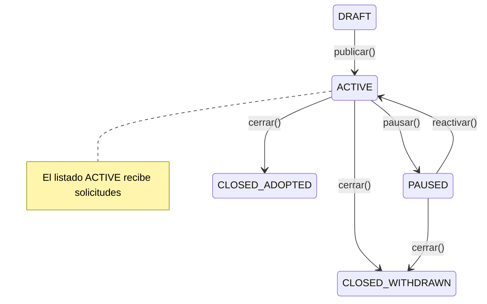
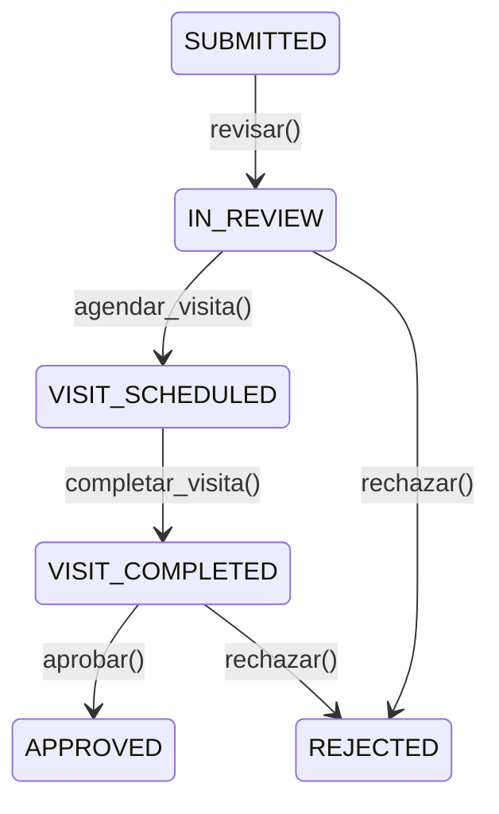

# Diseno: Flujo de Adopcion

**Change ID:** adoption-flow
**SRD Task:** T1-2 | **Linear:** ALT-14 | **Sprint:** 3 (v0.5.0)

---

## 1. Modelo de Datos

### 1.1 Entidad: AdoptionListing

Representa un animal publicado como disponible para adopcion. Se crea cuando el rescatista marca un animal existente (entidad `Animal`, status `IN_CASA_CUNA`) como listo para adoptar.

**AdoptionListing**

| Campo | Tipo | Notas |
|-------|------|-------|
| id | UUID (PK) | |
| animalId | UUID (FK -> animals.id, UNIQUE) | |
| publishedByUserId | UUID (FK -> users.id) | |
| casaCunaId | UUID (FK -> casas_cunas.id) | |
| status | AdoptionListingStatus (enum) | |
| **Datos de presentacion** | | |
| title | string | |
| description | text | |
| photos | string[] | URLs, min 1, max 10 |
| temperament | string[] | ej: ['tranquilo', 'jugueton', 'bueno_con_ninos'] |
| specialNeeds | text (nullable) | |
| medicalSummary | text | resumen del historial medico |
| **Filtros de busqueda** | | |
| species | AnimalSpecies (DOG, CAT, OTHER) | derivado de Animal |
| size | AnimalSize (SMALL, MEDIUM, LARGE) | nuevo campo |
| ageCategory | AgeCategory (PUPPY_KITTEN, YOUNG, ADULT, SENIOR) | |
| isChildFriendly | boolean | |
| isGoodWithOtherPets | boolean | |
| isSterilized | boolean | |
| location | Point (geometry, SRID 4326) | heredado de CasaCuna |
| **Requisitos del adoptante** | | |
| requirements | text | condiciones que pone el rescatista |
| requiresYard | boolean (default false) | |
| requiresExperience | boolean (default false) | |
| **Auditoria** | | |
| publishedAt | timestamp | |
| closedAt | timestamp (nullable) | |
| createdAt | timestamp | |
| updatedAt | timestamp | |

**Enum AdoptionListingStatus:**
- `DRAFT` — Listado creado pero no publicado
- `ACTIVE` — Publicado y visible para adoptantes
- `PAUSED` — Temporalmente oculto (rescatista lo pausa)
- `CLOSED_ADOPTED` — Animal fue adoptado
- `CLOSED_WITHDRAWN` — Rescatista retiro el listado

**Indices:**
- `IDX_adoption_listing_animal` en `animalId` (UNIQUE)
- `IDX_adoption_listing_status` en `status`
- `IDX_adoption_listing_species` en `species`
- `IDX_adoption_listing_location` (GIST) en `location`
- `IDX_adoption_listing_published` en `publishedAt`

### 1.2 Entidad: AdoptionApplication

Representa la solicitud de adopcion enviada por un adoptante para un listado especifico.

**AdoptionApplication**

| Campo | Tipo | Notas |
|-------|------|-------|
| id | UUID (PK) | |
| listingId | UUID (FK -> adoption_listings.id) | |
| applicantUserId | UUID (FK -> users.id) | |
| reviewerUserId | UUID (FK -> users.id, nullable) | |
| status | ApplicationStatus (enum) | |
| **Cuestionario del hogar** | | |
| housingType | HousingType (HOUSE, APARTMENT, FARM, OTHER) | |
| hasYard | boolean | |
| yardSize | string (nullable) | |
| householdMembers | int | |
| hasChildren | boolean | |
| childrenAges | string (nullable) | descripcion |
| hasOtherPets | boolean | |
| otherPetsDescription | string (nullable) | |
| previousPetExperience | text | |
| dailyHoursAlone | int | horas que el animal estaria solo |
| adoptionMotivation | text | |
| additionalNotes | text (nullable) | |
| **Datos de contacto del solicitante** | | |
| contactPhone | string | |
| contactEmail | string | |
| preferredContactMethod | ContactMethod (PHONE, EMAIL, WHATSAPP) | |
| **Proceso de revision** | | |
| reviewNotes | text (nullable) | notas internas del rescatista |
| visitScheduledAt | timestamp (nullable) | |
| visitCompletedAt | timestamp (nullable) | |
| visitNotes | text (nullable) | |
| rejectionReason | text (nullable) | |
| **Auditoria** | | |
| submittedAt | timestamp | |
| reviewedAt | timestamp (nullable) | |
| resolvedAt | timestamp (nullable) | |
| createdAt | timestamp | |
| updatedAt | timestamp | |

**Enum ApplicationStatus:**
- `SUBMITTED` — Solicitud enviada, pendiente de revision
- `IN_REVIEW` — Rescatista esta revisando
- `VISIT_SCHEDULED` — Visita/videollamada agendada
- `VISIT_COMPLETED` — Visita realizada
- `APPROVED` — Adopcion aprobada
- `REJECTED` — Solicitud rechazada

**Enum HousingType:** `HOUSE`, `APARTMENT`, `FARM`, `OTHER`
**Enum ContactMethod:** `PHONE`, `EMAIL`, `WHATSAPP`

**Indices:**
- `IDX_application_listing` en `listingId`
- `IDX_application_applicant` en `applicantUserId`
- `IDX_application_status` en `status`
- `UQ_application_listing_applicant` en (`listingId`, `applicantUserId`) — un adoptante solo puede aplicar una vez por listado

### 1.3 Cambios a Entidades Existentes

**Animal (entity existente):**
- Agregar valor `READY_FOR_ADOPTION` al enum `AnimalStatus`
- Nuevo campo opcional `size: AnimalSize` (SMALL, MEDIUM, LARGE)
- Nuevo campo opcional `ageCategory: AgeCategory` (PUPPY_KITTEN, YOUNG, ADULT, SENIOR)
- Nuevo campo opcional `isSterilized: boolean`

---

## 2. Maquina de Estados

### 2.1 Flujo del Listado (AdoptionListing)



**Transiciones validas:**
| Desde | Hacia | Accion | Actor |
|-------|-------|--------|-------|
| DRAFT | ACTIVE | `publishListing()` | Rescatista (P05/P06) |
| ACTIVE | PAUSED | `pauseListing()` | Rescatista |
| PAUSED | ACTIVE | `reactivateListing()` | Rescatista |
| ACTIVE | CLOSED_ADOPTED | `closeListing(reason: ADOPTED)` | Rescatista |
| ACTIVE | CLOSED_WITHDRAWN | `closeListing(reason: WITHDRAWN)` | Rescatista |
| PAUSED | CLOSED_WITHDRAWN | `closeListing(reason: WITHDRAWN)` | Rescatista |

**Reglas de negocio:**
- Solo se puede publicar si el animal tiene al menos 1 foto y status `READY_FOR_ADOPTION`
- Al cerrar como ADOPTED, se actualiza `Animal.status` a `ADOPTED`
- Al cerrar, todas las solicitudes pendientes pasan a `REJECTED` con razon automatica

### 2.2 Flujo de Solicitud (AdoptionApplication)



**Transiciones validas:**
| Desde | Hacia | Accion | Actor |
|-------|-------|--------|-------|
| SUBMITTED | IN_REVIEW | `reviewApplication()` | Rescatista |
| IN_REVIEW | VISIT_SCHEDULED | `scheduleVisit(date)` | Rescatista |
| IN_REVIEW | REJECTED | `rejectApplication(reason)` | Rescatista |
| VISIT_SCHEDULED | VISIT_COMPLETED | `completeVisit(notes)` | Rescatista |
| VISIT_COMPLETED | APPROVED | `approveApplication()` | Rescatista |
| VISIT_COMPLETED | REJECTED | `rejectApplication(reason)` | Rescatista |

**Reglas de negocio:**
- Un adoptante solo puede tener 1 solicitud activa (no REJECTED) por listado
- Un adoptante puede tener maximo 3 solicitudes activas simultaneas en toda la plataforma
- Solo se puede enviar solicitud a listados con status `ACTIVE`
- Al aprobar una solicitud, todas las demas solicitudes del mismo listado pasan a `REJECTED`
- Al aprobar, el listado pasa a `CLOSED_ADOPTED` automaticamente

---

## 3. API GraphQL

### 3.1 Queries

```graphql
# Galeria publica de listados con filtros
adoptionListings(
  filter: AdoptionListingFilter
  pagination: PaginationInput
  sort: AdoptionListingSort
): AdoptionListingConnection!

# Detalle de un listado
adoptionListing(id: ID!): AdoptionListing

# Solicitudes recibidas para un listado (rescatista)
adoptionApplications(
  listingId: ID!
  status: ApplicationStatus
): [AdoptionApplication!]!

# Mis solicitudes enviadas (adoptante)
myAdoptionApplications: [AdoptionApplication!]!

# Mis listados publicados (rescatista)
myAdoptionListings(status: AdoptionListingStatus): [AdoptionListing!]!
```

**AdoptionListingFilter:**
```graphql
input AdoptionListingFilter {
  species: AnimalSpecies
  size: AnimalSize
  ageCategory: AgeCategory
  isChildFriendly: Boolean
  isGoodWithOtherPets: Boolean
  isSterilized: Boolean
  nearLocation: LocationInput    # lat, lng
  radiusKm: Float                # default 25
  searchText: String             # busqueda en title + description
}
```

### 3.2 Mutations

```graphql
# --- Rescatista ---
createAdoptionListing(input: CreateAdoptionListingInput!): AdoptionListing!
publishAdoptionListing(id: ID!): AdoptionListing!
pauseAdoptionListing(id: ID!): AdoptionListing!
reactivateAdoptionListing(id: ID!): AdoptionListing!
closeAdoptionListing(id: ID!, reason: CloseReason!): AdoptionListing!
updateAdoptionListing(id: ID!, input: UpdateAdoptionListingInput!): AdoptionListing!

# --- Adoptante ---
submitAdoptionApplication(input: SubmitAdoptionApplicationInput!): AdoptionApplication!

# --- Rescatista (revision) ---
reviewAdoptionApplication(id: ID!): AdoptionApplication!
scheduleVisit(id: ID!, scheduledAt: DateTime!): AdoptionApplication!
completeVisit(id: ID!, notes: String): AdoptionApplication!
approveAdoptionApplication(id: ID!): AdoptionApplication!
rejectAdoptionApplication(id: ID!, reason: String!): AdoptionApplication!
```

### 3.3 Autorizacion

| Operacion | Roles permitidos | Condicion adicional |
|-----------|-----------------|---------------------|
| Listar/ver listados | Todos los autenticados | Solo listados ACTIVE (excepto propios) |
| Crear/editar/publicar listado | Rescatista, Lider ONG | Solo para animales en su casa cuna |
| Enviar solicitud | Adoptante | No puede ser el dueno del listado |
| Revisar/aprobar/rechazar | Rescatista, Lider ONG | Solo para solicitudes de sus listados |

---

## 4. Diseno de UI Mobile (Flutter)

### 4.1 Galeria de Listados — `/adoptions`

**Pantalla principal para adoptantes.** Accesible desde el tab de navegacion principal.

**Layout:** Pantalla con AppBar (titulo "Adopciones", icono filtro), fila de chips de especie (Perros / Gatos / Todos), grid de 2 columnas con cards. Cada card muestra: foto del animal, nombre, especie y edad, ubicacion, icono de favorito. Al final: boton "Cargar mas..."

**Ejemplo de cards:**
- Luna, Perra 2a, San Jose
- Max, Gato 1a, Heredia
- Rocky, Perro 5a, Cartago
- Mimi, Gata 3a, Alajuela

**Bottom sheet de filtros (al tocar icono filtro):**
- Especie (chips)
- Tamano: Pequeno / Mediano / Grande
- Edad: Cachorro / Joven / Adulto / Senior
- Compatible con ninos (toggle)
- Bueno con otras mascotas (toggle)
- Esterilizado (toggle)
- Distancia maxima (slider: 5-100 km)
- Boton "Aplicar filtros" + "Limpiar"

### 4.2 Detalle del Listado — `/adoptions/{id}`

**Layout:** Pantalla con AppBar (boton back, menu overflow). Componentes de arriba hacia abajo:

1. **Carrusel de fotos** (PageView con indicador de pagina, swipe horizontal)
2. **Info basica**: Nombre (Luna), especie/edad/tamano (Perra mestiza, 2 anos, Mediana), ubicacion (San Jose, Costa Rica)
3. **Seccion Temperamento**: Chips (Tranquila, Juguetona, Buena con ninos)
4. **Seccion Sobre Luna**: Descripcion textual del animal
5. **Seccion Historial Medico**: Resumen de vacunas, esterilizacion, condiciones
6. **Seccion Requisitos**: Condiciones del rescatista para el adoptante
7. **Info adicional**: Casa cuna (Patitas Felices), fecha de publicacion (hace 3 dias)
8. **Boton sticky inferior**: "Solicitar Adopcion"

### 4.3 Formulario de Solicitud — `/adoptions/{id}/apply`

**Layout:** Pantalla con AppBar (titulo "Solicitud de Adopcion"). Componentes de arriba hacia abajo:

1. **Resumen del animal**: Card con foto, nombre y datos (Luna, Perra 2a)
2. **Seccion Tu Hogar**:
   - Tipo de vivienda (dropdown: Casa, Apartamento, etc.)
   - Tiene patio? (toggle Si/No)
   - Tamano del patio (campo de texto condicional)
3. **Seccion Tu Familia**:
   - Miembros del hogar (campo numerico)
   - Hay ninos? (toggle Si/No)
   - Edades de los ninos (campo de texto condicional)
   - Tiene otras mascotas? (toggle Si/No)
   - Cuales (campo de texto condicional)
4. **Seccion Experiencia**:
   - Experiencia previa con mascotas (textarea)
   - Horas diarias que el animal estaria solo (campo numerico)
   - Motivacion para adoptar (textarea)
5. **Seccion Contacto**:
   - Telefono (campo de texto)
   - Email (campo de texto)
   - Contacto preferido (chips: Telefono, Email, WhatsApp)
6. **Notas adicionales** (textarea opcional)
7. **Boton inferior**: "Enviar Solicitud"

### 4.4 Revision de Solicitudes (Rescatista) — `/casa-cuna/adoptions/{id}/review`

**Layout:** Pantalla con AppBar (titulo "Solicitudes para Luna"). Muestra contador ("3 solicitudes recibidas") seguido de lista vertical de cards. Cada card muestra:

- Nombre del solicitante
- Tiempo desde envio
- Estado (badge con color)
- Resumen del hogar (tipo vivienda, ninos, mascotas)
- Experiencia
- Boton "Ver detalle >"

**Ejemplo de solicitudes:**
- Maria Elena Vargas: hace 2 dias, SUBMITTED, casa con patio, sin ninos, 5 anos experiencia
- Carlos Jimenez: hace 1 dia, IN_REVIEW, apartamento, 2 ninos, 2 anos experiencia
- Ana Mora: hoy, SUBMITTED, casa con patio, 1 perro, 10 anos experiencia

### 4.5 Detalle de Solicitud + Acciones — `/casa-cuna/adoptions/{appId}`

**Layout:** Pantalla con AppBar (titulo "Solicitud de Maria Elena"). Componentes de arriba hacia abajo:

1. **Header**: Estado (IN_REVIEW), animal (Luna, Perra 2a), fecha de envio (26 marzo 2026)
2. **Seccion Datos del Hogar**: Vivienda (Casa), patio (Si, 50 m2), miembros (2 adultos), ninos (No), otras mascotas (No)
3. **Seccion Experiencia**: Texto de experiencia previa, horas solo (4)
4. **Seccion Motivacion**: Texto de motivacion del adoptante
5. **Seccion Contacto**: Telefono (+506 8888-1234), email (maria@email.com), contacto preferido (WhatsApp)
6. **Seccion Notas del Rescatista**: Textarea editable para notas internas
7. **Botones de accion** (contextuales segun estado):
   - En IN_REVIEW: "Agendar Visita" + "Rechazar"
   - Despues de visita completada: "Aprobar Adopcion" + "Rechazar"

### 4.6 Navegacion

| Ruta | Pantalla | Actor |
|------|----------|-------|
| `/adoptions` | Galeria de listados con filtros | Adoptante (cualquier autenticado) |
| `/adoptions/{id}` | Detalle del listado | Adoptante |
| `/adoptions/{id}/apply` | Formulario de solicitud | Adoptante |
| `/casa-cuna/animals/{id}/publish` | Crear/editar listado de adopcion | Rescatista |
| `/casa-cuna/adoptions` | Mis listados publicados | Rescatista |
| `/casa-cuna/adoptions/{id}/review` | Solicitudes para un listado | Rescatista |
| `/casa-cuna/adoptions/{appId}` | Detalle de solicitud + acciones | Rescatista |

---

## 5. Notificaciones

Integracion con el sistema de push notifications (T1-3, Sprint 3).

| Trigger | Destinatario | Contenido | REQ |
|---------|-------------|-----------|-----|
| Nuevo listado coincide con preferencias | Adoptantes con match | "Nuevo animal disponible: {nombre}" | REQ-NOT-005 |
| Nueva solicitud recibida | Rescatista dueno del listado | "{adoptante} quiere adoptar a {animal}" | -- |
| Solicitud en revision | Adoptante | "Tu solicitud para {animal} esta en revision" | -- |
| Visita agendada | Adoptante | "Visita agendada para {fecha}" | -- |
| Solicitud aprobada | Adoptante | "Tu adopcion de {animal} fue aprobada!" | -- |
| Solicitud rechazada | Adoptante | "Tu solicitud para {animal} no fue aprobada" | -- |

---

## 6. Consideraciones Tecnicas

### 6.1 Backend (NestJS + TypeORM + GraphQL)

- Modulo nuevo: `apps/backend/src/adoptions/`
- Entidades en `adoptions/entities/`: `adoption-listing.entity.ts`, `adoption-application.entity.ts`
- Resolver: `adoptions.resolver.ts` (listados) + `adoption-applications.resolver.ts` (solicitudes)
- Service: `adoptions.service.ts` + `adoption-applications.service.ts`
- Guard: `@UseGuards(JwtAuthGuard)` en todas las mutaciones
- Validacion de transiciones de estado con patron State Machine (metodo privado `validateTransition()`)
- Consulta de proximidad con PostGIS: `ST_DWithin(location, ST_MakePoint(:lng, :lat)::geography, :radiusMeters)`

### 6.2 Mobile (Flutter + Riverpod)

- Feature nuevo: `apps/mobile/lib/features/adoptions/`
- Estructura Clean Architecture:
  - `data/`: repositories, models, datasources
  - `domain/`: entities, usecases, repository interfaces
  - `presentation/`: pages, widgets, providers
- Paginacion: cursor-based para la galeria (scroll infinito)
- Cache de imagenes: `cached_network_image`
- Estado local: Riverpod providers con estados de carga/error/datos

### 6.3 Migraciones de BD

- Migracion 1: Crear tabla `adoption_listings` con indices y relaciones
- Migracion 2: Crear tabla `adoption_applications` con constraint unique
- Migracion 3: Agregar campos `size`, `ageCategory`, `isSterilized` a tabla `animals`; agregar valor `READY_FOR_ADOPTION` al enum `animal_status`
