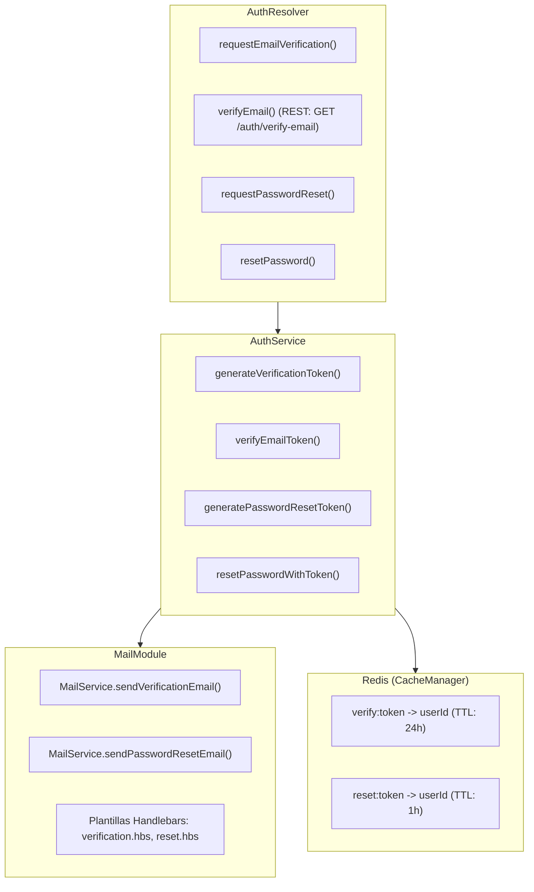
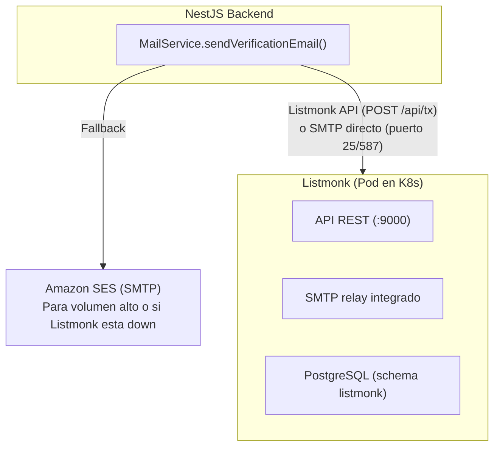

# Diseno: Verificacion de Correo y Restablecimiento de Contrasena

**Change ID**: `auth-email-password`
**Servicios afectados**: AuthModule, UsersModule, AppModule

---

## 1. Arquitectura General

Se agrega un `MailModule` global al backend NestJS que encapsula el envio de emails transaccionales. Los flujos de verificacion y reset generan tokens almacenados en el cache Redis existente (`CACHE_MANAGER`) y envian enlaces por email.



## 2. Servidor de Correos (Estrategia SMTP)

### Opciones de Transporte

El `MailModule` usa SMTP genérico, lo que permite conectar a cualquier proveedor. Estrategia recomendada: **self-hosted en K8s** para control total + fallback a servicio externo.

| Opción | Tipo | Stack | K8s Ready | Mejor para |
|--------|------|-------|-----------|------------|
| **Listmonk** (recomendado) | Self-hosted | Binario unico Go + PostgreSQL | Si - Helm Charts community | Transaccional + newsletters, ligero, ya usamos PostgreSQL |
| **Mailtrain** | Self-hosted | Node.js + MySQL/MariaDB + Redis | Si - Manifiestos YAML | Marketing automation, compatible con stack Node |
| **Mautic** | Self-hosted | PHP/Apache + MariaDB | Parcial - Mas pesado | Marketing avanzado, flujos complejos |
| **Amazon SES** | Managed | API/SMTP | N/A | Alto volumen, bajo costo ($0.10/1000 emails) |
| **Ethereal** | Dev only | Fake SMTP | N/A | Desarrollo local (ya configurado como default) |

### Recomendación: Listmonk en K8s

**¿Por qué Listmonk?**
1. **Binario único Go** — imagen Docker de ~15MB, startup <2s
2. **PostgreSQL nativo** — reutiliza la instancia existente del backend (misma DB, schema separado)
3. **API REST completa** — enviar emails transaccionales via `POST /api/tx`
4. **Templates** — motor de templates integrado con variables
5. **Bounce handling** — gestión automática de rebotes
6. **Helm Charts** — despliegue con `helm install listmonk listmonk/listmonk`

### Arquitectura con Listmonk



### Configuración dual en MailModule

El `MailModule` debe soportar ambos transportes (self-hosted y fallback) via config:

```yaml
# K8s ConfigMap
SMTP_HOST: listmonk.altrupets-dev.svc.cluster.local  # Listmonk interno
SMTP_PORT: 25
SMTP_SECURE: false
SMTP_FALLBACK_HOST: email-smtp.us-east-1.amazonaws.com  # SES fallback
SMTP_FALLBACK_USER: ${SES_ACCESS_KEY}
SMTP_FALLBACK_PASS: ${SES_SECRET_KEY}
```

## 3. MailModule (NestJS Mailer)

### Dependencia

```
@nestjs-modules/mailer + handlebars
```

### Configuracion del modulo

```typescript
// src/mail/mail.module.ts
@Module({
  imports: [
    MailerModule.forRootAsync({
      imports: [ConfigModule],
      useFactory: (config: ConfigService) => ({
        transport: {
          host: config.get('SMTP_HOST', 'smtp.ethereal.email'),
          port: config.get<number>('SMTP_PORT', 587),
          secure: config.get<boolean>('SMTP_SECURE', false),
          auth: {
            user: config.get('SMTP_USER'),
            pass: config.get('SMTP_PASS'),
          },
        },
        defaults: {
          from: config.get('MAIL_FROM', '"AltruPets" <noreply@altrupets.com>'),
        },
        template: {
          dir: join(__dirname, 'templates'),
          adapter: new HandlebarsAdapter(),
          options: { strict: true },
        },
      }),
      inject: [ConfigService],
    }),
  ],
  providers: [MailService],
  exports: [MailService],
})
export class MailModule {}
```

### Variables de entorno requeridas

```env
SMTP_HOST=smtp.ethereal.email
SMTP_PORT=587
SMTP_SECURE=false
SMTP_USER=
SMTP_PASS=
MAIL_FROM="AltruPets" <noreply@altrupets.com>
APP_URL=http://localhost:3000
EMAIL_VERIFICATION_TTL=86400000   # 24 horas en ms
PASSWORD_RESET_TTL=3600000        # 1 hora en ms
```

## 3. Flujo de Verificacion de Correo

### Secuencia

1. Usuario se registra via `register` mutation (ya existente).
2. `AuthService.register()` llama a `MailService.sendVerificationEmail()` despues de crear el usuario.
3. Se genera un token aleatorio (`randomBytes(32).toString('hex')`), se almacena en Redis como `verify:<token> -> userId` con TTL de 24h.
4. El email contiene un enlace: `${APP_URL}/auth/verify-email?token=<token>`.
5. El usuario hace clic en el enlace -> endpoint REST `GET /auth/verify-email`.
6. El backend valida el token en Redis, marca `isVerified = true` en la entidad User, elimina el token.
7. Redirige a una pagina de confirmacion o retorna JSON de exito.

### Por que REST y no GraphQL para verify-email

El enlace de verificacion se abre desde un cliente de correo (Gmail, Outlook). Los clientes de correo solo soportan enlaces GET. GraphQL opera exclusivamente via POST, por lo que el endpoint de verificacion debe ser REST.

### Mutations y Endpoints

```graphql
# Solicitar reenvio de verificacion (usuario autenticado)
mutation requestEmailVerification {
  requestEmailVerification: Boolean!
}
```

```
# Verificar email (REST, enlace desde email)
GET /auth/verify-email?token=<token>
Response: 302 redirect a pagina de confirmacion
         o 200 JSON { verified: true }
```

### Logica en AuthService

```typescript
async sendVerificationEmail(userId: string): Promise<void> {
  const user = await this.userRepository.findById(userId);
  if (!user || !user.email) throw new Error('Usuario sin email');
  if (user.isVerified) throw new Error('Email ya verificado');

  const token = randomBytes(32).toString('hex');
  const ttl = this.configService.get<number>('EMAIL_VERIFICATION_TTL', 86400000);
  await this.cacheManager.set(`verify:${token}`, userId, ttl);

  await this.mailService.sendVerificationEmail(user.email, user.firstName, token);
}

async verifyEmailToken(token: string): Promise<boolean> {
  const userId = await this.cacheManager.get<string>(`verify:${token}`);
  if (!userId) throw new Error('Token invalido o expirado');

  await this.userRepository.update(userId, { isVerified: true });
  await this.cacheManager.del(`verify:${token}`);
  return true;
}
```

## 4. Flujo de Restablecimiento de Contrasena

### Secuencia

1. Usuario solicita reset via mutation `requestPasswordReset(email)`.
2. El sistema busca el usuario por email. Si no existe, retorna exito igualmente (previene enumeracion de usuarios).
3. Se genera token, se almacena en Redis como `reset:<token> -> userId` con TTL de 1h.
4. Se envia email con enlace: `${APP_URL}/auth/reset-password?token=<token>`.
5. El usuario abre el enlace en el navegador/app, ingresa nueva contrasena.
6. La app del usuario llama a mutation `resetPassword(token, newPassword)`.
7. El backend valida el token, hashea la nueva contrasena (mismo esquema doble SHA-256 existente), actualiza en BD, invalida el token, e invalida todas las sesiones activas del usuario.

### Mutations GraphQL

```graphql
# Solicitar restablecimiento (publico, sin auth)
mutation requestPasswordReset($email: String!) {
  requestPasswordReset(email: $email): Boolean!
}

# Ejecutar restablecimiento (publico, con token del email)
mutation resetPassword($resetInput: ResetPasswordInput!) {
  resetPassword(resetInput: $resetInput): Boolean!
}

input ResetPasswordInput {
  token: String!
  newPassword: String!
}
```

### Logica en AuthService

```typescript
async requestPasswordReset(email: string): Promise<boolean> {
  const user = await this.userRepository.findByEmail(email);
  // Siempre retorna true para prevenir enumeracion de usuarios
  if (!user) return true;

  const token = randomBytes(32).toString('hex');
  const ttl = this.configService.get<number>('PASSWORD_RESET_TTL', 3600000);
  await this.cacheManager.set(`reset:${token}`, user.id, ttl);

  await this.mailService.sendPasswordResetEmail(user.email, user.firstName, token);
  return true;
}

async resetPasswordWithToken(token: string, newPassword: string): Promise<boolean> {
  const userId = await this.cacheManager.get<string>(`reset:${token}`);
  if (!userId) throw new Error('Token invalido o expirado');

  const user = await this.userRepository.findById(userId);
  if (!user) throw new Error('Usuario no encontrado');

  // Mismo esquema de hash doble SHA-256 que register()
  const firstHash = createHash('sha256').update(newPassword).digest('hex');
  const combined = firstHash + PASSWORD_SALT + user.username.toLowerCase();
  const passwordHash = createHash('sha256').update(combined).digest('hex');

  await this.userRepository.update(userId, { passwordHash });
  await this.cacheManager.del(`reset:${token}`);

  // Invalidar todas las sesiones activas
  await this.cacheManager.del(`token:${userId}`);

  return true;
}
```

## 5. Plantillas de Email

### Estructura de archivos

```
src/mail/
  mail.module.ts
  mail.service.ts
  templates/
    verification.hbs
    reset.hbs
```

### Plantilla: verification.hbs

Contenido en espanol. Elementos clave:
- Logo de AltruPets
- Saludo personalizado con `{{firstName}}`
- Boton/enlace de verificacion: `{{verificationUrl}}`
- Texto explicativo: "Haz clic en el siguiente enlace para verificar tu correo electronico"
- Nota de expiracion: "Este enlace expira en 24 horas"
- Pie de pagina con info de contacto

### Plantilla: reset.hbs

Contenido en espanol. Elementos clave:
- Logo de AltruPets
- Saludo personalizado con `{{firstName}}`
- Texto: "Recibimos una solicitud para restablecer tu contrasena"
- Boton/enlace de reset: `{{resetUrl}}`
- Nota de expiracion: "Este enlace expira en 1 hora"
- Advertencia: "Si no solicitaste este cambio, puedes ignorar este correo"
- Pie de pagina con info de contacto

### MailService

```typescript
@Injectable()
export class MailService {
  constructor(private readonly mailerService: MailerService) {}

  async sendVerificationEmail(
    email: string,
    firstName: string,
    token: string,
  ): Promise<void> {
    const verificationUrl = `${process.env.APP_URL}/auth/verify-email?token=${token}`;
    await this.mailerService.sendMail({
      to: email,
      subject: 'Verifica tu correo electronico - AltruPets',
      template: 'verification',
      context: { firstName: firstName || 'Usuario', verificationUrl },
    });
  }

  async sendPasswordResetEmail(
    email: string,
    firstName: string,
    token: string,
  ): Promise<void> {
    const resetUrl = `${process.env.APP_URL}/auth/reset-password?token=${token}`;
    await this.mailerService.sendMail({
      to: email,
      subject: 'Restablece tu contrasena - AltruPets',
      template: 'reset',
      context: { firstName: firstName || 'Usuario', resetUrl },
    });
  }
}
```

## 6. Seguridad

### Tokens

- Generados con `crypto.randomBytes(32)` (256 bits de entropia).
- Almacenados en Redis con TTL estricto (24h verificacion, 1h reset).
- Uso unico: se eliminan de Redis tras consumirse.
- No contienen informacion del usuario (son opacos).

### Rate limiting

- `requestPasswordReset`: Reutiliza el throttler `short` (10 req/seg) para prevenir abuso.
- `requestEmailVerification`: Requiere autenticacion JWT + throttle.

### Prevencion de enumeracion de usuarios

- `requestPasswordReset` siempre retorna `true` independientemente de si el email existe.
- Tiempo de respuesta constante (no hay diferencia observable entre email existente y no existente).

### Invalidacion de sesiones

- Al resetear la contrasena, se invalidan todos los tokens de acceso y refresh del usuario.

## 7. Integracion con Registro Existente

Modificacion minima a `AuthService.register()`: despues de crear el usuario, si tiene email, se invoca `sendVerificationEmail()`. El registro sigue siendo exitoso aunque falle el envio del email (fire-and-forget con log de error).

```typescript
// En register(), despues de userRepository.save():
if (newUser.email) {
  this.sendVerificationEmail(newUser.id).catch((err) => {
    this.logger.error(`Error enviando email de verificacion: ${err.message}`);
  });
}
```

## 8. Endpoint REST para Verificacion

Se agrega un controlador REST en el modulo de auth para manejar el enlace de verificacion:

```typescript
// src/auth/auth.controller.ts
@Controller('auth')
export class AuthController {
  constructor(private readonly authService: AuthService) {}

  @Get('verify-email')
  async verifyEmail(
    @Query('token') token: string,
    @Res() res: Response,
  ) {
    try {
      await this.authService.verifyEmailToken(token);
      // Redirigir a pagina de confirmacion en el frontend
      return res.redirect(`${process.env.APP_URL}/email-verified`);
    } catch (error) {
      return res.redirect(`${process.env.APP_URL}/email-verification-failed`);
    }
  }
}
```
