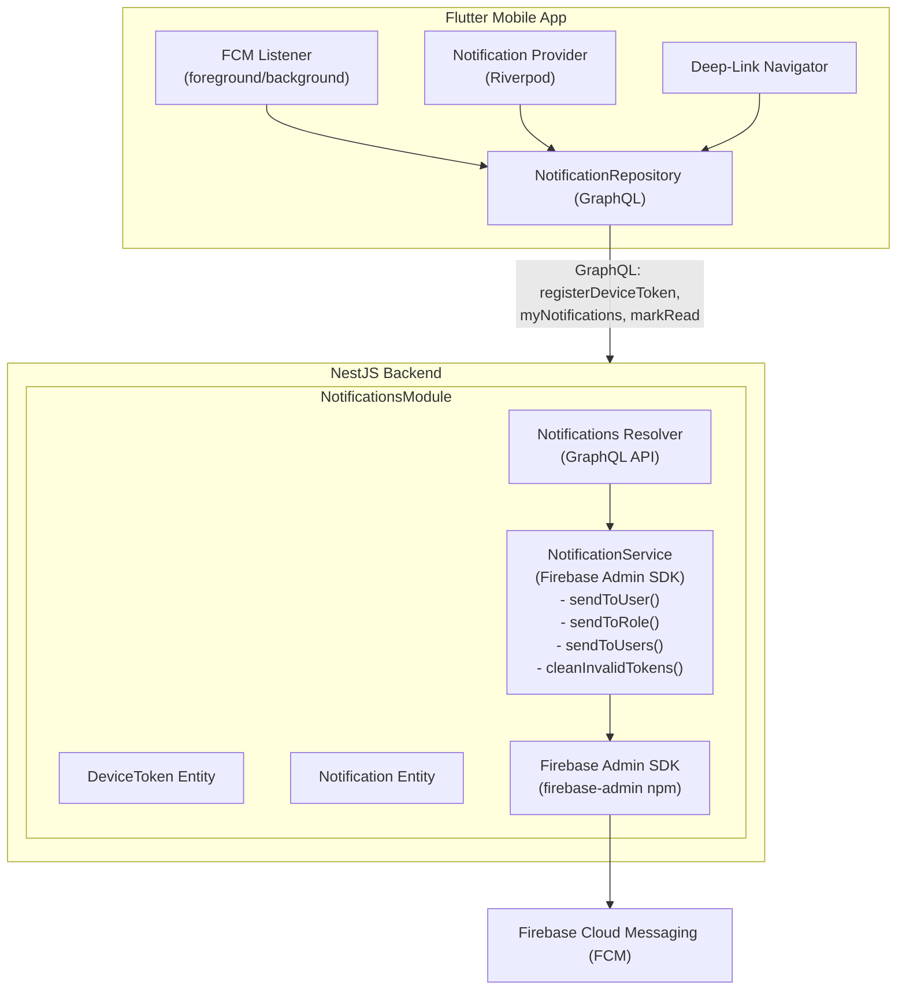

# Notificaciones Push — Diseno Tecnico

**ID de Cambio**: `push-notifications`
**Tarea SRD**: T1-3 | **Linear**: ALT-15 | **Sprint**: 3 (v0.5.0)

---

## 1. Arquitectura General



Los modulos existentes (`SubsidiesModule`, `CapturesModule`, `AbuseReportsModule`) invocan `NotificationService` cuando ocurren eventos relevantes, delegando completamente la logica de envio y enrutamiento.

---

## 2. Tipos de Notificacion

### 2.1 Enum NotificationType

```typescript
export enum NotificationType {
  // J2: Coordinacion de Rescate
  RESCUE_ALERT = 'RESCUE_ALERT',               // REQ-NOT-001: Solicitud de auxilio creada
  RESCUE_ACCEPTED = 'RESCUE_ACCEPTED',           // Auxiliar acepto la alerta
  RESCUE_TRANSFERRED = 'RESCUE_TRANSFERRED',     // Animal transferido a rescatista

  // J4: Subsidio Veterinario
  SUBSIDY_CREATED = 'SUBSIDY_CREATED',           // REQ-NOT-006: Nueva solicitud de subsidio
  SUBSIDY_APPROVED = 'SUBSIDY_APPROVED',         // REQ-NOT-006: Subsidio aprobado
  SUBSIDY_REJECTED = 'SUBSIDY_REJECTED',         // REQ-NOT-006: Subsidio rechazado
  SUBSIDY_VET_ASSIGNED = 'SUBSIDY_VET_ASSIGNED', // REQ-NOT-004: Autorizacion vet requerida

  // J5: Reportes de Maltrato
  ABUSE_REPORT_UPDATE = 'ABUSE_REPORT_UPDATE',   // Cambio de estado del reporte
  ABUSE_REPORT_FILED = 'ABUSE_REPORT_FILED',     // REQ-NOT-007: Nuevo reporte (para municipal)

  // J10: Chat
  CHAT_MESSAGE = 'CHAT_MESSAGE',                 // Nuevo mensaje en conversacion
}
```

### 2.2 Matriz de Enrutamiento por Tipo y Rol

| NotificationType | Destinatario(s) | Rol(es) | Datos adicionales |
|-----------------|-----------------|---------|-------------------|
| `RESCUE_ALERT` | Auxiliares en radio 10km | `HELPER` | `captureRequestId`, ubicacion, urgencia |
| `RESCUE_ACCEPTED` | Centinela creador | `WATCHER` | `captureRequestId`, nombre del auxiliar |
| `RESCUE_TRANSFERRED` | Centinela + Auxiliar | `WATCHER`, `HELPER` | `captureRequestId`, nombre del rescatista |
| `SUBSIDY_CREATED` | Coordinador jurisdiccional | `GOVERNMENT_ADMIN` | `subsidyRequestId`, monto, animal |
| `SUBSIDY_APPROVED` | Rescatista solicitante + Veterinario | `RESCUER`, `VETERINARIAN` | `subsidyRequestId`, monto aprobado |
| `SUBSIDY_REJECTED` | Rescatista solicitante | `RESCUER` | `subsidyRequestId`, motivo |
| `SUBSIDY_VET_ASSIGNED` | Veterinario asignado | `VETERINARIAN` | `subsidyRequestId`, detalles del animal |
| `ABUSE_REPORT_UPDATE` | Centinela/usuario que reporto | Cualquiera | `abuseReportId`, nuevo estado |
| `ABUSE_REPORT_FILED` | Coordinador jurisdiccional | `GOVERNMENT_ADMIN` | `abuseReportId`, ubicacion, tipo |
| `CHAT_MESSAGE` | Participante(s) de la conversacion | Cualquiera | `chatId`, preview del mensaje, nombre del remitente |

---

## 3. Entidades de Base de Datos

### 3.1 DeviceToken

Almacena los tokens FCM asociados a cada usuario. Un usuario puede tener multiples dispositivos.

```typescript
@Entity('device_tokens')
@Unique(['userId', 'token'])
export class DeviceToken {
  @PrimaryGeneratedColumn('uuid')
  id: string;

  @Column({ type: 'uuid' })
  @Index()
  userId: string;

  @ManyToOne(() => User)
  @JoinColumn({ name: 'userId' })
  user: User;

  @Column({ type: 'text' })
  token: string;

  @Column({ type: 'varchar', length: 20, default: 'unknown' })
  platform: string; // 'ios' | 'android' | 'web'

  @Column({ default: true })
  isActive: boolean;

  @CreateDateColumn()
  createdAt: Date;

  @UpdateDateColumn()
  updatedAt: Date;
}
```

### 3.2 Notification

Almacena todas las notificaciones enviadas para historial y consulta.

```typescript
@Entity('notifications')
export class Notification {
  @PrimaryGeneratedColumn('uuid')
  id: string;

  @Column({ type: 'uuid' })
  @Index()
  userId: string;

  @ManyToOne(() => User)
  @JoinColumn({ name: 'userId' })
  user: User;

  @Column({ type: 'enum', enum: NotificationType })
  @Index()
  type: NotificationType;

  @Column({ type: 'varchar', length: 255 })
  title: string;

  @Column({ type: 'text' })
  body: string;

  @Column({ type: 'jsonb', nullable: true })
  data: Record<string, string>; // Payload para deep-linking y contexto

  @Column({ type: 'uuid', nullable: true })
  @Index()
  referenceId: string; // ID de la entidad relacionada (subsidyRequestId, captureRequestId, etc.)

  @Column({ type: 'varchar', length: 50, nullable: true })
  referenceType: string; // 'subsidy_request' | 'capture_request' | 'abuse_report' | 'chat'

  @Column({ default: false })
  @Index()
  isRead: boolean;

  @Column({ default: false })
  pushSent: boolean;

  @Column({ nullable: true })
  pushSentAt: Date;

  @Column({ type: 'varchar', nullable: true })
  pushError: string; // Ultimo error de envio FCM (para debugging)

  @CreateDateColumn()
  createdAt: Date;
}
```

---

## 4. NotificationService (Backend NestJS)

### 4.1 Inicializacion de Firebase Admin SDK

```typescript
@Module({
  imports: [
    TypeOrmModule.forFeature([Notification, DeviceToken]),
    UsersModule,
  ],
  providers: [NotificationService, NotificationsResolver],
  exports: [NotificationService],
})
export class NotificationsModule implements OnModuleInit {
  constructor(private configService: ConfigService) {}

  onModuleInit() {
    const serviceAccount = this.configService.get<string>('FIREBASE_SERVICE_ACCOUNT_JSON');
    if (serviceAccount) {
      admin.initializeApp({
        credential: admin.credential.cert(JSON.parse(serviceAccount)),
      });
    } else {
      // En desarrollo, usa Application Default Credentials
      admin.initializeApp({
        credential: admin.credential.applicationDefault(),
      });
    }
  }
}
```

**Variable de entorno requerida**: `FIREBASE_SERVICE_ACCOUNT_JSON` — JSON stringificado del service account de Firebase. En produccion se inyecta como secreto de Kubernetes.

### 4.2 Interfaz del Servicio

```typescript
@Injectable()
export class NotificationService {
  constructor(
    @InjectRepository(Notification)
    private notificationRepo: Repository<Notification>,
    @InjectRepository(DeviceToken)
    private deviceTokenRepo: Repository<DeviceToken>,
  ) {}

  /**
   * Envia notificacion push a un usuario especifico.
   * Persiste la notificacion en BD y envia via FCM a todos sus dispositivos.
   */
  async sendToUser(params: {
    userId: string;
    type: NotificationType;
    title: string;
    body: string;
    data?: Record<string, string>;
    referenceId?: string;
    referenceType?: string;
  }): Promise<Notification>;

  /**
   * Envia notificacion push a multiples usuarios.
   * Util para broadcast a participantes de un caso.
   */
  async sendToUsers(params: {
    userIds: string[];
    type: NotificationType;
    title: string;
    body: string;
    data?: Record<string, string>;
    referenceId?: string;
    referenceType?: string;
  }): Promise<Notification[]>;

  /**
   * Envia notificacion a todos los usuarios con un rol especifico.
   * Opcionalmente filtrado por jurisdiccion (para GOVERNMENT_ADMIN).
   */
  async sendToRole(params: {
    role: UserRole;
    type: NotificationType;
    title: string;
    body: string;
    data?: Record<string, string>;
    referenceId?: string;
    referenceType?: string;
    jurisdictionId?: string; // Filtro opcional para notificaciones municipales
  }): Promise<Notification[]>;

  /**
   * Registra un token FCM para un usuario/dispositivo.
   */
  async registerToken(userId: string, token: string, platform: string): Promise<DeviceToken>;

  /**
   * Elimina un token FCM (logout o desinstalacion).
   */
  async unregisterToken(userId: string, token: string): Promise<boolean>;

  /**
   * Marca una notificacion como leida.
   */
  async markAsRead(userId: string, notificationId: string): Promise<Notification>;

  /**
   * Marca todas las notificaciones de un usuario como leidas.
   */
  async markAllAsRead(userId: string): Promise<number>;

  /**
   * Obtiene notificaciones paginadas de un usuario.
   */
  async getUserNotifications(userId: string, options: {
    page?: number;
    limit?: number;
    unreadOnly?: boolean;
  }): Promise<{ notifications: Notification[]; total: number; unreadCount: number }>;

  /**
   * Limpia tokens invalidos detectados por errores FCM.
   * Se ejecuta como cron job diario.
   */
  @Cron('0 3 * * *') // 3:00 AM diario
  async cleanInvalidTokens(): Promise<number>;
}
```

### 4.3 Logica de Envio FCM

```typescript
private async sendPush(
  tokens: string[],
  notification: { title: string; body: string },
  data: Record<string, string>,
): Promise<{ successCount: number; failedTokens: string[] }> {
  if (tokens.length === 0) return { successCount: 0, failedTokens: [] };

  const message: admin.messaging.MulticastMessage = {
    tokens,
    notification: {
      title: notification.title,
      body: notification.body,
    },
    data: {
      ...data,
      click_action: 'FLUTTER_NOTIFICATION_CLICK',
    },
    android: {
      priority: 'high',
      notification: {
        channelId: 'altrupets_default',
        sound: 'default',
      },
    },
    apns: {
      payload: {
        aps: {
          sound: 'default',
          badge: 1, // Se actualizara con conteo real de no-leidas
        },
      },
    },
  };

  const response = await admin.messaging().sendEachForMulticast(message);

  const failedTokens: string[] = [];
  response.responses.forEach((resp, idx) => {
    if (!resp.success) {
      const errorCode = resp.error?.code;
      // Tokens invalidos o expirados se marcan para limpieza
      if (
        errorCode === 'messaging/invalid-registration-token' ||
        errorCode === 'messaging/registration-token-not-registered'
      ) {
        failedTokens.push(tokens[idx]);
      }
    }
  });

  // Desactivar tokens invalidos de forma asincrona
  if (failedTokens.length > 0) {
    this.deactivateTokens(failedTokens).catch((err) =>
      console.error('Error desactivando tokens:', err),
    );
  }

  return { successCount: response.successCount, failedTokens };
}
```

### 4.4 Deduplicacion

Para evitar notificaciones duplicadas (ej: multiples eventos rapidos del mismo tipo):

```typescript
private async isDuplicate(
  userId: string,
  type: NotificationType,
  referenceId: string,
  windowSeconds: number = 60,
): Promise<boolean> {
  const cutoff = new Date(Date.now() - windowSeconds * 1000);
  const existing = await this.notificationRepo.findOne({
    where: {
      userId,
      type,
      referenceId,
      createdAt: MoreThan(cutoff),
    },
  });
  return !!existing;
}
```

---

## 5. GraphQL API

### 5.1 Resolver

```typescript
@Resolver(() => NotificationObjectType)
export class NotificationsResolver {
  constructor(private notificationService: NotificationService) {}

  @Mutation(() => DeviceTokenType)
  @UseGuards(JwtAuthGuard)
  async registerDeviceToken(
    @CurrentUser() user: User,
    @Args('input') input: RegisterDeviceTokenInput,
  ): Promise<DeviceToken> {
    return this.notificationService.registerToken(
      user.id,
      input.token,
      input.platform,
    );
  }

  @Mutation(() => Boolean)
  @UseGuards(JwtAuthGuard)
  async unregisterDeviceToken(
    @CurrentUser() user: User,
    @Args('token') token: string,
  ): Promise<boolean> {
    return this.notificationService.unregisterToken(user.id, token);
  }

  @Query(() => NotificationPage)
  @UseGuards(JwtAuthGuard)
  async myNotifications(
    @CurrentUser() user: User,
    @Args('page', { defaultValue: 1 }) page: number,
    @Args('limit', { defaultValue: 20 }) limit: number,
    @Args('unreadOnly', { defaultValue: false }) unreadOnly: boolean,
  ): Promise<NotificationPage> {
    return this.notificationService.getUserNotifications(user.id, {
      page,
      limit,
      unreadOnly,
    });
  }

  @Mutation(() => NotificationObjectType)
  @UseGuards(JwtAuthGuard)
  async markNotificationRead(
    @CurrentUser() user: User,
    @Args('notificationId') notificationId: string,
  ): Promise<Notification> {
    return this.notificationService.markAsRead(user.id, notificationId);
  }

  @Mutation(() => Int)
  @UseGuards(JwtAuthGuard)
  async markAllNotificationsRead(
    @CurrentUser() user: User,
  ): Promise<number> {
    return this.notificationService.markAllAsRead(user.id);
  }
}
```

### 5.2 Inputs y Types GraphQL

```typescript
@InputType()
export class RegisterDeviceTokenInput {
  @Field()
  token: string;

  @Field({ defaultValue: 'unknown' })
  platform: string; // 'ios' | 'android' | 'web'
}

@ObjectType()
export class NotificationPage {
  @Field(() => [NotificationObjectType])
  notifications: Notification[];

  @Field()
  total: number;

  @Field()
  unreadCount: number;
}
```

---

## 6. Integracion con Modulos Existentes

Los modulos existentes invocan `NotificationService` tras eventos de negocio. No se modifica la logica de negocio existente; solo se agregan llamadas de notificacion.

### 6.1 SubsidiesModule (J4)

```typescript
// En subsidies.service.ts — al crear solicitud de subsidio
async createSubsidyRequest(data: CreateSubsidyInput, userId: string) {
  const subsidy = await this.subsidyRepo.save(/* ... */);

  // Notificar al coordinador municipal de la jurisdiccion
  await this.notificationService.sendToRole({
    role: UserRole.GOVERNMENT_ADMIN,
    type: NotificationType.SUBSIDY_CREATED,
    title: 'Nueva solicitud de subsidio',
    body: `Solicitud de subsidio para ${subsidy.animalName} — $${subsidy.estimatedCost}`,
    referenceId: subsidy.id,
    referenceType: 'subsidy_request',
    data: { subsidyRequestId: subsidy.id, route: `/subsidy/review/${subsidy.id}` },
    jurisdictionId: subsidy.jurisdictionId,
  });

  return subsidy;
}

// Al aprobar subsidio
async approveSubsidy(subsidyId: string, approvedBy: string) {
  const subsidy = await this.updateStatus(subsidyId, 'APPROVED');

  // Notificar al rescatista y veterinario
  await this.notificationService.sendToUsers({
    userIds: [subsidy.requesterId, subsidy.veterinarianId].filter(Boolean),
    type: NotificationType.SUBSIDY_APPROVED,
    title: 'Subsidio aprobado',
    body: `Tu solicitud de subsidio para ${subsidy.animalName} fue aprobada — $${subsidy.approvedAmount}`,
    referenceId: subsidy.id,
    referenceType: 'subsidy_request',
    data: { subsidyRequestId: subsidy.id, route: `/vet/subsidy/${subsidy.id}` },
  });

  return subsidy;
}
```

### 6.2 CapturesModule (J2)

```typescript
// En captures.service.ts — al crear solicitud de auxilio
async createCaptureRequest(data: CreateCaptureInput, userId: string) {
  const capture = await this.captureRepo.save(/* ... */);

  // Notificar a auxiliares en radio de 10km
  // (requiere query PostGIS para encontrar auxiliares cercanos)
  const nearbyHelpers = await this.findNearbyUsersByRole(
    capture.latitude,
    capture.longitude,
    10000, // 10km en metros
    UserRole.HELPER,
  );

  await this.notificationService.sendToUsers({
    userIds: nearbyHelpers.map(h => h.id),
    type: NotificationType.RESCUE_ALERT,
    title: 'Alerta de rescate cercana',
    body: `Animal necesita auxilio a ${capture.distanceText} de tu ubicacion`,
    referenceId: capture.id,
    referenceType: 'capture_request',
    data: {
      captureRequestId: capture.id,
      route: `/rescues/alert/${capture.id}`,
      latitude: String(capture.latitude),
      longitude: String(capture.longitude),
    },
  });

  return capture;
}
```

### 6.3 AbuseReportsModule (J5)

```typescript
// En abuse-reports.service.ts — al actualizar estado del reporte
async updateReportStatus(reportId: string, newStatus: string, updatedBy: string) {
  const report = await this.updateStatus(reportId, newStatus);

  // Notificar al usuario que creo el reporte
  await this.notificationService.sendToUser({
    userId: report.reporterId,
    type: NotificationType.ABUSE_REPORT_UPDATE,
    title: 'Actualizacion de tu reporte',
    body: `Tu reporte de maltrato #${report.trackingCode} cambio a estado: ${this.translateStatus(newStatus)}`,
    referenceId: report.id,
    referenceType: 'abuse_report',
    data: { abuseReportId: report.id, route: `/report-abuse/track/${report.trackingCode}` },
  });

  return report;
}

// Al crear nuevo reporte — notificar a municipal
async createAbuseReport(data: CreateAbuseReportInput, userId: string) {
  const report = await this.abuseReportRepo.save(/* ... */);

  await this.notificationService.sendToRole({
    role: UserRole.GOVERNMENT_ADMIN,
    type: NotificationType.ABUSE_REPORT_FILED,
    title: 'Nuevo reporte de maltrato',
    body: `Reporte de maltrato animal (#${report.trackingCode}) en tu jurisdiccion`,
    referenceId: report.id,
    referenceType: 'abuse_report',
    data: { abuseReportId: report.id, route: `/b2g/reports/${report.id}` },
    jurisdictionId: report.jurisdictionId,
  });

  return report;
}
```

### 6.4 Chat/Mensajeria (J10)

La mensajeria usa Firebase Firestore directamente. Para notificaciones push de chat, se implementa un Cloud Function o un listener en el backend:

**Opcion elegida**: Trigger desde el backend cuando el servicio de chat registra un nuevo mensaje.

```typescript
// Invocado cuando se detecta nuevo mensaje en Firestore
async onNewChatMessage(params: {
  chatId: string;
  senderId: string;
  senderName: string;
  messagePreview: string;
  participantIds: string[];
}) {
  const recipientIds = params.participantIds.filter(id => id !== params.senderId);

  await this.notificationService.sendToUsers({
    userIds: recipientIds,
    type: NotificationType.CHAT_MESSAGE,
    title: params.senderName,
    body: params.messagePreview.substring(0, 100),
    referenceId: params.chatId,
    referenceType: 'chat',
    data: { chatId: params.chatId, route: `/messages/${params.chatId}` },
  });
}
```

---

## 7. Flutter Mobile — Manejo de Notificaciones

### 7.1 Inicializacion del Servicio

```dart
/// Servicio de notificaciones push para Flutter.
/// Se inicializa al arrancar la app y gestiona el ciclo de vida
/// completo de FCM: permisos, token, foreground/background/terminated.
class PushNotificationService {
  final FirebaseMessaging _messaging = FirebaseMessaging.instance;
  final GraphQLClient _graphqlClient;
  final GoRouter _router;

  PushNotificationService(this._graphqlClient, this._router);

  /// Inicializar al arrancar la app (main.dart).
  Future<void> initialize() async {
    // 1. Solicitar permisos
    final settings = await _messaging.requestPermission(
      alert: true,
      badge: true,
      sound: true,
      provisional: false,
    );

    if (settings.authorizationStatus == AuthorizationStatus.authorized ||
        settings.authorizationStatus == AuthorizationStatus.provisional) {
      // 2. Obtener y registrar token FCM
      final token = await _messaging.getToken();
      if (token != null) {
        await _registerTokenOnBackend(token);
      }

      // 3. Escuchar cambios de token
      _messaging.onTokenRefresh.listen(_registerTokenOnBackend);

      // 4. Configurar handlers
      _setupForegroundHandler();
      _setupBackgroundHandler();
      await _handleInitialMessage();
    }
  }

  /// Limpiar al hacer logout.
  Future<void> dispose() async {
    final token = await _messaging.getToken();
    if (token != null) {
      await _unregisterTokenOnBackend(token);
    }
  }
}
```

### 7.2 Manejo de Estados de la App

```dart
/// Foreground: La app esta abierta y visible.
/// Muestra un banner/snackbar local sin interrumpir al usuario.
void _setupForegroundHandler() {
  FirebaseMessaging.onMessage.listen((RemoteMessage message) {
    final notification = message.notification;
    if (notification != null) {
      _showLocalNotification(
        title: notification.title ?? '',
        body: notification.body ?? '',
        data: message.data,
      );
    }
    // Actualizar el provider de notificaciones para refrescar badge
    _notificationProvider.refresh();
  });
}

/// Background: La app esta en segundo plano.
/// El sistema operativo muestra la notificacion automaticamente.
/// Al tocar, se ejecuta onMessageOpenedApp.
static void _setupBackgroundHandler() {
  FirebaseMessaging.onBackgroundMessage(_firebaseBackgroundHandler);
  FirebaseMessaging.onMessageOpenedApp.listen(_handleNotificationTap);
}

/// Terminated: La app estaba cerrada.
/// Si el usuario abrio la app tocando una notificacion, navegar al destino.
Future<void> _handleInitialMessage() async {
  final initialMessage = await _messaging.getInitialMessage();
  if (initialMessage != null) {
    _handleNotificationTap(initialMessage);
  }
}

/// Handler global para background messages (debe ser funcion top-level).
@pragma('vm:entry-point')
static Future<void> _firebaseBackgroundHandler(RemoteMessage message) async {
  await Firebase.initializeApp();
  // No se necesita logica adicional: el OS muestra la notificacion.
  // El tap se maneja en onMessageOpenedApp.
}
```

### 7.3 Deep-Link por Tipo de Notificacion

```dart
/// Navega a la pantalla correcta segun el tipo de notificacion.
void _handleNotificationTap(RemoteMessage message) {
  final route = message.data['route'];
  if (route != null && route.isNotEmpty) {
    _router.go(route);
    return;
  }

  // Fallback: navegar segun tipo
  final type = message.data['type'];
  switch (type) {
    case 'RESCUE_ALERT':
      final id = message.data['captureRequestId'];
      if (id != null) _router.go('/rescues/alert/$id');
      break;
    case 'SUBSIDY_CREATED':
    case 'SUBSIDY_APPROVED':
    case 'SUBSIDY_REJECTED':
    case 'SUBSIDY_VET_ASSIGNED':
      final id = message.data['subsidyRequestId'];
      if (id != null) _router.go('/vet/subsidy/$id');
      break;
    case 'ABUSE_REPORT_UPDATE':
      final id = message.data['abuseReportId'];
      if (id != null) _router.go('/report-abuse/track/$id');
      break;
    case 'CHAT_MESSAGE':
      final chatId = message.data['chatId'];
      if (chatId != null) _router.go('/messages/$chatId');
      break;
    default:
      _router.go('/notifications');
  }
}
```

### 7.4 Riverpod Provider

```dart
/// Provider que gestiona el estado de notificaciones.
/// Expone el conteo de no-leidas para badge y la lista paginada.
@riverpod
class NotificationNotifier extends _$NotificationNotifier {
  @override
  Future<NotificationState> build() async {
    final result = await ref.read(notificationRepositoryProvider)
        .getMyNotifications(page: 1, limit: 20);
    return NotificationState(
      notifications: result.notifications,
      unreadCount: result.unreadCount,
      total: result.total,
    );
  }

  Future<void> refresh() async {
    state = const AsyncLoading();
    state = await AsyncValue.guard(() => build());
  }

  Future<void> markAsRead(String notificationId) async {
    await ref.read(notificationRepositoryProvider)
        .markNotificationRead(notificationId);
    await refresh();
  }

  Future<void> markAllAsRead() async {
    await ref.read(notificationRepositoryProvider).markAllRead();
    await refresh();
  }
}

@freezed
class NotificationState with _$NotificationState {
  const factory NotificationState({
    required List<NotificationModel> notifications,
    required int unreadCount,
    required int total,
  }) = _NotificationState;
}
```

---

## 8. Configuracion y Variables de Entorno

### Backend (.env)

```
# Firebase Admin SDK
FIREBASE_SERVICE_ACCOUNT_JSON={"type":"service_account","project_id":"altrupets",...}
# O alternativamente, path al archivo:
# GOOGLE_APPLICATION_CREDENTIALS=/path/to/service-account.json
```

### Flutter (ya configurado)

El paquete `firebase_messaging: ^15.2.4` ya esta en `pubspec.yaml`. La configuracion de Firebase Core (`firebase_core: ^3.8.1`) tambien existe. Se requiere:

- `android/app/src/main/AndroidManifest.xml`: Ya deberia tener el permiso de INTERNET. Agregar canal de notificacion por defecto.
- `ios/Runner/Info.plist`: Agregar `UIBackgroundModes` con `remote-notification` (si no existe).
- `android/app/src/main/res/drawable/ic_notification.png`: Icono de notificacion (opcional, usa icono de la app por defecto).

---

## 9. Migracion de Base de Datos

Se genera una migracion TypeORM con las dos tablas nuevas:

```sql
-- Tabla device_tokens
CREATE TABLE device_tokens (
  id UUID PRIMARY KEY DEFAULT gen_random_uuid(),
  "userId" UUID NOT NULL REFERENCES users(id) ON DELETE CASCADE,
  token TEXT NOT NULL,
  platform VARCHAR(20) DEFAULT 'unknown',
  "isActive" BOOLEAN DEFAULT true,
  "createdAt" TIMESTAMP DEFAULT NOW(),
  "updatedAt" TIMESTAMP DEFAULT NOW(),
  UNIQUE("userId", token)
);
CREATE INDEX idx_device_tokens_user ON device_tokens("userId");

-- Tabla notifications
CREATE TABLE notifications (
  id UUID PRIMARY KEY DEFAULT gen_random_uuid(),
  "userId" UUID NOT NULL REFERENCES users(id) ON DELETE CASCADE,
  type VARCHAR(50) NOT NULL,
  title VARCHAR(255) NOT NULL,
  body TEXT NOT NULL,
  data JSONB,
  "referenceId" UUID,
  "referenceType" VARCHAR(50),
  "isRead" BOOLEAN DEFAULT false,
  "pushSent" BOOLEAN DEFAULT false,
  "pushSentAt" TIMESTAMP,
  "pushError" VARCHAR,
  "createdAt" TIMESTAMP DEFAULT NOW()
);
CREATE INDEX idx_notifications_user ON notifications("userId");
CREATE INDEX idx_notifications_type ON notifications(type);
CREATE INDEX idx_notifications_reference ON notifications("referenceId");
CREATE INDEX idx_notifications_unread ON notifications("userId", "isRead") WHERE "isRead" = false;
```

---

## 10. Consideraciones de Seguridad

1. **Autenticacion requerida**: Todas las mutaciones/queries de notificaciones requieren `JwtAuthGuard`.
2. **Aislamiento de datos**: Un usuario solo puede ver y marcar como leidas sus propias notificaciones.
3. **Validacion de tokens**: Los tokens FCM se validan al registrarse; tokens expirados se limpian automaticamente.
4. **Rate limiting**: El envio de push se limita a 500 tokens por llamada multicast (limite de FCM).
5. **Service account**: El JSON del service account de Firebase se almacena como secreto de Kubernetes, nunca en codigo fuente.
6. **Datos sensibles**: Los payloads de notificacion no incluyen datos medicos ni financieros detallados; solo referencias (IDs) que requieren autenticacion para resolver.
