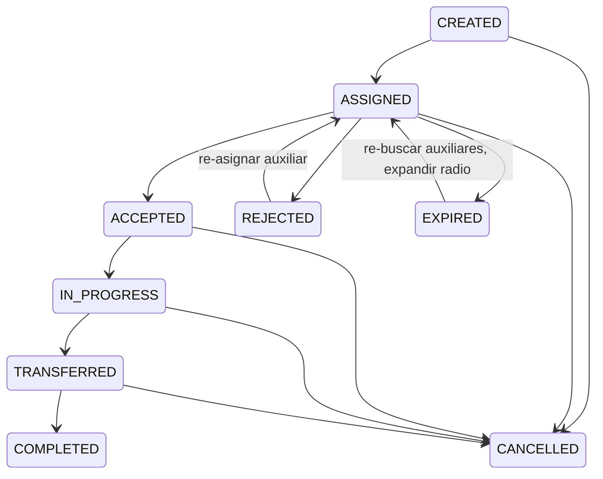

# Diseno Tecnico: Pipeline de Coordinacion de Rescate

**Change ID:** `rescue-coordination`
**SRD Task:** T1-1 | **Linear:** ALT-13 | **Sprint:** 3 (v0.5.0)

---

## 1. Arquitectura General

### Componentes involucrados

```
apps/backend/src/rescues/          <-- NUEVO: modulo completo
apps/backend/src/push-notifications/ <-- NUEVO: servicio FCM compartido
apps/mobile/lib/features/rescues/  <-- MODIFICAR: reemplazar stubs con UI funcional
```

### Servicios afectados

| Servicio | Rol | Tipo de cambio |
|----------|-----|----------------|
| Backend (NestJS/GraphQL) | Logica de negocio, estado, matching | Nuevo modulo |
| Mobile (Flutter) | UI de rescate, navegacion, estado | Reescritura de feature |
| PostgreSQL + PostGIS | Almacenamiento, consultas espaciales | Nueva tabla + indices |
| Firebase Cloud Messaging | Push notifications | Integracion nueva |

### Restricciones tecnicas (dependencias ya cumplidas)

- **PostGIS** (ALT-9 Done): Extension habilitada, migracion `EnablePostGIS` ejecutada. Tipo `geometry(Point, 4326)` ya usado en entidad `Animal`.
- **Entidad Animal** (ALT-6 Done): Tiene `location`, `species`, `status`, relacion a `CasaCuna`, campo `rescuerId`.
- **Auth/RBAC** (ALT-7 Done): `JwtAuthGuard`, `RolesGuard`, decorador `@Roles()`, enum `UserRole` con CENTINELA, AUXILIAR, RESCATISTA.
- **CaptureRequest existente**: Entidad basica con lat/lon/description/animalType/status/imageUrl. Se mantiene como esta; el nuevo modulo `rescues/` la reemplaza funcionalmente para el flujo completo.

---

## 2. Maquina de Estados de Rescate

### Diagrama de transiciones



### Definicion de estados

| Estado | Descripcion | Quien lo activa | Accion del sistema |
|--------|-------------|-----------------|-------------------|
| `CREATED` | Centinela creo la alerta con GPS, fotos, urgencia | Centinela (mutacion `createRescueAlert`) | Buscar auxiliares cercanos, enviar push |
| `ASSIGNED` | Sistema encontro auxiliares y envio notificaciones | Sistema (automatico) | Timer de 15 min para escalacion |
| `ACCEPTED` | Un auxiliar acepto la alerta | Auxiliar (mutacion `acceptRescueAlert`) | Detener busqueda, habilitar navegacion |
| `IN_PROGRESS` | Auxiliar llego y esta documentando/atendiendo al animal | Auxiliar (mutacion `updateRescueProgress`) | Permitir carga de fotos/evaluacion |
| `TRANSFERRED` | Auxiliar solicito transferencia y rescatista acepto | Rescatista (mutacion `acceptRescueTransfer`) | Crear/vincular entidad Animal a CasaCuna |
| `COMPLETED` | Animal en casa cuna con codigo de seguimiento | Sistema (automatico al confirmar registro) | Notificar a todos los participantes |
| `CANCELLED` | Alerta cancelada por cualquier motivo | Centinela o Sistema | Notificar a participantes activos |
| `REJECTED` | Auxiliar rechazo la alerta | Auxiliar (mutacion `rejectRescueAlert`) | Re-buscar otro auxiliar |
| `EXPIRED` | Sin respuesta de auxiliar en tiempo limite | Sistema (cron/scheduler) | Expandir radio a 25km, re-notificar |

### Transiciones validas

```typescript
const TRANSICIONES_VALIDAS: Record<RescueStatus, RescueStatus[]> = {
  CREATED:       ['ASSIGNED', 'CANCELLED'],
  ASSIGNED:      ['ACCEPTED', 'REJECTED', 'EXPIRED', 'CANCELLED'],
  ACCEPTED:      ['IN_PROGRESS', 'CANCELLED'],
  IN_PROGRESS:   ['TRANSFERRED', 'CANCELLED'],
  TRANSFERRED:   ['COMPLETED', 'CANCELLED'],
  COMPLETED:     [],  // Estado final
  CANCELLED:     [],  // Estado final
  REJECTED:      ['ASSIGNED'],  // Re-asignacion
  EXPIRED:       ['ASSIGNED'],  // Re-busqueda con radio expandido
};
```

---

## 3. Modelo de Datos

### Entidad RescueAlert

```typescript
@ObjectType()
@Entity('rescue_alerts')
export class RescueAlert {
  @PrimaryGeneratedColumn('uuid')
  id: string;

  // --- Relaciones ---
  @Column({ type: 'uuid' })
  @Index()
  reportedById: string;          // FK -> users (centinela)

  @ManyToOne(() => User)
  @JoinColumn({ name: 'reportedById' })
  reportedBy: User;

  @Column({ type: 'uuid', nullable: true })
  @Index()
  auxiliarId?: string;           // FK -> users (auxiliar asignado)

  @ManyToOne(() => User, { nullable: true })
  @JoinColumn({ name: 'auxiliarId' })
  auxiliar?: User;

  @Column({ type: 'uuid', nullable: true })
  @Index()
  rescuerId?: string;            // FK -> users (rescatista receptor)

  @ManyToOne(() => User, { nullable: true })
  @JoinColumn({ name: 'rescuerId' })
  rescuer?: User;

  @Column({ type: 'uuid', nullable: true })
  @Index()
  animalId?: string;             // FK -> animals (vinculado al documentar)

  @ManyToOne(() => Animal, { nullable: true })
  @JoinColumn({ name: 'animalId' })
  animal?: Animal;

  // --- Ubicacion ---
  @Column({
    type: 'geometry',
    spatialFeatureType: 'Point',
    srid: 4326,
  })
  @Index({ spatial: true })
  location: any;                 // PostGIS Point (lon, lat)

  @Column({ nullable: true })
  locationDescription?: string;  // Referencia textual del lugar

  // --- Detalle de la alerta ---
  @Column({
    type: 'enum',
    enum: RescueUrgency,
  })
  urgency: RescueUrgency;       // LOW, MEDIUM, HIGH, CRITICAL

  @Column({ type: 'text', nullable: true })
  description?: string;

  @Column({ type: 'simple-array', nullable: true })
  imageUrls?: string[];          // Fotos del centinela

  @Column({ nullable: true })
  animalType?: string;           // Tipo de animal reportado (previo a entidad Animal)

  // --- Estado ---
  @Column({
    type: 'enum',
    enum: RescueStatus,
    default: RescueStatus.CREATED,
  })
  @Index()
  status: RescueStatus;

  // --- Documentacion del auxiliar ---
  @Column({ type: 'simple-array', nullable: true })
  auxiliarPhotoUrls?: string[];  // Fotos tomadas por el auxiliar

  @Column({ type: 'text', nullable: true })
  conditionAssessment?: string;  // Evaluacion de condicion del animal

  // --- Tracking ---
  @Column({ nullable: true, unique: true })
  trackingCode?: string;         // Codigo de seguimiento compartido

  @Column({ type: 'int', default: 10000 })
  searchRadiusMeters: number;    // Radio actual de busqueda (10km default, 25km escalado)

  // --- Timestamps ---
  @CreateDateColumn()
  createdAt: Date;

  @UpdateDateColumn()
  updatedAt: Date;

  @Column({ type: 'timestamptz', nullable: true })
  acceptedAt?: Date;

  @Column({ type: 'timestamptz', nullable: true })
  transferredAt?: Date;

  @Column({ type: 'timestamptz', nullable: true })
  completedAt?: Date;

  @Column({ type: 'timestamptz', nullable: true })
  expiresAt?: Date;              // Deadline para respuesta de auxiliar
}
```

### Enums

```typescript
enum RescueStatus {
  CREATED = 'CREATED',
  ASSIGNED = 'ASSIGNED',
  ACCEPTED = 'ACCEPTED',
  IN_PROGRESS = 'IN_PROGRESS',
  TRANSFERRED = 'TRANSFERRED',
  COMPLETED = 'COMPLETED',
  CANCELLED = 'CANCELLED',
  REJECTED = 'REJECTED',
  EXPIRED = 'EXPIRED',
}

enum RescueUrgency {
  LOW = 'LOW',
  MEDIUM = 'MEDIUM',
  HIGH = 'HIGH',
  CRITICAL = 'CRITICAL',
}
```

### Migracion SQL (conceptual)

```sql
CREATE TABLE rescue_alerts (
  id UUID PRIMARY KEY DEFAULT gen_random_uuid(),
  "reportedById" UUID NOT NULL REFERENCES users(id),
  "auxiliarId" UUID REFERENCES users(id),
  "rescuerId" UUID REFERENCES users(id),
  "animalId" UUID REFERENCES animals(id),
  location geometry(Point, 4326) NOT NULL,
  "locationDescription" VARCHAR,
  urgency VARCHAR NOT NULL CHECK (urgency IN ('LOW','MEDIUM','HIGH','CRITICAL')),
  description TEXT,
  "imageUrls" TEXT,
  "animalType" VARCHAR,
  status VARCHAR NOT NULL DEFAULT 'CREATED'
    CHECK (status IN ('CREATED','ASSIGNED','ACCEPTED','IN_PROGRESS','TRANSFERRED','COMPLETED','CANCELLED','REJECTED','EXPIRED')),
  "auxiliarPhotoUrls" TEXT,
  "conditionAssessment" TEXT,
  "trackingCode" VARCHAR UNIQUE,
  "searchRadiusMeters" INTEGER NOT NULL DEFAULT 10000,
  "createdAt" TIMESTAMPTZ NOT NULL DEFAULT NOW(),
  "updatedAt" TIMESTAMPTZ NOT NULL DEFAULT NOW(),
  "acceptedAt" TIMESTAMPTZ,
  "transferredAt" TIMESTAMPTZ,
  "completedAt" TIMESTAMPTZ,
  "expiresAt" TIMESTAMPTZ
);

-- Indice espacial GiST para consultas de proximidad
CREATE INDEX idx_rescue_alerts_location ON rescue_alerts USING GIST (location);

-- Indices para queries frecuentes
CREATE INDEX idx_rescue_alerts_status ON rescue_alerts (status);
CREATE INDEX idx_rescue_alerts_reported_by ON rescue_alerts ("reportedById");
CREATE INDEX idx_rescue_alerts_auxiliar ON rescue_alerts ("auxiliarId");
CREATE INDEX idx_rescue_alerts_rescuer ON rescue_alerts ("rescuerId");
```

---

## 4. API GraphQL

### Mutations

```graphql
type Mutation {
  # Paso 1-2: Centinela crea alerta
  createRescueAlert(input: CreateRescueAlertInput!): RescueAlert!

  # Paso 5: Auxiliar acepta la alerta
  acceptRescueAlert(alertId: ID!): RescueAlert!

  # Auxiliar rechaza la alerta
  rejectRescueAlert(alertId: ID!, reason: String): RescueAlert!

  # Paso 6: Auxiliar documenta al animal
  updateRescueProgress(input: UpdateRescueProgressInput!): RescueAlert!

  # Paso 7-8: Auxiliar solicita transferencia a rescatista
  requestRescueTransfer(alertId: ID!): RescueAlert!

  # Paso 8: Rescatista acepta la transferencia
  acceptRescueTransfer(alertId: ID!): RescueAlert!

  # Paso 9: Confirmar registro del animal en casa cuna
  completeRescue(input: CompleteRescueInput!): RescueAlert!

  # Cancelar alerta
  cancelRescueAlert(alertId: ID!, reason: String): RescueAlert!
}

input CreateRescueAlertInput {
  latitude: Float!
  longitude: Float!
  locationDescription: String
  urgency: RescueUrgency!
  description: String
  imageBase64s: [String!]!     # Fotos codificadas en base64
  animalType: String
}

input UpdateRescueProgressInput {
  alertId: ID!
  conditionAssessment: String!
  imageBase64s: [String!]      # Fotos del auxiliar
}

input CompleteRescueInput {
  alertId: ID!
  animalName: String!
  species: AnimalSpecies!
  casaCunaId: ID!
}

enum RescueUrgency {
  LOW
  MEDIUM
  HIGH
  CRITICAL
}
```

### Queries

```graphql
type Query {
  # Obtener alerta por ID
  rescueAlert(id: ID!): RescueAlert

  # Alertas del usuario actual (centinela, auxiliar o rescatista)
  myRescueAlerts(status: RescueStatus): [RescueAlert!]!

  # Alertas cercanas disponibles (para auxiliares)
  nearbyRescueAlerts(
    latitude: Float!
    longitude: Float!
    radiusKm: Float = 10
  ): [RescueAlert!]!

  # Rescatistas disponibles cerca de una ubicacion (para transferencia)
  availableRescuers(
    alertId: ID!
    radiusKm: Float = 15
  ): [AvailableRescuer!]!
}

type RescueAlert {
  id: ID!
  reportedBy: User!
  auxiliar: User
  rescuer: User
  animal: Animal
  latitude: Float!
  longitude: Float!
  locationDescription: String
  urgency: RescueUrgency!
  description: String
  imageUrls: [String!]
  animalType: String
  status: RescueStatus!
  auxiliarPhotoUrls: [String!]
  conditionAssessment: String
  trackingCode: String
  searchRadiusMeters: Int!
  createdAt: DateTime!
  updatedAt: DateTime!
  acceptedAt: DateTime
  transferredAt: DateTime
  completedAt: DateTime
}

type AvailableRescuer {
  user: User!
  distanceKm: Float!
  casaCuna: CasaCuna!
  availableCapacity: Int!    # Espacios disponibles
}
```

---

## 5. Servicio de Matching por Proximidad

### RescueMatchingService

Utiliza PostGIS `ST_DWithin` sobre la columna `location` (geography cast) para encontrar usuarios disponibles.

#### Busqueda de auxiliares (Paso 3 del J2)

```typescript
class RescueMatchingService {
  /**
   * Encuentra auxiliares cercanos dentro del radio especificado.
   * Ordenados por proximidad (distancia ascendente).
   *
   * Usa: ST_DWithin(geography, ST_MakePoint(lon, lat)::geography, radius_meters)
   * Filtros: rol AUXILIAR, status activo, no ocupado en otro rescate activo
   */
  async findNearbyAuxiliares(
    longitude: number,
    latitude: number,
    radiusMeters: number = 10000, // 10km default
  ): Promise<AuxiliarMatch[]>;

  /**
   * Encuentra rescatistas con capacidad disponible en casa cuna.
   * Radio: 15km default.
   *
   * Filtros: rol RESCATISTA, tiene CasaCuna con capacidad > 0
   * Ordenado por: distancia * 0.3 + capacidad * 0.25 + especializacion * 0.2
   * (Sin reputacion hasta T2-5)
   */
  async findAvailableRescuers(
    longitude: number,
    latitude: number,
    radiusMeters: number = 15000, // 15km default
  ): Promise<RescuerMatch[]>;
}
```

#### Algoritmo de scoring (simplificado sin reputacion — T2-5 lo agrega)

Para **auxiliares** (MVP sin reputacion):
```
Score = (1 / distancia_km) * 0.6 + disponibilidad * 0.4
```

Para **rescatistas** (MVP sin reputacion):
```
Score = (1 / distancia_km) * 0.4 + capacidad_casa_cuna * 0.4 + especializacion * 0.2
```

> **Nota:** Cuando T2-5 (sistema de reputacion) se implemente, el scoring se actualizara a la formula completa del SRD:
> - Auxiliares: `distancia * 0.4 + reputacion * 0.3 + disponibilidad * 0.2 + experiencia * 0.1`
> - Rescatistas: `distancia * 0.3 + capacidad * 0.25 + reputacion * 0.25 + especializacion * 0.2`

#### Consulta PostGIS core

```sql
-- Auxiliares cercanos dentro de radio
SELECT u.id, u."firstName", u."lastName",
       ST_Distance(
         u.location::geography,
         ST_MakePoint(:lon, :lat)::geography
       ) / 1000 AS distance_km
FROM users u
WHERE u.roles @> ARRAY['AUXILIAR']::user_role[]
  AND ST_DWithin(
    u.location::geography,
    ST_MakePoint(:lon, :lat)::geography,
    :radius_meters
  )
  AND u.id NOT IN (
    SELECT ra."auxiliarId"
    FROM rescue_alerts ra
    WHERE ra.status IN ('ACCEPTED', 'IN_PROGRESS')
      AND ra."auxiliarId" IS NOT NULL
  )
ORDER BY distance_km ASC;
```

> **Prerequisito:** Los usuarios deben tener una columna `location` (geometry Point). Si no existe, se agrega en la migracion de este change. Alternativamente, se usa una tabla separada `user_locations` para la posicion actual del usuario (actualizada periodicamente desde el movil).

#### Escalacion automatica

```typescript
/**
 * Si ningun auxiliar responde dentro del tiempo limite:
 * 1. Expandir radio de 10km a 25km
 * 2. Re-enviar notificaciones push al set expandido
 * 3. Notificar al coordinador de la organizacion del centinela (si tiene)
 *
 * Timer: 15 minutos (configurable)
 * Implementacion: @Cron o Bull queue con delay
 */
async escalateSearch(alertId: string): Promise<void>;
```

---

## 6. Notificaciones Push (Firebase Cloud Messaging)

### Integracion backend

```typescript
// apps/backend/src/push-notifications/push-notification.service.ts
class PushNotificationService {
  /**
   * Envia notificacion push via Firebase Admin SDK.
   * Requiere: firebase-admin configurado con service account.
   * Tokens de dispositivo almacenados en tabla user_device_tokens.
   */
  async sendToUser(userId: string, notification: PushPayload): Promise<void>;
  async sendToUsers(userIds: string[], notification: PushPayload): Promise<void>;
}

interface PushPayload {
  title: string;
  body: string;
  data?: Record<string, string>;  // Deep link, alertId, etc.
  imageUrl?: string;
}
```

### Tabla de tokens de dispositivo

```sql
CREATE TABLE user_device_tokens (
  id UUID PRIMARY KEY DEFAULT gen_random_uuid(),
  "userId" UUID NOT NULL REFERENCES users(id) ON DELETE CASCADE,
  token VARCHAR NOT NULL,
  platform VARCHAR NOT NULL CHECK (platform IN ('android', 'ios', 'web')),
  "createdAt" TIMESTAMPTZ NOT NULL DEFAULT NOW(),
  "updatedAt" TIMESTAMPTZ NOT NULL DEFAULT NOW(),
  UNIQUE ("userId", token)
);
```

### Eventos que disparan push

| Evento | Destinatario | Contenido | Deep link |
|--------|-------------|-----------|-----------|
| Alerta creada | Auxiliares en 10km | "Animal {tipo} necesita auxilio a {dist}km" | `/rescues/alert/{id}` |
| Escalacion (sin respuesta 15min) | Auxiliares en 25km | "Urgente: nadie ha respondido, animal necesita ayuda" | `/rescues/alert/{id}` |
| Auxiliar acepto | Centinela | "Un auxiliar va en camino" | `/rescues/alert/{id}/status` |
| Auxiliar documenta | Centinela, Rescatistas potenciales | "Animal evaluado, se busca rescatista" | `/rescues/alert/{id}` |
| Solicitud de transferencia | Rescatistas en 15km | "Auxiliar solicita transferencia de {tipo}" | `/rescues/alert/{id}` |
| Rescatista acepto | Centinela, Auxiliar | "Rescatista va a recibir al animal" | `/rescues/alert/{id}/status` |
| Rescate completado | Todos los participantes | "Animal registrado en casa cuna. Codigo: {code}" | `/rescues/alert/{id}/status` |

### Integracion movil

```dart
// apps/mobile/lib/core/services/push_notification_service.dart
class PushNotificationService {
  // Inicializar en main.dart
  Future<void> initialize();

  // Solicitar permisos (Android 13+ y iOS)
  Future<bool> requestPermission();

  // Registrar/actualizar token en backend
  Future<void> registerDeviceToken();

  // Manejar notificacion en foreground
  void onForegroundMessage(RemoteMessage message);

  // Manejar tap en notificacion (background/terminated)
  void onMessageOpenedApp(RemoteMessage message);
}
```

---

## 7. Pantallas Moviles

### Arbol de pantallas

| Archivo | Accion |
|---------|--------|
| `/rescues/rescues_page.dart` | MODIFICAR: lista de alertas activas + boton crear |
| `/rescues/create_alert_page.dart` | NUEVO: formulario GPS + fotos + urgencia |
| `/rescues/alert_detail_page.dart` | NUEVO: detalle completo, acciones segun rol |
| `/rescues/alert_navigation_page.dart` | NUEVO: mapa con ruta hacia ubicacion |
| `/rescues/update_progress_page.dart` | NUEVO: fotos + evaluacion del auxiliar |
| `/rescues/transfer_confirmation_page.dart` | NUEVO: aceptar/rechazar transferencia |

### Flujo por rol

**Centinela (P07 Andrea):**
1. `rescues_page.dart` -> Toca "Crear Alerta de Auxilio"
2. `create_alert_page.dart` -> GPS auto, selecciona fotos, urgencia, descripcion -> Enviar
3. `alert_detail_page.dart` -> Ve estado en tiempo real (quien acepto, progreso)

**Auxiliar (P08 Diego):**
1. Recibe push -> Abre `alert_detail_page.dart`
2. Ve fotos, ubicacion, distancia, urgencia -> Toca "Aceptar"
3. `alert_navigation_page.dart` -> Navega con GPS al punto
4. `update_progress_page.dart` -> Toma fotos, describe condicion
5. `alert_detail_page.dart` -> Toca "Solicitar Transferencia"

**Rescatista (P05 Sofia):**
1. Recibe push -> Abre `alert_detail_page.dart`
2. Ve fotos del centinela + evaluacion del auxiliar
3. `transfer_confirmation_page.dart` -> Acepta, selecciona casa cuna
4. Sistema registra animal en casa cuna -> Codigo de seguimiento generado

### State management

```dart
// Riverpod providers
final rescueAlertProvider = StateNotifierProvider<RescueAlertNotifier, AsyncValue<RescueAlert>>();
final myRescueAlertsProvider = FutureProvider<List<RescueAlert>>();
final nearbyAlertsProvider = FutureProvider.family<List<RescueAlert>, LatLng>();
```

### Integracion de mapas

- Paquete: `google_maps_flutter` o `flutter_map` (MapBox)
- GPS actual: `geolocator` package (ya referenciado en el spec)
- Ruta de navegacion: API de Directions de Google Maps o MapBox
- Marcadores: ubicacion del animal (rojo), posicion actual del auxiliar (azul)

---

## 8. Estructura de Archivos

### Backend (nuevo modulo)

**`apps/backend/src/rescues/`**
- `rescues.module.ts`
- `rescues.resolver.ts`
- `rescues.service.ts`
- `rescue-matching.service.ts`
- `rescue-state-machine.ts`
- `dto/create-rescue-alert.input.ts`
- `dto/update-rescue-progress.input.ts`
- `dto/complete-rescue.input.ts`
- `entities/rescue-alert.entity.ts`
- `enums/rescue-status.enum.ts`
- `enums/rescue-urgency.enum.ts`

**`apps/backend/src/push-notifications/`**
- `push-notifications.module.ts`
- `push-notification.service.ts`
- `entities/device-token.entity.ts`
- `dto/register-device-token.input.ts`

**`apps/backend/src/migrations/`**
- `XXXXXX-CreateRescueAlerts.ts`
- `XXXXXX-CreateDeviceTokens.ts`

### Movil (feature rescues)

**`apps/mobile/lib/features/rescues/`**
- `data/rescue_repository.dart`
- `data/rescue_graphql_queries.dart`
- `domain/rescue_alert.dart`
- `domain/rescue_status.dart`
- `presentation/pages/rescues_page.dart` (MODIFICAR)
- `presentation/pages/create_alert_page.dart` (NUEVO)
- `presentation/pages/alert_detail_page.dart` (NUEVO)
- `presentation/pages/alert_navigation_page.dart` (NUEVO)
- `presentation/pages/update_progress_page.dart` (NUEVO)
- `presentation/pages/transfer_confirmation_page.dart` (NUEVO)
- `presentation/providers/rescue_providers.dart`
- `application/rescue_notifier.dart`

---

## 9. Decisiones de Diseno

### D1: Modulo separado vs. extender CaptureRequest

**Decision:** Crear modulo nuevo `rescues/` con entidad `RescueAlert` separada.
**Razon:** `CaptureRequest` es demasiado basica (8 columnas, sin relaciones, sin estados). Extenderla requeriria migraciones destructivas y romperia la API existente. El modulo nuevo permite evolucion independiente.
**Trade-off:** Duplicacion parcial de datos de ubicacion. Mitigacion: FK opcional `captureRequestId` para vincular si se desea migrar datos historicos.

### D2: Almacenamiento de ubicacion de usuarios

**Decision:** Tabla `user_locations` separada (actualizada periodicamente desde movil) en lugar de columna en `users`.
**Razon:** La ubicacion de usuarios cambia constantemente. Una tabla separada evita writes frecuentes a la tabla `users` y permite historico de ubicaciones. El update desde movil sera via mutacion `updateMyLocation(lat, lon)` con frecuencia configurable (cada 5 min cuando la app esta activa).
**Trade-off:** JOIN adicional en queries de matching. Mitigacion: indice GiST en la tabla `user_locations`.

### D3: Escalacion con Bull queue vs. cron

**Decision:** Bull queue con job delayed para la escalacion (15 min timer).
**Razon:** Cada alerta tiene su propio timer independiente. Cron tendria que escanear todas las alertas pendientes cada minuto. Bull queue con delay es mas eficiente y preciso.
**Alternativa si Bull no esta configurado:** `@nestjs/schedule` con `@Cron('*/1 * * * *')` que escanea alertas en estado ASSIGNED con `expiresAt < NOW()`.

### D4: Fotos como base64 vs. presigned URLs

**Decision:** Mantener patron base64 existente (igual que `CaptureRequest`).
**Razon:** Consistencia con la API existente. El storage service ya maneja la conversion base64 -> almacenamiento.
**Mejora futura:** Migrar a presigned URLs para archivos grandes (fuera de alcance de T1-1).

---

## 10. Seguridad y Validacion

### Guards por endpoint

| Mutation/Query | Roles permitidos | Validacion adicional |
|---------------|-----------------|---------------------|
| `createRescueAlert` | CENTINELA, RESCATISTA | GPS valido, al menos 1 foto |
| `acceptRescueAlert` | AUXILIAR | Alerta en estado ASSIGNED, auxiliar no ocupado |
| `rejectRescueAlert` | AUXILIAR | Alerta asignada a este auxiliar |
| `updateRescueProgress` | AUXILIAR | Alerta aceptada por este auxiliar |
| `requestRescueTransfer` | AUXILIAR | Alerta en estado IN_PROGRESS |
| `acceptRescueTransfer` | RESCATISTA | Alerta en estado IN_PROGRESS, rescatista tiene capacidad |
| `completeRescue` | RESCATISTA | Alerta en estado TRANSFERRED, rescatista asignado |
| `cancelRescueAlert` | CENTINELA (creador) | No en estado final |
| `nearbyRescueAlerts` | AUXILIAR | -- |
| `availableRescuers` | AUXILIAR | Alerta en estado IN_PROGRESS |
| `myRescueAlerts` | CENTINELA, AUXILIAR, RESCATISTA | Solo alertas donde el usuario participa |

### Validaciones de transicion

Cada transicion de estado se valida en `RescueStateMachine`:
- Solo transiciones definidas en el mapa de transiciones
- Solo el actor correcto puede ejecutar cada transicion
- Timestamps se registran automaticamente
- Evento de auditoria emitido en cada transicion
