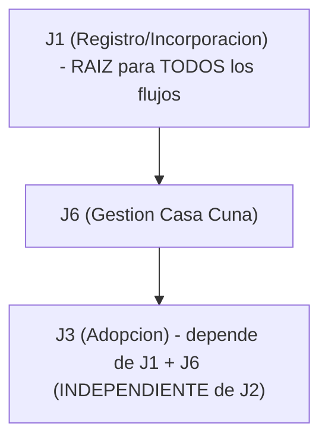
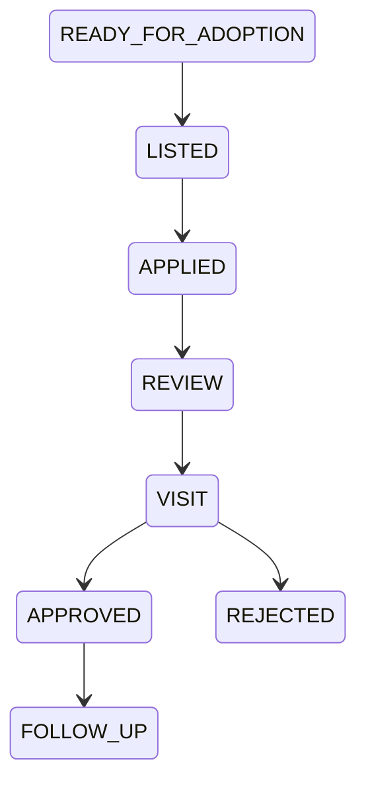
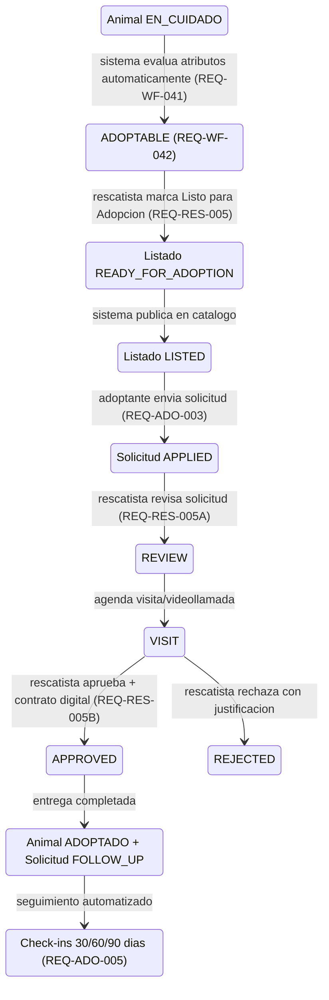
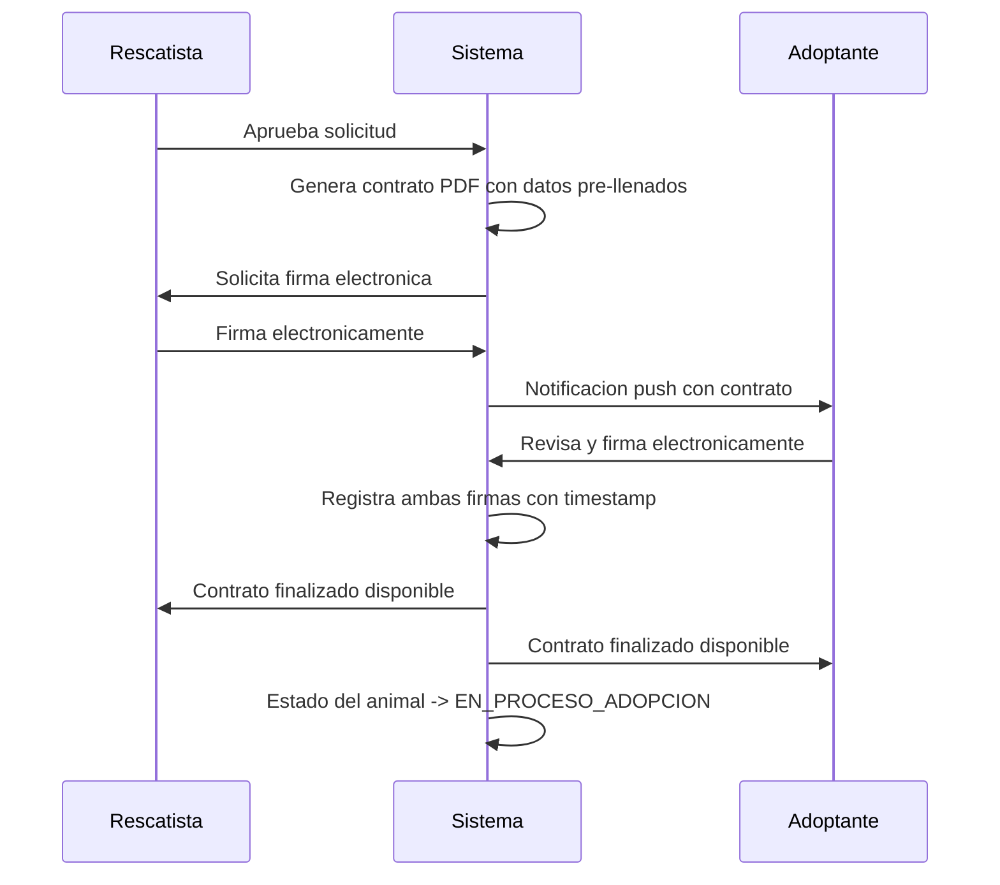
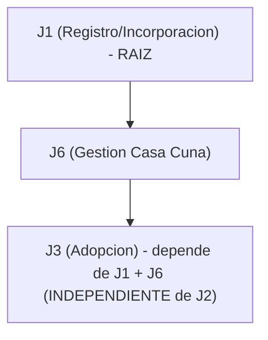

# Spec: Ciclo de Vida de Adopcion

**Dominio**: `adoption`
**Sprint**: 03 (Red Veterinaria y Adopciones)
**Servicios afectados**: Animal Rescue Service, Notification Service, User Management Service
**Ingresos en riesgo**: $200/mes (J3)

---

## Vision General

El modulo de adopcion gestiona el proceso completo desde que un rescatista (P05/P06) determina que un animal esta listo para ser adoptado hasta el seguimiento post-adopcion a 30/60/90 dias. Los adoptantes (P09) buscan animales disponibles, envian solicitudes, pasan por revision y visita, y reciben al animal tras aprobacion formal con contrato digital firmado electronicamente.

**Personas involucradas:** P05 (Rescatista Individual), P06 (Rescatista Organizacional), P09 (Adoptante)
**Etiqueta de ingresos:** Value-Delivery
**Ingresos en riesgo (SRD):** $200/mes
**Estado actual:** 0% construido -- sin entidad de adopcion, UI ni backend.

### Dependencias

- **J1 (Registro/Incorporacion):** Todos los usuarios deben estar autenticados (REQ-SEC-001).
- **J6 (Casa Cuna y Gestion Animal):** El inventario de animales y la entidad Animal deben existir antes de poder publicar listados de adopcion. La lista de necesidades de J6 alimenta la visibilidad para donantes en J8.
- **J10 (Chat):** Mejora la comunicacion rescatista-adoptante durante el proceso de revision y seguimiento.

### Grafo de Dependencia



---

## Flujo de Trabajo de Adopcion (Maquina de Estados)

### Estados del Workflow



| Estado | Descripcion | Actor | Transicion Siguiente |
|--------|-------------|-------|---------------------|
| `READY_FOR_ADOPTION` | El rescatista marca al animal como apto. El sistema evalua automaticamente los criterios de adoptabilidad (REQ-BR-050, REQ-BR-051). | Sistema / Rescatista | LISTED |
| `LISTED` | El animal esta publicado en el catalogo publico de adopcion. Visible para adoptantes con filtros por especie, tamano, edad, ubicacion. | Sistema | APPLIED (cuando un adoptante envia solicitud) |
| `APPLIED` | Un adoptante envio solicitud con cuestionario del hogar, detalles familiares, experiencia con mascotas y motivacion. | Adoptante | REVIEW |
| `REVIEW` | El rescatista revisa la solicitud: perfil del solicitante, respuestas del cuestionario, historial. Puede agendar visita o videollamada. | Rescatista | VISIT o REJECTED |
| `VISIT` | Visita presencial o videollamada para evaluar compatibilidad entre adoptante y animal. | Rescatista + Adoptante | APPROVED o REJECTED |
| `APPROVED` | Adopcion aprobada. Se genera contrato digital para firma electronica de ambas partes. Estado del animal cambia a "En Proceso de Adopcion". | Rescatista | FOLLOW_UP |
| `REJECTED` | Solicitud rechazada con justificacion obligatoria. El animal permanece en `LISTED`. | Rescatista | (estado terminal para la solicitud) |
| `FOLLOW_UP` | Seguimiento automatizado post-adopcion a 30/60/90 dias. Check-ins con foto + actualizacion de estado. | Sistema + Adoptante + Rescatista | (estado terminal tras completar 90 dias) |

### Estados del Ciclo de Vida del Animal (relevantes a adopcion)

```typescript
enum AnimalState {
  EN_CUIDADO = 'EN_CUIDADO',           // Animal bajo cuidado del rescatista
  ADOPTABLE = 'ADOPTABLE',             // Cumple todos los requisitos de adoptabilidad
  EN_PROCESO_ADOPCION = 'EN_PROCESO',  // Solicitud aprobada, pendiente de entrega
  ADOPTADO = 'ADOPTADO',               // Adopcion completada
  NO_ADOPTABLE = 'NO_ADOPTABLE',       // Tiene restricciones que impiden adopcion
}
```

### Transiciones del Flujo Completo



### Requisitos de Workflow

**REQ-WF-020:** CUANDO se cree una solicitud de adopcion ENTONCES el sistema DEBERA asignar el estado inicial "CREADA" (equivalente a `APPLIED` en la maquina de estados).

**REQ-WF-021:** CUANDO un animal cumpla requisitos de adoptabilidad ENTONCES el sistema DEBERA cambiar automaticamente a estado "VALIDADA" (equivalente a `READY_FOR_ADOPTION`).

**REQ-WF-022:** CUANDO un animal este validado para adopcion ENTONCES el sistema DEBERA permitir cambio a estado "PUBLICADA" (equivalente a `LISTED`).

**REQ-WF-041:** CUANDO se actualicen atributos de un animal ENTONCES el sistema DEBERA evaluar automaticamente si cumple requisitos de adoptabilidad.

**REQ-WF-042:** CUANDO un animal cumpla todos los requisitos Y no tenga restricciones ENTONCES el sistema DEBERA cambiar automaticamente su estado a "ADOPTABLE".

### Pasos del Recorrido J3

| Paso | Accion del Usuario | Pantalla/Ruta | Que Debe Suceder | Datos Requeridos |
|------|------------|-------------|------------------|---------------|
| 1 | El rescatista marca al animal "Listo para Adopcion" | `/casa-cuna/animals/{id}/publish` [TBD] | Listado con fotos, historial medico, temperamento, requisitos | Entidad animal |
| 2 | El adoptante navega los listados | `/adoptions` [TBD] | Galeria filtrable: especie, tamano, edad, compatible con ninos, ubicacion | Listados de adopcion |
| 3 | El adoptante envia solicitud | `/adoptions/{id}/apply` [TBD] | Cuestionario del hogar, detalles familiares. Estado -> `APPLIED` | Perfil del adoptante |
| 4 | El rescatista revisa la solicitud | `/casa-cuna/adoptions/{id}/review` [TBD] | Ver perfil del solicitante, respuestas. Agendar videollamada. | Solicitud + perfil |
| 5 | Visita/videollamada | Externa o en la app | Evaluar compatibilidad. Estado -> `VISIT` | Programacion |
| 6 | El rescatista aprueba | `/casa-cuna/adoptions/{id}/approve` [TBD] | Contrato digital generado y firmado. Estado -> `APPROVED` | Plantilla de contrato |
| 7 | Seguimiento (30/60/90 dias) | Push -> `/adoptions/{id}/followup` [TBD] | Foto + actualizacion de estado del adoptante. El rescatista confirma bienestar. | Notificacion |

---

## Contratos Digitales

### Firma Electronica

**REQ-RES-005B:** CUANDO un rescatista apruebe una solicitud de adopcion ENTONCES el sistema DEBERA:
- Notificar inmediatamente al adoptante sobre la aprobacion
- Facilitar coordinacion de fecha y lugar de entrega
- Generar contrato digital de adopcion para firma de ambas partes
- Cambiar automaticamente el estado del animal a "En Proceso de Adopcion"

### Contenido del Contrato Digital

El contrato generado automaticamente incluye:

| Campo | Descripcion | Fuente |
|-------|-------------|--------|
| Datos del adoptante | Nombre completo, direccion, telefono, correo | AdoptionApplication.informacionPersonal |
| Datos del rescatista | Nombre/organizacion, identificacion, contacto | Perfil del rescatista |
| Identificacion del animal | Especie, edad, sexo, fotos, codigo de seguimiento | Entidad Animal |
| Historial medico | Vacunas, esterilizacion, tratamientos previos | Historial medico del animal |
| Terminos y condiciones | Obligaciones del adoptante, clausulas de devolucion | Plantilla configurable |
| Compromiso de seguimiento | Verificaciones obligatorias a 30/60/90 dias | Configuracion del sistema |
| Firma electronica | Firma digital de ambas partes con timestamp | Sistema de firma |
| Fecha y lugar de entrega | Acordados entre rescatista y adoptante | Coordinacion via chat |

### Flujo de Firma



---

## Sistema de Seguimiento Post-Adopcion

**REQ-ADO-005:** CUANDO se complete una adopcion ENTONCES el sistema DEBERA permitir seguimiento del bienestar del animal adoptado.

### Intervalos de Verificacion

| Dia | Tipo | Accion del Adoptante | Accion del Rescatista |
|-----|------|---------------------|----------------------|
| **30** | Primera verificacion | Subir foto + actualizacion de estado del animal | Revisar y confirmar bienestar |
| **60** | Segunda verificacion | Subir foto + actualizacion de estado del animal | Revisar y confirmar bienestar |
| **90** | Verificacion final | Subir foto + actualizacion de estado del animal | Revisar, confirmar bienestar y cerrar seguimiento activo |

### Mecanismo

- Las notificaciones push se envian automaticamente al adoptante en cada intervalo, redirigiendo a `/adoptions/{id}/followup`.
- Si el adoptante no responde en 7 dias, se envia recordatorio.
- Si no hay respuesta en 14 dias, se notifica al rescatista para seguimiento manual.
- Al completar satisfactoriamente los 90 dias, el seguimiento activo concluye.

### Estructura del Check-in

```typescript
interface FollowUpCheckIn {
  dia: 30 | 60 | 90;
  fotoUrl?: string;               // Foto actual del animal
  actualizacionEstado?: string;    // Texto libre del adoptante
  confirmacionRescatista?: boolean; // El rescatista valida el bienestar
  fechaNotificacion: Date;         // Cuando se envio la notificacion
  fechaCompletado?: Date;          // Cuando el adoptante respondio
  fechaConfirmacion?: Date;        // Cuando el rescatista confirmo
}
```

---

## Reglas de Negocio

### Requisitos Minimos de Adoptabilidad

**REQ-BR-050:** CUANDO se evalue la adoptabilidad de un animal ENTONCES el sistema DEBERA verificar que cumpla TODOS los siguientes requisitos:
- Usa arenero = TRUE
- Come por si mismo = TRUE

### Restricciones que Impiden Adopcion

**REQ-BR-051:** CUANDO se evalue la adoptabilidad de un animal ENTONCES el sistema DEBERA verificar que NO tenga NINGUNA de las siguientes restricciones:
- Arizco con humanos = TRUE
- Arizco con otros animales = TRUE
- Lactante = TRUE
- Nodriza = TRUE
- Enfermo = TRUE
- Herido = TRUE
- Recien parida = TRUE
- Recien nacido = TRUE

### Validaciones de Integridad

**REQ-BR-081:** CUANDO se actualicen atributos de un animal ENTONCES el sistema DEBERA impedir que tenga simultaneamente "Come por si mismo" = TRUE Y "Lactante" = TRUE.

**REQ-BR-082:** CUANDO un animal tenga "Recien Nacido" = TRUE ENTONCES el sistema DEBERA establecer automaticamente "Lactante" = TRUE.

**REQ-BR-091:** CUANDO se intente crear una solicitud de adopcion ENTONCES el sistema DEBERA verificar que el animal cumpla todos los requisitos de adoptabilidad.

### Criterios para Solicitudes de Adopcion

**REQ-BR-027:** CUANDO un rescatista evalue crear una solicitud de adopcion ENTONCES DEBERA verificar que el animal cumple todos los criterios de adoptabilidad segun REQ-BR-050 y REQ-BR-051.

**REQ-BR-032:** CUANDO un rescatista cree una solicitud de adopcion ENTONCES el sistema DEBERA verificar que el animal cumpla todos los requisitos de adoptabilidad.

### Publicacion y Marcado

**REQ-RES-005:** CUANDO un rescatista determine que un animal cumple todos los requisitos de adoptabilidad ENTONCES el sistema DEBERA permitir marcar el animal como "Listo para Adoptar" (Ready for Adoption) y publicar automaticamente su perfil en el catalogo de adopcion.

### Gestion de Solicitudes Recibidas

**REQ-RES-005A:** CUANDO un rescatista reciba solicitudes de adopcion para sus animales ENTONCES el sistema DEBERA permitir:
- Ver todas las solicitudes pendientes con informacion del adoptante
- Revisar historial y experiencia del adoptante con mascotas
- Aprobar o rechazar solicitudes con justificacion obligatoria
- Establecer comunicacion directa con el adoptante mediante chat interno

### Coordinacion Post-Aprobacion

**REQ-RES-005B:** CUANDO un rescatista apruebe una solicitud de adopcion ENTONCES el sistema DEBERA:
- Notificar inmediatamente al adoptante sobre la aprobacion
- Facilitar coordinacion de fecha y lugar de entrega
- Generar contrato digital de adopcion para firma de ambas partes
- Cambiar automaticamente el estado del animal a "En Proceso de Adopcion"

### Notificaciones

**REQ-NOT-005:** CUANDO un animal este disponible para adopcion ENTONCES el sistema DEBERA notificar a adoptantes con preferencias coincidentes.

---

## Modelos de Datos

### AdoptionListing

```typescript
interface AdoptionListing {
  id: string;
  animalId: string;
  rescatistaId: string;
  casaCunaId: string;

  // Informacion del listado
  fotos: string[];                // URLs de fotos del animal
  historialMedico: string;        // Resumen del historial medico
  temperamento: string;           // Descripcion del temperamento
  requisitosAdoptante: string;    // Requisitos especificos del rescatista
  compatibleConNinos: boolean;
  compatibleConOtrosAnimales: boolean;

  // Estado del workflow
  estado: 'READY_FOR_ADOPTION' | 'LISTED' | 'PAUSADA' | 'CERRADA';
  fechaPublicacion?: Date;
  fechaCreacion: Date;
  fechaActualizacion: Date;
}
```

### AdoptionApplication

```typescript
interface AdoptionApplication {
  id: string;
  listingId: string;
  adoptanteId: string;
  animalId: string;
  rescatistaId: string;

  // Datos del cuestionario
  informacionPersonal: {
    nombreCompleto: string;
    direccion: string;
    telefono: string;
    correo: string;
  };
  experienciaMascotas: string;
  motivacion: string;
  detallesFamiliares: string;
  tipoVivienda: string;

  // Estado del proceso (maquina de estados)
  estado: 'APPLIED' | 'REVIEW' | 'VISIT' | 'APPROVED' | 'REJECTED' | 'FOLLOW_UP';
  justificacionRechazo?: string;

  // Visita
  fechaVisita?: Date;
  tipoVisita?: 'PRESENCIAL' | 'VIDEOLLAMADA';
  resultadoVisita?: 'APROBADA' | 'RECHAZADA' | 'PENDIENTE';

  // Contrato digital
  contratoDigitalUrl?: string;
  firmaAdoptante?: boolean;
  firmaRescatista?: boolean;
  fechaFirmaAdoptante?: Date;
  fechaFirmaRescatista?: Date;

  // Seguimiento post-adopcion (30/60/90 dias)
  seguimientos: FollowUpCheckIn[];

  fechaCreacion: Date;
  fechaActualizacion: Date;
}
```

### Requisitos de Adoptabilidad

```typescript
interface AdoptabilityRequirements {
  usaArenero: boolean;           // Entrenado para usar arenero (REQ-BR-050)
  comePorSiMismo: boolean;       // Capaz de alimentarse independientemente (REQ-BR-050)
}
```

### Restricciones de Adoptabilidad

```typescript
interface AdoptabilityRestrictions {
  arizcoConHumanos: boolean;     // Comportamiento agresivo/temeroso hacia personas (REQ-BR-051)
  arizcoConAnimales: boolean;    // Comportamiento agresivo hacia otros animales (REQ-BR-051)
  lactante: boolean;             // Aun requiere leche materna (REQ-BR-051)
  nodriza: boolean;              // Hembra amamantando crias (REQ-BR-051)
  enfermo: boolean;              // Condicion medica activa que requiere tratamiento (REQ-BR-051)
  herido: boolean;               // Lesiones fisicas que requieren atencion (REQ-BR-051)
  recienParida: boolean;         // Hembra que dio a luz recientemente <8 semanas (REQ-BR-051)
  recienNacido: boolean;         // Animal menor a 8 semanas de edad (REQ-BR-051)
}
```

### Entidad Animal (campos relevantes a adopcion)

```typescript
interface Animal {
  id: string;
  nombre?: string;
  especie: 'GATO' | 'PERRO' | 'OTRO';
  edad?: number;
  sexo?: 'MACHO' | 'HEMBRA';
  condiciones: AnimalConditions;
  requisitos: AdoptabilityRequirements;
  restricciones: AdoptabilityRestrictions;
  estado: AnimalState;
  ubicacion: Coordenadas;
  rescatistaId?: string;
  casaCunaId?: string;
}
```

### Estructura de Carpetas (Flutter)

```
features/
  adopcion/
    presentation/    # UI: listados, solicitudes, seguimiento, contratos
    domain/
      entities/      # AdoptionListing, AdoptionApplication, FollowUpCheckIn
      repositories/  # Interfaces de repositorio
      use_cases/     # PublicarAnimal, EnviarSolicitud, AprobarAdopcion, RegistrarSeguimiento
    data/
      models/        # Modelos de datos
      repositories/  # Implementaciones de repositorio
      data_sources/  # Fuentes de datos (remote/local)
```

---

## Funciones por Rol

### Rescatista (P05/P06)

**Definicion:** Persona con casa cuna que puede rescatar y cuidar animales a largo plazo. Determina cuando un animal esta listo para adopcion y gestiona las solicitudes de adopcion.

**Permisos:**
- Publicacion de animales para adopcion
- Gestion de solicitudes de adopcion (aprobar/rechazar)
- Generacion de contratos digitales
- Confirmacion de seguimiento post-adopcion

**REQ-RES-005:** Marcar animal como "Listo para Adoptar" y publicar en catalogo.
**REQ-RES-005A:** Revisar, aprobar o rechazar solicitudes con justificacion obligatoria.
**REQ-RES-005B:** Coordinar entrega y generar contrato digital.

### Adoptante (P09)

**Definicion:** Persona que desea adoptar animales rescatados, preferiblemente castrados y vacunados.

**Permisos:**
- Busqueda de animales disponibles
- Solicitar adopciones
- Comunicacion con rescatistas
- Acceso a historial medico del animal
- Firmar contratos de adopcion
- Proporcionar seguimiento post-adopcion

**REQ-ADO-001:** Registro con datos personales, preferencias de adopcion y experiencia con mascotas.
**REQ-ADO-002:** Busqueda con filtros por especie, edad, tamano y ubicacion.
**REQ-ADO-003:** Envio de solicitud con informacion personal, motivacion y experiencia.
**REQ-ADO-004:** El rescatista aprueba o rechaza con justificacion; coordinacion de entrega si aprobada.

### Tabla de Permisos (extracto)

| Funcionalidad | Centinela | Auxiliar | Rescatista | Adoptante | Donante | Veterinario |
|---|---|---|---|---|---|---|
| Solicitar adopcion | No | No | No | Si | No | No |
| Publicar animal para adopcion | No | No | Si | No | No | No |
| Gestionar solicitudes de adopcion | No | No | Si | No | No | No |
| Firmar contrato de adopcion | No | No | Si | Si | No | No |

---

## Criterios de Aceptacion (de J3)

- [FAIL] El rescatista publica animal con fotos e historial medico (fix: T1-2)
- [FAIL] El adoptante navega y filtra listados (fix: T1-2)
- [FAIL] El adoptante envia solicitud con cuestionario (fix: T1-2)
- [FAIL] El rescatista revisa, agenda visita, aprueba/rechaza (fix: T1-2)
- [FAIL] Contrato digital de adopcion generado y firmado (fix: T2-1)
- [FAIL] Seguimiento automatizado a 30/60/90 dias (fix: T2-2)

---

## Referencia SRD: J3 -- Ciclo de Vida de Adopcion ($200/mes)

**Puntuacion actual:** 0% | **Ingresos en riesgo:** $200/mes

**Grafo de dependencia:**



**Personas:** P05/P06 (publican), P09 (aplica)
**Etiqueta:** Value-Delivery

Nada esta construido actualmente. Sin entidad de adopcion, UI ni backend. La funcionalidad esta planificada para Sprint 03 junto con la red veterinaria y contratos digitales.

### IDs de Requisitos Referenciados

| ID | Descripcion |
|----|-------------|
| REQ-RES-005 | Marcado de animal listo para adopcion |
| REQ-RES-005A | Gestion de solicitudes de adopcion recibidas |
| REQ-RES-005B | Coordinacion de entrega post-aprobacion |
| REQ-ADO-001 | Registro de adoptantes |
| REQ-ADO-002 | Busqueda de animales |
| REQ-ADO-003 | Envio de solicitud de adopcion |
| REQ-ADO-004 | Aprobacion/rechazo de solicitud de adopcion |
| REQ-ADO-005 | Seguimiento post-adopcion |
| REQ-BR-027 | Criterios para solicitudes de adopcion de rescatistas |
| REQ-BR-032 | Adopcion requiere adoptabilidad completa |
| REQ-BR-050 | Requisitos minimos de adoptabilidad |
| REQ-BR-051 | Restricciones que impiden adopcion |
| REQ-BR-081 | Incompatibilidad comer por si mismo vs lactante |
| REQ-BR-082 | Recien nacido implica lactante |
| REQ-BR-091 | Adopcion requiere adoptabilidad |
| REQ-WF-020 | Adopcion inicia en CREADA |
| REQ-WF-021 | Adopcion pasa a VALIDADA |
| REQ-WF-022 | Adopcion se puede PUBLICAR |
| REQ-WF-041 | Evaluacion automatica de adoptabilidad |
| REQ-WF-042 | Cambio automatico a ADOPTABLE |
| REQ-NOT-005 | Notificar adoptantes coincidentes |
