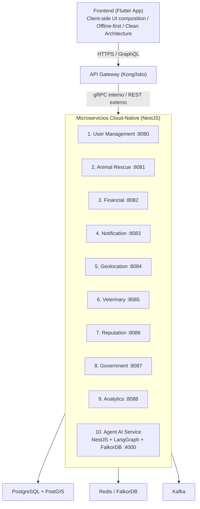
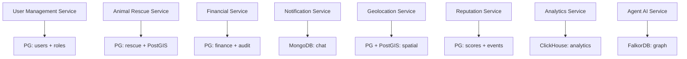
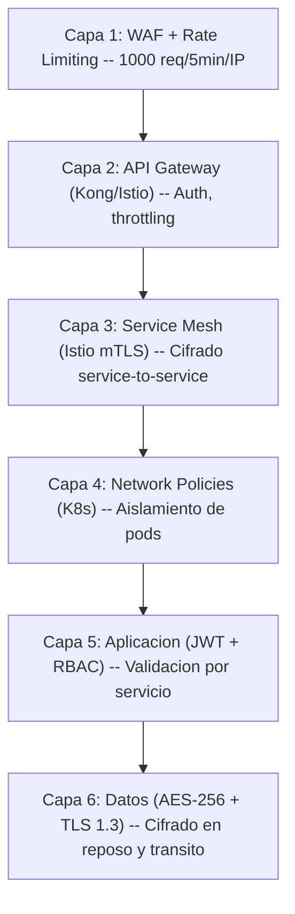
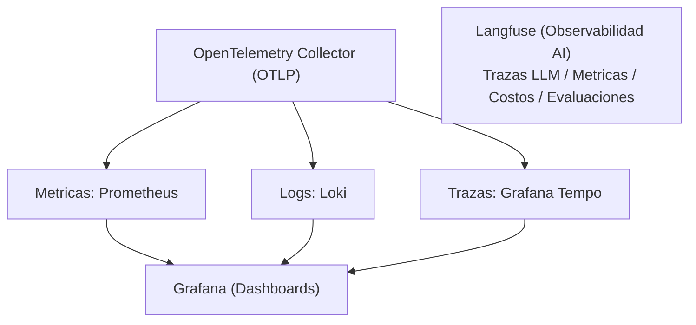

# Especificacion de Arquitectura del Sistema

**Proyecto:** AltruPets - Plataforma de Rescate Animal
**Version:** 1.0
**Estado:** Aprobado

---

## 1. Arquitectura del Sistema

### 1.1 Vision General

AltruPets implementa una arquitectura de microservicios cloud-native con 10 servicios autocontenidos, cada uno con base de datos propia (Database per Service), comunicacion sincrona via gRPC/GraphQL y asincrona via Apache Kafka.



### 1.2 Principios Arquitectonicos

**Microservicios Autocontenidos:** Cada servicio es una unidad independiente con su propia base de datos, siguiendo el patron Database per Service para garantizar desacoplamiento flexible.

**API-First:** Comunicacion a traves de APIs GraphQL y gRPC bien definidas, garantizando interoperabilidad entre servicios y con el frontend.

**Cloud-Native:** Optimizado para contenedorizacion con Docker/Podman y orquestacion con Kubernetes, aprovechando autoescalado y gestion elastica de recursos.

**Headless:** Desacoplamiento completo entre frontend movil (Flutter) y microservicios backend (NestJS).

**12-Factor App:**

| Factor | Implementacion |
|--------|---------------|
| Codebase | Monorepo Turborepo con pnpm workspaces |
| Dependencies | Declaradas en contenedores |
| Config | ConfigMaps y Secrets de Kubernetes |
| Backing Services | Bases de datos como recursos adjuntos |
| Stateless Processes | Sin estado en memoria, datos externalizados |
| Port Binding | Cada servicio expone su propio puerto |
| Disposability | Inicio/parada rapida de contenedores |

---

## 2. Stack Tecnologico

### 2.1 Frontend

| Componente | Tecnologia | Detalle |
|-----------|-----------|---------|
| SDK | Flutter SDK | Clean Architecture de tres capas (REQ-DIS-008) |
| Plataformas | iOS 12+, Android API 21+ | Multiplataforma sin modificaciones (REQ-DIS-009) |
| Estado | Riverpod / Bloc | Gestion de estado reactiva |
| Networking | GraphQL (graphql_flutter) | Schema-first contra API Gateway |
| Offline | Hive / SQLite | Offline-first con sincronizacion |
| Mapas | Google Maps / OpenStreetMap | Fallback dual |

### 2.2 Backend

| Componente | Tecnologia | Detalle |
|-----------|-----------|---------|
| Runtime | Node.js 22 LTS | Todos los microservicios |
| Framework | NestJS 11 + TypeScript | Microservicios y Agent AI |
| API Externa | Apollo Server 5.x (GraphQL) | Schema-first |
| API Interna | gRPC + Protobuf | Service-to-service |
| Orquestacion AI | LangGraph (StateGraph) | Agent AI Service |
| LLM | OpenAI GPT-4o (via @langchain/openai) | Recomendaciones de rescate |
| Memoria AI | Zep Cloud | Sesiones conversacionales |

### 2.3 Bases de Datos

| Base de Datos | Proposito | Servicio(s) |
|---------------|-----------|-------------|
| PostgreSQL 15 | Base relacional principal | Todos los dominios |
| PostGIS | Geoespacial y proximidad | Geolocation, Animal Rescue |
| Redis | Cache, refresh tokens, sesiones, memoria Zep | Backend, Agent |
| FalkorDB | Grafo de rescatistas y relaciones | Agent AI |
| MongoDB | Chat y mensajeria en tiempo real | Notification Service |
| ClickHouse | Analytics y metricas de negocio | Analytics Service |

### 2.4 Infraestructura

| Componente | Tecnologia | Detalle |
|-----------|-----------|---------|
| Contenedores | Docker / Podman | Multi-stage builds |
| Orquestacion | Kubernetes (Minikube dev, OVHCloud prod) | REQ-DIS-002 |
| Service Mesh | Istio | mTLS, observabilidad |
| API Gateway | Kong / Istio Gateway | Punto unico de entrada |
| IaC | Terraform | Infraestructura como codigo |
| GitOps | ArgoCD | Despliegue declarativo |
| CI/CD | GitHub Actions | Pipeline automatizado (REQ-MAN-003) |
| Secrets | Infisical + K8s Secrets + HashiCorp Vault | Gestion centralizada |
| Observabilidad | Prometheus + Grafana + Loki + Tempo | REQ-DIS-007 |
| Observabilidad AI | Langfuse | Trazas LLM, metricas, costos |

---

## 3. Estrategia de APIs

### 3.1 GraphQL Schema-First

Se define el SDL completo basado en los 10 dominios. Los resolvers se implementan incrementalmente:

1. **Schema completo definido upfront** -- Tipos, inputs, enums para todos los dominios
2. **Resolvers incrementales** -- Se implementan por sprint con placeholder `throw new Error('Not implemented')`
3. **Mobile codifica contra el schema inmediatamente** -- Sin esperar a resolvers
4. **Prioridad:** Sprint 01 (Auth, User, Animal Rescue, Geolocation) -> Sprint 02 (Vet Subsidy, Government) -> Sprint 03-04 (resto)

### 3.2 Endpoints por Microservicio

**1. User Management Service**
```
POST /api/v1/users/register
POST /api/v1/users/login
GET  /api/v1/users/profile
PUT  /api/v1/users/roles
GET  /api/v1/organizations
POST /api/v1/organizations/membership
GET  /health
```

**2. Animal Rescue Service**
```
POST /api/v1/reports/anonymous
POST /api/v1/rescues/request
GET  /api/v1/rescues/{id}/status
PUT  /api/v1/rescues/{id}/update
GET  /api/v1/casa-cuna/inventory
POST /api/v1/casa-cuna/animals
GET  /health
```

**3. Financial Service**
```
POST /api/v1/donations/process
POST /api/v1/donations/recurring
GET  /api/v1/financial/reports
POST /api/v1/kyc/validate
GET  /api/v1/transactions/history
POST /api/v1/webhooks/onvopay
POST /api/v1/veterinary-subsidy/request
GET  /api/v1/veterinary-subsidy/{id}/status
PUT  /api/v1/veterinary-subsidy/{id}/approve
PUT  /api/v1/veterinary-subsidy/{id}/reject
GET  /api/v1/veterinary-subsidy/municipal/{tenantId}
POST /api/v1/veterinary-subsidy/{id}/invoice
GET  /api/v1/veterinary-subsidy/reports/{tenantId}
GET  /health
```

**4. Notification Service**
```
POST /api/v1/notifications/send
GET  /api/v1/chat/conversations
POST /api/v1/chat/messages
WS   /api/v1/chat/websocket
GET  /api/v1/notifications/preferences
PUT  /api/v1/notifications/preferences
GET  /health
```

**5. Geolocation Service**
```
POST /api/v1/location/proximity
GET  /api/v1/location/rescuers/nearby
POST /api/v1/location/route/optimize
GET  /api/v1/location/jurisdictions
PUT  /api/v1/location/update
GET  /health
```

**6. Veterinary Service**
```
POST /api/v1/veterinary/register
GET  /api/v1/veterinary/available
POST /api/v1/veterinary/request
PUT  /api/v1/veterinary/treatment
GET  /api/v1/veterinary/medical-records
POST /api/v1/veterinary/referral
GET  /health
```

**7. Reputation Service**
```
POST /api/v1/reputation/rate
GET  /api/v1/reputation/score/{userId}
GET  /api/v1/reputation/history
POST /api/v1/reputation/report-abuse
GET  /api/v1/reputation/analytics
GET  /health
```

**8. Government Service**
```
GET  /api/v1/government/dashboard
POST /api/v1/government/mediation
GET  /api/v1/government/reports
GET  /api/v1/government/complaints
PUT  /api/v1/government/jurisdiction
GET  /api/v1/government/veterinary-subsidies/pending
PUT  /api/v1/government/veterinary-subsidies/{id}/approve
PUT  /api/v1/government/veterinary-subsidies/{id}/reject
POST /api/v1/government/veterinary-subsidies/{id}/request-info
GET  /api/v1/government/veterinary-subsidies/reports
PUT  /api/v1/government/config/subsidy-response-time
GET  /health
```

**9. Analytics Service**
```
GET  /api/v1/analytics/reports
POST /api/v1/analytics/ml/detect-anomalies
GET  /api/v1/analytics/metrics
GET  /api/v1/analytics/insights
POST /api/v1/analytics/custom-query
GET  /health
```

**10. Agent AI Service (GraphQL :4000)**
```graphql
type Mutation {
  recommendRescuers(
    captureRequestId: String!
    latitude: Float!
    longitude: Float!
    animalType: String!
  ): RecommendationResult!
}

type RecommendationResult {
  sessionId: String!
  message: String!
  recommendations: [RescuerRecommendation!]!
}

type RescuerRecommendation {
  userId: String!
  username: String!
  roles: [String!]!
  distanceKm: Float!
  score: Float!
  reasoning: String!
}
```

---

## 4. Estrategia de Bases de Datos

### 4.1 Patron Database per Service

Cada microservicio posee su propia base de datos dedicada. Ningun servicio accede directamente a la base de datos de otro; la comunicacion se realiza exclusivamente via APIs o eventos.



### 4.2 Optimizaciones de Base de Datos

```sql
-- User Management Service
CREATE INDEX CONCURRENTLY idx_users_email ON users(email);
CREATE INDEX CONCURRENTLY idx_user_roles_user_id ON user_roles(user_id);

-- Geolocation Service (PostGIS)
CREATE INDEX CONCURRENTLY idx_locations_geom ON locations USING GIST (coordinates);
CREATE INDEX CONCURRENTLY idx_locations_user_updated ON locations(user_id, updated_at);

-- Financial Service (particionado por fecha)
CREATE TABLE financial_transactions_2024 PARTITION OF financial_transactions
FOR VALUES FROM ('2024-01-01') TO ('2025-01-01');
```

### 4.3 Configuracion de Bases de Datos en Produccion

```yaml
database-optimization:
  production-critical:
    - financial-service-db:
        engine: "PostgreSQL"
        instance-class: "db.r6g.large"
        multi-az: true
        read-replicas: 2
        backup-retention: 35  # Maximo para cumplimiento

    - user-management-db:
        engine: "PostgreSQL"
        instance-class: "db.t4g.medium"
        multi-az: true
        read-replicas: 1
        backup-retention: 7

  production-standard:
    - animal-rescue-db:
        engine: "PostgreSQL"
        instance-class: "db.t4g.medium"
        read-replicas: 1
        backup-retention: 7

    - geolocation-db:
        engine: "PostgreSQL + PostGIS"
        instance-class: "db.r6g.medium"
        read-replicas: 2
        backup-retention: 7

  analytics-optimized:
    - analytics-db:
        engine: "ClickHouse on EC2"
        instance-class: "r6i.xlarge"
        reserved-instance: "3-year-all-upfront"
```

---

## 5. Autenticacion y Autorizacion

### 5.1 OAuth 2.0 / OpenID Connect con JWT

```yaml
auth:
  provider: keycloak
  flows:
    - authorization_code   # Para frontend Flutter
    - client_credentials   # Para service-to-service

  token-validation:
    - signature-verification
    - expiration-check
    - scope-validation

  jwt:
    expiration: 24h        # REQ-SEC-001
    refresh-tokens: true
    claims: [userId, roles, tenantId, scopes]
```

**REQ-SEC-001:** JWT con expiracion de 24 horas y refresh tokens.

**REQ-SEC-002:** Esquema de hashing dual:
1. **Capa cliente (mobile):** `SHA256(SHA256(password) + PASSWORD_SALT + username.toLowerCase())` -- se ejecuta en el dispositivo antes de transmitir.
2. **Capa servidor:** bcrypt (>=12 rounds) sobre el hash SHA-256 recibido antes de almacenar.

### 5.2 Jerarquia RBAC

```mermaid
graph TD
    AG["Administrador Gubernamental<br/>(Maximo nivel jurisdiccional)"]
    AG --> EBA["Encargado de Bienestar Animal<br/>(autoriza atencion veterinaria)"]
    AG --> MC["Mediador de Conflictos"]
    AG --> OJ["Organizaciones en su jurisdiccion"]

    RL["Representante Legal<br/>(Maximo nivel organizacional)"]
    RL --> AU["Administrador de Usuarios"]
    RL --> CO["Centinela Organizacional"]
    RL --> AO["Auxiliar Organizacional"]
    RL --> RO["Rescatista Organizacional"]
    RL --> ADO["Adoptante Organizacional"]
    RL --> DO["Donante Organizacional"]
    RL --> VO["Veterinario Organizacional"]

    UI["Usuarios Individuales<br/>(con responsabilidades especificas)"]
    UI --> CI["Centinela Individual<br/>(SOLO solicitudes de auxilio)"]
    UI --> AI["Auxiliar Individual<br/>(SOLO solicitudes de auxilio inmediato)"]
    UI --> RI["Rescatista Individual<br/>(SOLO solicitudes de adopcion)"]
    UI --> ADI["Adoptante Individual"]
    UI --> DI["Donante Individual"]
    UI --> VI["Veterinario Individual"]
```



Cada rol tiene tipos especificos de solicitudes que puede crear, siguiendo las reglas BR-010 a BR-032. Cada servicio valida permisos independientemente usando tokens JWT con claims de roles.

### 5.3 RBAC Distribuido

- **JWT Claims:** Roles y permisos embebidos en tokens
- **Service-Level Authorization:** Cada microservicio valida permisos de forma independiente
- **Fine-Grained Permissions:** Permisos especificos por recurso

### 5.4 Scopes del Sistema

| Scope | Descripcion |
|-------|-------------|
| `platform:metrics:read` | Telemetria y metricas agregadas |
| `central:pii:masked:read` | PII enmascarada de usuarios centrales |
| `finance:tokenized:read` | Datos financieros tokenizados |
| `tenant:{id}:gov:read` | Datos gubernamentales por jurisdiccion |
| `env:{authority}:read` | Datos ambientales por autoridad |

### 5.5 Protocolo Break-Glass

Proceso de acceso excepcional auditado con expiracion (REQ-SEC-007):

1. **Solicitud:** Identidad, caso, motivo, alcance, TTL
2. **Aprobacion independiente:** Doble control segun tipo de datos
3. **Emision de credenciales temporales:** Scope minimo, TTL, no renovables
4. **Acceso controlado:** Solo lectura/enmascarado, limites de volumen, deteccion de anomalias
5. **Auto-revocacion:** Al expirar TTL o cierre manual
6. **Informe de auditoria:** Eventos, consultas, exportaciones, hashes, sellos de tiempo

**Matriz de Aprobadores por Tipo de Datos:**

| Tipo de Datos | Aprobadores | TTL Maximo | Restricciones |
|---------------|-------------|-----------|---------------|
| Plataforma/Operacional (REQ-SEC-007-A) | Seguridad/Compliance + Manager SRE | 2h | Solo lectura, sin PII |
| PII Central (REQ-SEC-007-B) | DPO/Compliance + Data Owner | 1h | PII minimizada, motivo legal |
| Financiero/PCI (REQ-SEC-007-C) | PCI Officer + Compliance | 1h | SOLO tokens, sin PAN |
| Gubernamental (REQ-SEC-007-D) | Admin Gubernamental + Compliance | 1h | Por jurisdiccion |
| Ambiental (REQ-SEC-007-E) | Autoridad Ambiental (SINAC) + Compliance | 1h | Por jurisdiccion |

---

## 6. Seguridad

### 6.1 Defense in Depth (Seguridad por Capas)



### 6.2 Network Policies (Kubernetes)

```yaml
apiVersion: networking.k8s.io/v1
kind: NetworkPolicy
metadata:
  name: financial-service-policy
spec:
  podSelector:
    matchLabels:
      app: financial-service
  policyTypes:
  - Ingress
  - Egress
  ingress:
  - from:
    - podSelector:
        matchLabels:
          app: api-gateway
    ports:
    - protocol: TCP
      port: 8080
```

### 6.3 Reduccion de Scope PCI DSS (REQ-DIS-004)

```yaml
pci-scope:
  in-scope:
    - financial-service
    - api-gateway (payment endpoints)

  out-of-scope:
    - user-management-service
    - animal-rescue-service
    - notification-service
    - geolocation-service
    - veterinary-service
    - reputation-service
    - government-service
    - analytics-service
    - agent-ai-service
```

**Estrategia de Tokenizacion:**
- Payment Tokens: Almacenamiento seguro de referencias (nunca PAN)
- Vault Integration: HashiCorp Vault para secrets
- Token Rotation: Rotacion automatica de tokens

### 6.4 Clasificacion de Datos

```yaml
data-classification:
  public:
    - animal photos
    - rescue statistics

  internal:
    - user profiles
    - rescue requests

  confidential:
    - financial transactions
    - medical records

  restricted:
    - payment tokens
    - kyc documents
```

### 6.5 Cifrado Multi-Nivel (REQ-DIS-005)

| Ambito | Cifrado | Detalle |
|--------|---------|---------|
| En transito | TLS 1.3 | Todas las comunicaciones |
| En reposo | AES-256 | Bases de datos |
| En memoria | Cifrado de datos sensibles en cache | Redis |
| Punto a punto | E2E encryption | Datos PII y financieros |

### 6.6 Rate Limiting (REQ-SEC-005)

- **Por usuario:** 1000 requests por minuto
- **Por IP (WAF):** 1000 requests por 5 minutos
- **Geo-blocking:** Bloqueo de trafico no-LATAM para reducir superficie de ataque

---

## 7. Patrones de Comunicacion

### 7.1 Comunicacion Sincrona

| Protocolo | Uso | Detalle |
|-----------|-----|---------|
| gRPC + Protobuf | Service-to-service interno (REQ-DIS-006) | Baja latencia, tipado fuerte |
| GraphQL | Frontend -> API Gateway | Schema-first, Apollo Server 5 |
| REST | APIs externas (webhooks ONVOPay) | Integraciones terceros |
| WebSockets | Chat en tiempo real | Notification Service |

### 7.2 Comunicacion Asincrona

```yaml
# Apache Kafka para eventos
kafka:
  brokers: ${KAFKA_BROKERS}
  topics:
    - user-events
    - rescue-events
    - financial-events
    - notification-events

  consumer-groups:
    - notification-service-group
    - analytics-service-group
```

### 7.3 Eventos del Sistema

```yaml
UserManagementService:
  - user.registered
  - user.role.assigned
  - organization.created

AnimalRescueService:
  - rescue.requested
  - rescue.completed
  - animal.rescued

FinancialService:
  - donation.received
  - payment.processed
  - kyc.required
  - veterinary.subsidy.requested
  - veterinary.subsidy.approved
  - veterinary.subsidy.rejected
  - veterinary.subsidy.expired
  - municipal.invoice.issued
  - rescuer.invoice.issued

NotificationService:
  - notification.sent
  - chat.message.delivered

ReputationService:
  - rating.created
  - reputation.updated
```

### 7.4 Saga Pattern para Transacciones Distribuidas

```yaml
# Ejemplo: Proceso de donacion
donation-saga:
  steps:
    1. validate-user (User Management Service)
    2. process-payment (Financial Service)
    3. update-casa-cuna (Animal Rescue Service)
    4. send-notification (Notification Service)

  compensations:
    4. cancel-notification
    3. revert-casa-cuna-update
    2. refund-payment
    1. log-validation-failure
```

### 7.5 Service Discovery

- **Kubernetes DNS:** Descubrimiento automatico de servicios via ClusterIP
- **Service Mesh (Istio):** Comunicacion segura con mTLS y observabilidad
- **Load Balancing:** Distribucion automatica de carga entre replicas

```yaml
apiVersion: v1
kind: Service
metadata:
  name: user-management-service
spec:
  selector:
    app: user-management
  ports:
  - port: 8080
    targetPort: 8080
  type: ClusterIP
```

---

## 8. Patrones de Resiliencia

### 8.1 Circuit Breaker (REQ-REL-002)

```yaml
services:
  financial-service:
    circuit-breaker:
      failure-threshold: 5
      timeout: 30s
      recovery-timeout: 60s

  geolocation-service:
    circuit-breaker:
      failure-threshold: 3
      timeout: 10s
      recovery-timeout: 30s
```

### 8.2 Retry con Backoff Exponencial (REQ-REL-004)

| Tipo de Error | Reintentos | Estrategia |
|---------------|-----------|------------|
| Errores de red | Automatico con backoff exponencial | Base 1s, max 32s |
| Errores de pago | Maximo 3 reintentos | Escalacion manual despues |
| Errores de geolocalizacion | 2 reintentos | Fallback a seleccion manual |

### 8.3 Bulkhead (Aislamiento de Recursos)

```yaml
resources:
  user-management:
    requests:
      cpu: 100m
      memory: 128Mi
    limits:
      cpu: 500m
      memory: 512Mi

  financial-service:
    requests:
      cpu: 200m
      memory: 256Mi
    limits:
      cpu: 1000m
      memory: 1Gi
```

### 8.4 Timeout y Health Checks

```yaml
/health:
  liveness: /health/live     # Kubernetes liveness probe
  readiness: /health/ready   # Kubernetes readiness probe

  checks:
    - database-connection
    - external-service-connectivity
    - memory-usage
    - disk-space
```

### 8.5 Auto-Remediacion

```yaml
auto-remediation:
  - failed-health-checks:
      action: "restart-pod"
      max-attempts: 3
      escalation: "alert-on-call"

  - high-memory-usage:
      threshold: 85%
      action: "scale-up"
      cooldown: "5-minutes"

  - database-connection-pool-exhaustion:
      action: "restart-service"
      notification: "immediate"
```

---

## 9. Estrategia de Testing

### 9.1 Frontend (Flutter)

| Tipo | Objetivo |
|------|----------|
| Unit Tests | Logica de negocio y validaciones basicas |
| Widget Tests | Componentes de UI individuales |
| Integration Tests | Flujos completos de usuario |
| Golden Tests | Consistencia visual de interfaces |

### 9.2 Microservicios (Backend)

```yaml
# Service Component Tests
user-management-service:
  tests:
    - unit: domain logic, RBAC validation
    - integration: PostgreSQL, JWT generation
    - contract: API schema validation

financial-service:
  tests:
    - unit: payment processing, KYC validation
    - integration: ONVOPay adapter, Event Sourcing
    - security: PCI DSS compliance, encryption
```

```yaml
# Service Integration Contract Tests
contracts:
  user-management -> animal-rescue:
    - user authentication tokens
    - role validation responses

  financial -> notification:
    - payment completion events
    - donation confirmation data
```

**End-to-End Tests:**
- Cross-Service Workflows: Flujos completos de rescate
- Saga Testing: Validacion de transacciones distribuidas
- Event Flow Testing: Propagacion correcta de eventos

### 9.3 Testing de Infraestructura

| Tipo | Herramienta | Objetivo |
|------|-------------|----------|
| Helm Chart Testing | helm lint, kubeval | Validacion de manifiestos |
| Pod Startup Testing | K8s probes | Health checks y readiness |
| Service Discovery Testing | Istio tools | Comunicacion entre pods |
| Load Testing | K6 / JMeter | Capacidad bajo carga |
| Stress Testing | K6 | Limites de cada microservicio |
| Chaos Engineering | Chaos Monkey | Resiliencia bajo fallas |

### 9.4 Testing de Reglas de Negocio

- **Adoptabilidad (BR-050, BR-051):** Animal debe cumplir TODOS los requisitos; CUALQUIER restriccion impide adopcion
- **Workflow (WF-001 a WF-042):** Auxilio completado crea automaticamente solicitud de rescate; actualizacion de atributos evalua adoptabilidad
- **Geolocalizacion (GEO-001 a GEO-022):** Busqueda inicial en 10km; expansion automatica a 25km despues de 30 min
- **Jurisdicciones (JUR-001 a JUR-022):** Solo encargados de jurisdiccion pueden autorizar; zona fronteriza requiere autorizacion multiple

### 9.5 Testing de Cumplimiento PCI DSS

| Tipo | Frecuencia |
|------|-----------|
| Quarterly Scans | Escaneos de vulnerabilidades automatizados |
| Penetration Testing | Testing anual de penetracion |
| Token Validation | Verificacion continua de tokenizacion |
| KYC/AML Regulatory Compliance | Validacion de procesos KYC |
| ML Model Testing | Precision de deteccion de anomalias |
| Audit Trail Testing | Trazabilidad completa de transacciones |

---

## 10. Infraestructura

### 10.1 Entornos

| Entorno | Plataforma | Proposito |
|---------|-----------|-----------|
| Desarrollo | Minikube (local) | Desarrollo y testing rapido |
| Staging | OVHCloud Kubernetes | Pre-produccion |
| Produccion | OVHCloud Kubernetes | Produccion multi-region |

### 10.2 GitOps con ArgoCD

ArgoCD sincroniza el estado deseado declarado en Git con el cluster de Kubernetes. Todo despliegue pasa por el repositorio Git como fuente unica de verdad.

### 10.3 Terraform IaC

Toda la infraestructura se define como codigo con Terraform, incluyendo clusters Kubernetes, bases de datos, redes, balanceadores de carga y politicas de seguridad.

### 10.4 Multi-Region (REQ-ESC-003)

```yaml
multi-region-strategy:
  primary-region:
    region: "us-east-1"
    services: "all"
    redundancy: "multi-az"

  secondary-region:
    region: "us-west-2"
    services: ["financial-service", "user-management-service"]
    deployment-type: "warm-standby"
    rto: "15-minutes"
    rpo: "5-minutes"

  replication-strategy:
    - financial-data: "synchronous"
    - user-data: "asynchronous-5min"
    - analytics-data: "daily-batch"
```

### 10.5 Rolling Updates (REQ-MAN-001)

Despliegues sin downtime mediante rolling updates de Kubernetes. Cada microservicio se actualiza incrementalmente, validando health checks antes de continuar.

### 10.6 Operaciones Programadas

```yaml
scheduled-operations:
  - development-environment-shutdown:
      schedule: "0 19 * * 1-5"  # 7 PM dias laborales
      action: "scale-to-zero"

  - analytics-batch-processing:
      schedule: "0 2 * * *"     # 2 AM diario
      resources: "spot-instances"

  - database-maintenance:
      schedule: "0 3 * * 0"     # Domingos 3 AM
      action: "automated-maintenance"
```

---

## 11. Performance y Escalabilidad

### 11.1 Horizontal Pod Autoscaler (HPA)

```yaml
apiVersion: autoscaling/v2
kind: HorizontalPodAutoscaler
metadata:
  name: financial-service-hpa
spec:
  scaleTargetRef:
    apiVersion: apps/v1
    kind: Deployment
    name: financial-service
  minReplicas: 2
  maxReplicas: 10
  metrics:
  - type: Resource
    resource:
      name: cpu
      target:
        type: Utilization
        averageUtilization: 70
  - type: Resource
    resource:
      name: memory
      target:
        type: Utilization
        averageUtilization: 80
```

### 11.2 Configuracion de Auto-Scaling por Servicio

```yaml
cost-optimization:
  high-demand-services:
    - animal-rescue-service:
        min-replicas: 2
        max-replicas: 20
        target-cpu: 60%
        scale-down-delay: 300s

    - notification-service:
        min-replicas: 3
        max-replicas: 50
        target-cpu: 70%
        scale-down-delay: 180s

  moderate-demand-services:
    - user-management-service:
        min-replicas: 2
        max-replicas: 10
        target-cpu: 70%
        scale-down-delay: 600s

    - geolocation-service:
        min-replicas: 2
        max-replicas: 15
        target-cpu: 65%
        scale-down-delay: 300s

  low-demand-services:
    - analytics-service:
        min-replicas: 1
        max-replicas: 5
        target-cpu: 80%
        use-spot-instances: true

    - reputation-service:
        min-replicas: 1
        max-replicas: 3
        target-cpu: 75%
        use-spot-instances: true
```

### 11.3 Vertical Pod Autoscaler (VPA)

```yaml
apiVersion: autoscaling.k8s.io/v1
kind: VerticalPodAutoscaler
metadata:
  name: user-management-vpa
spec:
  targetRef:
    apiVersion: apps/v1
    kind: Deployment
    name: user-management-service
  updatePolicy:
    updateMode: "Auto"
```

### 11.4 Estrategia de Cache Redis

```yaml
caching-strategy:
  user-management:
    - user-sessions: TTL 30m
    - role-permissions: TTL 1h

  geolocation:
    - proximity-queries: TTL 5m
    - route-calculations: TTL 15m

  reputation:
    - user-scores: TTL 10m
    - rating-aggregates: TTL 1h
```

### 11.5 CDN y Edge Computing

```yaml
cdn-strategy:
  static-content:
    - animal-photos:
        cdn: "CloudFront"
        origin: "S3"
        cache-ttl: "30-days"
        compression: "gzip + brotli"

    - app-assets:
        cdn: "CloudFront"
        origin: "S3"
        cache-ttl: "1-year"
        versioning: "enabled"

  api-caching:
    - public-endpoints:
        cache-ttl: "5-minutes"
    - user-specific-endpoints:
        cache-ttl: "30-seconds"
    - geolocation-queries:
        cache-ttl: "2-minutes"

  edge-computing:
    - image-resizing: "Lambda@Edge"
    - geolocation-calculations: "CloudFront Functions"
    - user-authentication: "Lambda@Edge"
```

### 11.6 Almacenamiento por Niveles

```yaml
storage-optimization:
  tier-1-hot:
    services: [financial-service, user-management-service]
    storage-class: "gp3"
    iops: 3000
    retention: "7-years"
    backup-frequency: "6-hours"

  tier-2-warm:
    services: [animal-rescue-service, geolocation-service, notification-service]
    storage-class: "gp3"
    iops: 1000
    retention: "2-years"
    backup-frequency: "12-hours"

  tier-3-cold:
    services: [analytics-service, reputation-service]
    storage-class: "st1"
    retention: "5-years"
    backup-frequency: "24-hours"

  media-storage:
    type: "S3"
    classes:
      - frequent-access: "S3 Standard"       # Primeros 30 dias
      - infrequent-access: "S3 IA"           # 30-90 dias
      - archive: "S3 Glacier"                # 90+ dias
      - deep-archive: "S3 Glacier Deep Archive"  # 1+ ano
```

---

## 12. Observabilidad

### 12.1 Stack de Observabilidad (REQ-DIS-007)



### 12.2 Structured Logging (12-Factor App)

```yaml
logging:
  level: INFO
  format: json
  output: stdout  # Agregacion por Kubernetes

  fields:
    service: ${SERVICE_NAME}
    version: ${SERVICE_VERSION}
    trace_id: ${TRACE_ID}
    span_id: ${SPAN_ID}
```

### 12.3 Metricas (Prometheus)

| Tipo | Metricas |
|------|----------|
| Application | Latencia p50/p95/p99, throughput, tasas de error |
| Business | Rescates completados, donaciones procesadas |
| Infrastructure | CPU, memoria, red por pod |

### 12.4 Trazas Distribuidas (Grafana Tempo)

- **Request Tracing:** Seguimiento de requests a traves de microservicios
- **Performance Analysis:** Identificacion de cuellos de botella
- **Error Correlation:** Correlacion de errores entre servicios

### 12.5 Estrategia de Sampling

```yaml
sampling-strategy:
  traces: "1% sampling for normal traffic, 100% for errors"
  logs: "ERROR and WARN always, INFO sampled at 10%"
  metrics: "1-minute resolution for dashboards, 5-minute for alerts"

retention-optimization:
  hot-data: "7-days"     # Dashboards y alertas
  warm-data: "30-days"   # Analisis y debugging
  cold-data: "1-year"    # Compliance y analisis historico
```

### 12.6 Observabilidad AI (Langfuse)

El Agent AI Service utiliza Langfuse para trazabilidad completa de interacciones con LLM:
- Trazas de cada invocacion de GPT-4o
- Metricas de latencia y tokens consumidos
- Costos por sesion y por usuario
- Evaluaciones de calidad de recomendaciones

### 12.7 APM por Servicio

```yaml
metrics:
  latency:
    - p50, p95, p99 response times
    - database query times
    - external API call times

  throughput:
    - requests per second
    - transactions per minute
    - events processed per hour

  errors:
    - error rates by endpoint
    - failed transaction rates
    - circuit breaker activations
```

---

## 13. Requisitos No Funcionales

### 13.1 Rendimiento (REQ-PER)

| ID | Requisito | Valor |
|----|-----------|-------|
| REQ-PER-001 | Usuarios concurrentes minimos | 10,000 |
| REQ-PER-002 | TPS en transacciones financieras | >= 100 |
| REQ-PER-003 | Latencia de notificaciones push | < 5 segundos |
| REQ-PER-004 | Latencia de busquedas geoespaciales | < 2 segundos |
| REQ-PER-005 | Tamano maximo de imagenes (compresion) | <= 2 MB |
| REQ-PER-006 | Sincronizacion offline | < 30 segundos |
| REQ-PER-007 | Generacion de reportes financieros (1 ano) | < 10 segundos |
| REQ-PER-008 | Rendimiento Flutter | 60 FPS constantes |
| REQ-PER-009 | Tiempo de inicio Flutter (gama media) | <= 3 segundos |
| REQ-PER-010 | Uso eficiente de memoria Flutter | ListView.builder obligatorio |

### 13.2 Seguridad (REQ-SEC)

| ID | Requisito | Valor |
|----|-----------|-------|
| REQ-SEC-001 | Autenticacion JWT + refresh tokens | Expiracion 24h |
| REQ-SEC-002 | Hash de credenciales | SHA-256 (cliente) + bcrypt >=12 rounds (servidor) |
| REQ-SEC-003 | Bloqueo por actividad sospechosa | Bloqueo temporal + notificacion admin |
| REQ-SEC-004 | KYC cifrado | E2E + BD segregada |
| REQ-SEC-005 | Rate limiting por usuario | 1000 RPM |
| REQ-SEC-006 | Minimizacion de PII | Solo lectura, enmascarado/tokenizacion |
| REQ-SEC-007 | Proceso break-glass | Doble autorizacion, TTL, auto-revocacion |
| REQ-SEC-007-A | Break-glass Plataforma | TTL <= 2h, sin PII |
| REQ-SEC-007-B | Break-glass PII Central | TTL <= 1h, PII minimizada |
| REQ-SEC-007-C | Break-glass Financiero/PCI | TTL <= 1h, SOLO tokens |
| REQ-SEC-007-D | Break-glass Gubernamental | TTL <= 1h, por jurisdiccion |
| REQ-SEC-007-E | Break-glass Ambiental | TTL <= 1h, por jurisdiccion |
| REQ-SEC-008 | Auditoria inmutable de break-glass | Hashes SHA-256, sellado temporal |
| REQ-SEC-009 | Controles de volumen en break-glass | Limites por sesion, deteccion anomalias |

### 13.3 Confiabilidad (REQ-REL)

| ID | Requisito | Valor |
|----|-----------|-------|
| REQ-REL-001 | Disponibilidad mensual | >= 99.9% |
| REQ-REL-002 | Circuit Breaker ante fallas | Prevencion de cascadas de errores |
| REQ-REL-003 | Backups automaticos | Cada 6h, retencion 30 dias |
| REQ-REL-004 | Reintentos con backoff exponencial | Automatico en errores transitorios |
| REQ-REL-005 | Continuidad ante perdida de usuarios criticos | < 24h criticos, < 72h rutinarios |
| REQ-REL-006 | Redundancia en roles criticos | 3 backup/rescatista, 2 supervisores/area |
| REQ-REL-007 | Recuperacion ante falla de supervisores | Escalacion automatica a areas adyacentes |

### 13.4 Escalabilidad (REQ-ESC)

| ID | Requisito | Valor |
|----|-----------|-------|
| REQ-ESC-001 | Autoescalado por microservicio | Hasta 100 replicas |
| REQ-ESC-002 | Particionamiento horizontal en BD | Soporte obligatorio |
| REQ-ESC-003 | Soporte multi-region | Despliegue geografico distribuido |

### 13.5 Mantenibilidad (REQ-MAN)

| ID | Requisito | Valor |
|----|-----------|-------|
| REQ-MAN-001 | Rolling updates | Sin downtime |
| REQ-MAN-002 | Healthchecks y diagnostico | Metricas de salud por microservicio |
| REQ-MAN-003 | CI/CD automatizado | Pruebas unitarias + integracion obligatorias |

### 13.6 Restricciones de Diseno (REQ-DIS)

| ID | Requisito | Valor |
|----|-----------|-------|
| REQ-DIS-001 | Arquitectura | Microservicios con Database per Service |
| REQ-DIS-002 | Contenedores y orquestacion | Docker/Podman + Kubernetes/OpenShift |
| REQ-DIS-003 | Principios 12-Factor App | Obligatorio en todos los servicios |
| REQ-DIS-004 | Cumplimiento PCI DSS | Nivel 1 para procesamiento de pagos |
| REQ-DIS-005 | Cifrado | AES-256 en reposo, TLS 1.3 en transito |
| REQ-DIS-006 | Comunicacion interna/externa | gRPC interno, REST externo |
| REQ-DIS-007 | Observabilidad | OTel + Prometheus + Loki + Tempo |
| REQ-DIS-008 | Frontend | Flutter SDK + Clean Architecture 3 capas |
| REQ-DIS-009 | Compatibilidad | iOS 12+, Android API 21+ |

---

## 14. Integraciones Externas

### 14.1 Financial Service Integrations

```yaml
payment-adapters:
  onvopay:
    adapter: ONVOPayAdapter
    config: ${ONVOPAY_CONFIG}
    fallback: stripe

  stripe:
    adapter: StripeAdapter
    config: ${STRIPE_CONFIG}
    fallback: manual-transfer

  sinpe:
    adapter: SINPEAdapter
    config: ${SINPE_CONFIG}
    region: costa-rica
```

### 14.2 Geolocation Service Integrations

```yaml
map-providers:
  primary: google-maps
  fallback: openstreetmap

  google-maps:
    api-key: ${GOOGLE_MAPS_API_KEY}
    rate-limit: 1000/day

  openstreetmap:
    endpoint: ${OSM_ENDPOINT}
    rate-limit: unlimited
```

### 14.3 Servicios Externos

```yaml
external-services:
  firebase-messaging:
    url: ${FCM_URL}
    credentials: ${FCM_CREDENTIALS}

  kyc-provider:
    url: ${KYC_API_URL}
    api-key: ${KYC_API_KEY}

  sanctions-list:
    url: ${SANCTIONS_API_URL}
    refresh-interval: 24h
```

### 14.4 Configuracion Externa (ConfigMaps)

```yaml
apiVersion: v1
kind: ConfigMap
metadata:
  name: external-services-config
data:
  google-maps-url: "https://maps.googleapis.com/maps/api"
  firebase-url: "https://fcm.googleapis.com/fcm"
  onvopay-url: "https://api.onvopay.com"
```
