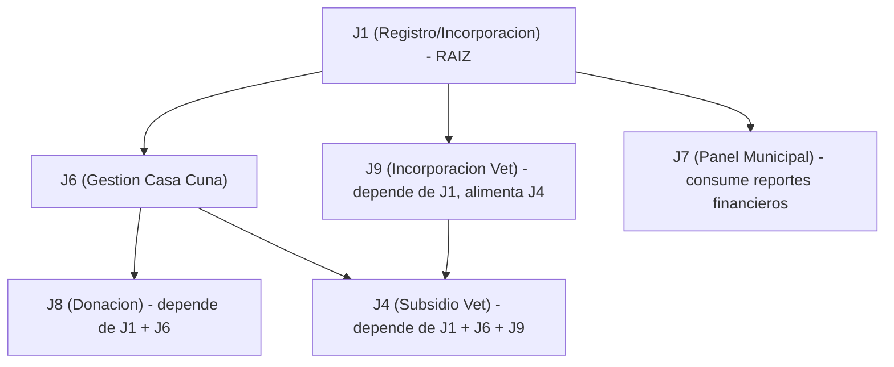
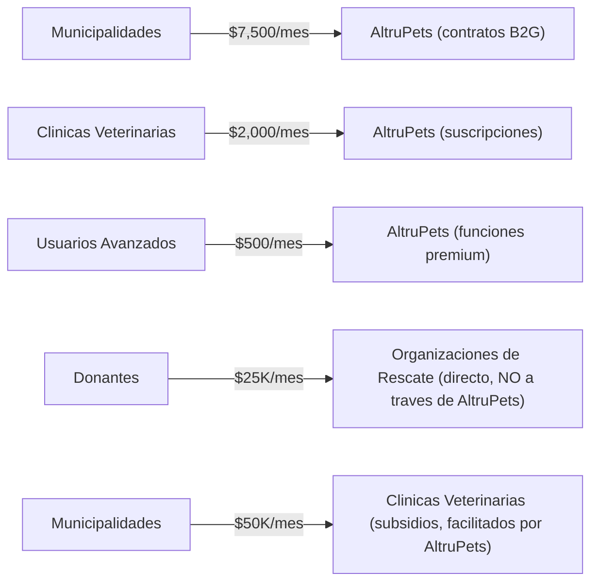
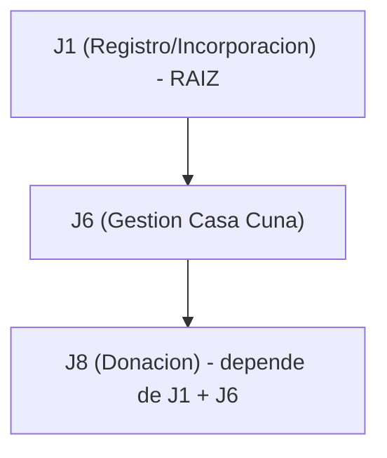

# Spec: Sistema Financiero

**Dominio**: `financial`
**Sprint**: 04 (Sistema Financiero Completo)
**Servicios afectados**: Financial Service, Government Service, Veterinary Service, Notification Service
**Ingresos en riesgo**: $92/mes (J8) + vinculo critico con $3,500/mes (J4) y $1,000/mes (J9)

---

## Vision General

AltruPets es una **plataforma de coordinacion, NO un intermediario financiero.** Las donaciones fluyen de persona a persona: donante -> cuenta bancaria de la organizacion de rescate (via SINPE o transferencia bancaria). Los pagos de subsidios veterinarios fluyen de gobierno -> clinica veterinaria (facilitados por AltruPets). AltruPets facilita, registra y genera transparencia pero NUNCA retiene, procesa ni enruta fondos a traves de sus cuentas.

Esta decision de diseno evita la supervision de SUGEF (Ley 7786, Arts. 15/15 bis) en Costa Rica y reguladores financieros equivalentes en otros paises de LATAM (CNBV en Mexico, SUPERFINANCIERA en Colombia, BCRA en Argentina).

El Financial Service es un microservicio dedicado que gestiona:
- Procesamiento de donaciones y pagos (PCI DSS compliant)
- Gestion financiera y contable de rescatistas
- Sistema de Subvencion Municipal para Atencion Veterinaria (REQ-FIN-VET-001 a REQ-FIN-VET-014)
- Integracion con ONVOPay mediante patron Adapter
- Cumplimiento regulatorio y KYC
- Gestion de obligaciones de pago municipales vs rescatistas
- Generacion de reportes de transparencia con exportacion PDF/Excel

**Personas involucradas:** P10 (Donante), P06 (Rescatista), P03/P04 (Veterinarios), P01/P02 (Gobierno)
**Etiqueta de ingresos (J8):** Value-Delivery
**Ingresos en riesgo (J8 SRD):** $92/mes
**Estado actual (J8):** 8% construido -- infraestructura de pasarela de pago existe (4 implementaciones), perfiles de organizaciones existen, sin UI de donacion, entidad ni seguimiento de impacto.

### Dependencias

- **J1 (Registro/Incorporacion):** Todos los usuarios deben estar autenticados (REQ-SEC-001).
- **J6 (Casa Cuna y Gestion Animal):** Necesita listados del inventario de casa cuna para la lista de necesidades visible a donantes.
- **J9 (Incorporacion Veterinaria):** Alimenta el flujo de subsidios veterinarios (J4).
- **J4 (Subsidio Veterinario):** El Financial Service emite facturas duales (municipal vs rescatista) segun resolucion de subvencion.
- **J7 (Panel Municipal):** Consume reportes de transparencia generados por el Financial Service.

### Grafo de Dependencia



---

## Sistema de Donaciones

### Tipos de Donacion

| Tipo | Descripcion | Flujo de Fondos | Requisito |
|------|-------------|-----------------|-----------|
| **Monetaria P2P** | El donante transfiere directamente a la organizacion de rescate via SINPE o transferencia bancaria. AltruPets NO toca los fondos. | Donante -> Cuenta bancaria de la org | REQ-DON-002 |
| **De Insumos** | El donante ofrece insumos fisicos (comida, medicina, suministros) que las casas cuna necesitan. | Donante -> Entrega fisica a la org | REQ-DON-003 |
| **Recurrente (Suscripcion)** | El donante configura frecuencia, monto y casas cuna beneficiarias para donaciones automaticas. | Donante -> Cuenta bancaria de la org (periodico) | REQ-DON-004 |
| **De Emergencia** | Para casos urgentes de rescate que requieren fondos inmediatos. | Donante -> Cuenta bancaria de la org (urgente) | REQ-DON-002 |

### Requisitos Funcionales de Donaciones

**REQ-DON-001:** CUANDO una persona desee donar ENTONCES el sistema DEBERA permitir registro con informacion KYC segun el tipo y monto de donacion.

**REQ-DON-002:** CUANDO un donante realice donacion monetaria ENTONCES el sistema DEBERA procesar el pago a traves de ONVOPay con cumplimiento PCI DSS.

**REQ-DON-003:** CUANDO un donante ofrezca insumos ENTONCES el sistema DEBERA mostrar necesidades actuales de casas cuna cercanas.

**REQ-DON-004:** CUANDO un donante configure suscripcion ENTONCES el sistema DEBERA permitir seleccionar frecuencia, monto y casas cuna beneficiarias.

**REQ-DON-005:** CUANDO un donante contribuya ENTONCES el sistema DEBERA proporcionar seguimiento del uso de fondos y impacto generado.

**REQ-RES-006:** CUANDO un rescatista reciba donaciones ENTONCES el sistema DEBERA registrar automaticamente en el sistema financiero y enviar agradecimiento al donante.

**REQ-RES-003:** CUANDO un rescatista incurra en gastos ENTONCES el sistema DEBERA permitir registrar gastos por categorias: alimentacion, veterinaria, medicamentos y otros insumos.

### Flujo de Donacion (Recorrido J8)

| Paso | Accion del Usuario | Pantalla/Ruta | Que Debe Suceder | Datos Requeridos |
|------|------------|-------------|------------------|---------------|
| 1 | Encontrar perfil de organizacion de rescate | `/organizations/{id}` (existe) | Perfil de la org con mision, animales, lista de necesidades, puntaje de transparencia | Entidad org (existe) |
| 2 | Ver lista de necesidades | `/organizations/{id}/needs` [TBD] | Necesidades actuales de la org: comida, medicina, suministros, montos en efectivo | Lista de necesidades de J6 |
| 3 | Iniciar donacion | `/donate/{orgId}` [TBD] | Seleccionar tipo (efectivo/en especie), monto/articulos. Redirigir a SINPE/banco (persona a persona). | Datos bancarios de la org |
| 4 | Confirmar donacion en la app | `/donate/{orgId}/confirm` [TBD] | Marcar como enviada. La org confirma recepcion. Registrada en la plataforma. | Registro de donacion |
| 5 | Ver reporte de impacto | `/donor/impact` [TBD] | Panel: total donado, animales ayudados, historias especificas | Datos de impacto |

### Proceso de Donacion Multi-Pais

```typescript
class DonationProcessingService {
  async processDonation(donationRequest: DonationRequest): Promise<DonationResult> {
    // 1. Validar que donante y receptor esten en el mismo pais (NO cross-border)
    if (donationRequest.donorCountry !== donationRequest.recipientCountry) {
      throw new Error('Donaciones cross-border no soportadas inicialmente');
    }
    // 2. Validar configuracion del pais
    // 3. Determinar si requiere KYC
    // 4. Seleccionar proveedor de pago del pais
    // 5. Convertir moneda solo si es USD -> moneda local o viceversa
    // 6. Procesar pago via ONVOPay (o fallback)
    // 7. Registrar transaccion (mismo pais)
  }
}

interface DonationRequest {
  donorId: string;
  recipientId: string;
  amount: number;
  currency: string;        // Solo moneda local o USD
  country: string;          // Mismo pais para donante y receptor
  donorCountry: string;
  recipientCountry: string;
  kycCompleted?: boolean;
  purpose?: string;
  animalId?: string;        // Si es para un animal especifico
}
```

### Continuidad Financiera

**REQ-CONT-011:** CUANDO se transfiera un caso ENTONCES el sistema DEBERA:
- Transferir automaticamente donaciones recurrentes al nuevo cuidador
- Notificar a donantes sobre el cambio con transparencia completa
- Honrar compromisos financieros existentes del usuario anterior

**REQ-DEATH-007:** CUANDO un usuario fallezca ENTONCES el sistema DEBERA:
- Transferir donaciones recurrentes a rescatistas padrinos designados
- Notificar a donantes sobre el fallecimiento y nueva asignacion
- Proporcionar reporte financiero completo a familiares/albacea

---

## Procesamiento de Pagos (Delegacion ONVOPay)

### Modelo de Delegacion

AltruPets delega el procesamiento directo de pagos con tarjetas a ONVOPay. El patron Adapter permite intercambiar proveedores sin afectar la logica de negocio. AltruPets NO es procesador de pagos; ONVOPay asume esa responsabilidad.

**REQ-SW-001:** CUANDO se procesen pagos ENTONCES el sistema DEBERA integrarse con la API de ONVOPay usando protocolo HTTPS y autenticacion mediante API keys.

**REQ-INT-001:** CUANDO se integre con ONVOPay ENTONCES el sistema DEBERA implementar patron Adapter para facilitar cambios de proveedor.

**REQ-INT-002:** CUANDO ONVOPay no este disponible ENTONCES el sistema DEBERA ofrecer metodos alternativos como transferencia bancaria.

### Adaptadores de Pago

```yaml
payment-adapters:
  onvopay:
    adapter: ONVOPayAdapter
    config: ${ONVOPAY_CONFIG}
    fallback: stripe

  stripe:
    adapter: StripeAdapter
    config: ${STRIPE_CONFIG}
    fallback: manual-transfer

  sinpe:
    adapter: SINPEAdapter
    config: ${SINPE_CONFIG}
    region: costa-rica
```

### Endpoints Financieros

```
POST /api/v1/donations/process
POST /api/v1/donations/recurring
GET  /api/v1/financial/reports
POST /api/v1/kyc/validate
GET  /api/v1/transactions/history
POST /api/v1/webhooks/onvopay

# Subvencion Municipal Veterinaria
POST /api/v1/veterinary-subsidy/request
GET  /api/v1/veterinary-subsidy/{id}/status
PUT  /api/v1/veterinary-subsidy/{id}/approve
PUT  /api/v1/veterinary-subsidy/{id}/reject
GET  /api/v1/veterinary-subsidy/municipal/{tenantId}
POST /api/v1/veterinary-subsidy/{id}/invoice
GET  /api/v1/veterinary-subsidy/reports/{tenantId}
```

### Patrones de Resiliencia

- **Circuit Breaker:** failure-threshold: 5, timeout: 30s, recovery-timeout: 60s
- **Retry con Backoff Exponencial:** Maximo 3 reintentos con escalacion manual para errores de pago
- **Saga Pattern:** Transacciones distribuidas para donaciones (validate-user -> process-payment -> update-casa-cuna -> send-notification, con compensaciones de rollback)

### Eventos del Financial Service

```yaml
FinancialService:
  - donation.received
  - payment.processed
  - kyc.required
  - veterinary.subsidy.requested
  - veterinary.subsidy.approved
  - veterinary.subsidy.rejected
  - veterinary.subsidy.expired
  - municipal.invoice.issued
  - rescuer.invoice.issued
```

### Vinculo con Subvencion Municipal Veterinaria (J4)

**REQ-SW-FIN-010:** CUANDO una solicitud de subvencion cambie a `APROBADA` ENTONCES el Financial Service DEBERA crear la obligacion de pago municipal y preparar el flujo de pago (via ONVOPay o metodo alternativo REQ-INT-002).

**REQ-SW-FIN-011:** CUANDO una solicitud de subvencion cambie a `RECHAZADA` o `EXPIRADA` ENTONCES el Financial Service DEBERA crear la obligacion de pago del rescatista y habilitar los metodos de cobro correspondientes.

**REQ-FIN-VET-004:** CUANDO una solicitud sea `APROBADA` ENTONCES el sistema DEBERA emitir la factura a nombre de la municipalidad aprobadora y registrar la obligacion de pago municipal (subvencion total).

**REQ-FIN-VET-005:** CUANDO una solicitud sea `RECHAZADA` o `EXPIRADA` ENTONCES el sistema DEBERA emitir la factura a nombre del rescatista y registrar su obligacion de pago.

**REQ-FIN-VET-008:** La subvencion NO condiciona la realizacion de procedimientos medicos. Los rescatistas pueden actuar libremente. La subvencion afecta unicamente la facturacion y el sujeto obligado de pago.

**REQ-FIN-VET-013:** CUANDO se gestione subvencion ENTONCES el sistema DEBERA registrar auditoria completa (solicitante, aprobador, fechas, montos, ubicacion) con retencion minima de 7 anos (REQ-REG-004).

---

## Cumplimiento PCI DSS

### Alcance y Aislamiento

**REQ-DIS-004:** CUANDO se procesen pagos ENTONCES el sistema DEBERA cumplir obligatoriamente con PCI DSS nivel 1.

El alcance PCI se aisla estrictamente al Financial Service y los endpoints de pago del API Gateway. Todos los demas microservicios quedan fuera del alcance PCI.

```yaml
pci-scope:
  in-scope:
    - financial-service
    - api-gateway (payment endpoints)

  out-of-scope:
    - user-management-service
    - animal-rescue-service
    - notification-service
    - government-service
    - veterinary-service
    - geolocation-service
    - reputation-service
```

### Estrategia de Tokenizacion

**REQ-REG-003:** CUANDO se almacenen datos de tarjetas ENTONCES el sistema DEBERA utilizar unicamente tokenizacion sin almacenar PAN completo.

- **Payment Tokens:** Almacenamiento seguro de referencias (solo token, nunca datos de tarjeta)
- **Vault Integration:** HashiCorp Vault para gestion de secrets
- **Token Rotation:** Rotacion automatica de tokens

### Seguridad de Datos Financieros

**REQ-DIS-005:** CUANDO se almacenen datos sensibles ENTONCES DEBERAN encriptarse usando AES-256 en reposo y TLS 1.3 en transito.

**Clasificacion de datos:**
- **Confidencial:** Transacciones financieras, registros medicos
- **Restringido:** Tokens de pago, documentos KYC

### Aislamiento de Red (Kubernetes)

```yaml
apiVersion: networking.k8s.io/v1
kind: NetworkPolicy
metadata:
  name: financial-service-policy
spec:
  podSelector:
    matchLabels:
      app: financial-service
  policyTypes:
  - Ingress
  - Egress
  ingress:
  - from:
    - podSelector:
        matchLabels:
          app: api-gateway
    ports:
    - protocol: TCP
      port: 8080
```

### Break-glass Financiero/PCI

**REQ-SEC-007-C:** CUANDO se requiera acceso excepcional a datos financieros ENTONCES los aprobadores DEBERAN ser PCI Officer y Compliance, permitiendo SOLO tokens (sin PAN), con controles de exportacion, TTL <= 1 hora y alcance minimo.

### Testing PCI DSS

- **Quarterly Scans:** Escaneos de vulnerabilidades automatizados
- **Penetration Testing:** Testing anual de penetracion
- **Token Validation:** Verificacion de tokenizacion correcta

---

## Requisitos KYC

### Umbrales SUGEF y Reguladores por Pais

**REQ-REG-001:** CUANDO se procesen donaciones superiores a $1000 USD ENTONCES el sistema DEBERA aplicar controles KYC extendidos segun regulaciones financieras locales.

**REQ-SEC-004:** CUANDO se procesen datos KYC ENTONCES DEBERAN encriptarse punto a punto y almacenarse en bases de datos segregadas.

### Umbrales por Periodo

| Periodo | Umbral por Defecto | Requiere Verificacion |
|---------|-------------------|----------------------|
| Diario | $1,000 USD | Identidad + Direccion |
| Mensual | $5,000 USD | Identidad + Direccion |
| Anual | $50,000 USD | Identidad + Direccion + Origen de fondos |

### Entidades Reguladoras por Pais

| Pais | Codigo | Entidad Reguladora | Codigo Entidad |
|------|--------|-------------------|----------------|
| Costa Rica | CRI | Superintendencia General de Entidades Financieras | SUGEF |
| Mexico | MEX | Comision Nacional Bancaria y de Valores | CNBV |
| Colombia | COL | Superintendencia Financiera de Colombia | SUPERFINANCIERA |
| Argentina | ARG | Banco Central de la Republica Argentina | BCRA |

### Validacion KYC Multi-Pais

```typescript
class MultiCurrencyService {
  async validateKycRequirement(
    donorCountry: string,
    amount: number,
    currency: string,
    period: 'daily' | 'monthly' | 'annual' = 'daily'
  ): Promise<KycValidationResult> {
    const threshold = await this.getKycThreshold(donorCountry, currency, period);
    const convertedAmount = await this.convertToLocalCurrency(amount, currency, donorCountry);
    const requiresKyc = convertedAmount >= threshold.amount;
    const regulatoryEntity = await this.getRegulatoryEntity(donorCountry, 'FINANCIAL');

    return {
      requiresKyc,
      threshold: threshold.amount,
      thresholdCurrency: threshold.currency,
      regulatoryEntity: regulatoryEntity.entityName,
      requiredDocuments: requiresKyc ? threshold.requiredDocuments : []
    };
  }
}

interface KycValidationResult {
  requiresKyc: boolean;
  threshold: number;
  thresholdCurrency: string;
  regulatoryEntity: string;
  requiredDocuments: string[];
}
```

### Deteccion de Patrones Sospechosos

**REQ-REG-002:** CUANDO se detecten patrones sospechosos ENTONCES el sistema DEBERA generar reportes automaticos para autoridades competentes.

### Testing KYC/AML

- **Regulatory Compliance:** Validacion de procesos KYC
- **ML Model Testing:** Precision de deteccion de anomalias
- **Audit Trail Testing:** Trazabilidad completa de transacciones

---

## Reportes de Transparencia

### Exportacion PDF/Excel

**REQ-PER-007:** CUANDO se generen reportes financieros ENTONCES DEBERAN procesarse en menos de 10 segundos para periodos de hasta 1 ano.

El panel gubernamental (J7) y los perfiles de organizaciones permiten generar reportes de transparencia con las siguientes capacidades:

| Funcionalidad | Descripcion | Requisito |
|---------------|-------------|-----------|
| Rango de fechas | Configurable por periodo (dia, semana, mes, ano) | REQ-PER-007 |
| Seleccion de metricas | Rescates, subsidios, donaciones, reportes de maltrato | J7 |
| Exportacion PDF | Documento formateado para impresion y archivo | J7 |
| Exportacion Excel | Datos tabulares para analisis externo | J7 |
| Metricas de impacto | Animales ayudados, donaciones procesadas, subsidios aprobados | REQ-DON-005 |

### Componentes Frontend

- **FinancialReports:** Configuracion y descarga de reportes
- **DonationInterface:** Multiples metodos de pago con WebView seguro
- **KYCForms:** Formularios de debida diligencia
- **SubscriptionManager:** Gestion de donaciones recurrentes

### Logs y Auditoria

**REQ-REG-004:** CUANDO se audite el sistema ENTONCES DEBERA mantener logs inmutables de todas las transacciones financieras por 7 anos.

**REQ-REG-005:** CUANDO se conserven evidencias de auditoria ENTONCES el sistema DEBERA mantener retencion minima de 7 anos, con cadena de custodia documentada y verificable criptograficamente.

---

## Modelo de Ingresos

### Desglose de Ingresos (Objetivo: $10,000 MRR)

| Fuente | MRR | % | Economia Unitaria |
|--------|-----|---|----------------|
| **Contratos Municipales B2G** | **$7,500** | 75% | 10 municipalidades x $750/mes prom. |
| **Suscripciones de Clinicas Veterinarias** | **$2,000** | 20% | 25 clinicas x $80/mes prom. |
| **Funciones Premium** | **$500** | 5% | Analitica, acceso API, soporte prioritario |

### Flujo de Dinero del Ecosistema



### Niveles de Contratos Municipales ($7,500/mes)

| Nivel | Poblacion | Precio | Incluye |
|-------|-----------|--------|---------|
| **Pequeno** | <50K hab. | $500/mes | Flujo de subsidios + reportes basicos |
| **Mediano** | 50-200K hab. | $800/mes | Panel completo + reportes de maltrato + analitica |
| **Grande** | >200K hab. | $1,500/mes | Multi-departamento + integraciones API + soporte prioritario |

**Distribucion geografica objetivo:** 7 municipalidades en Costa Rica, 3 en segundo pais (Colombia o Mexico).

### Niveles de Clinicas Veterinarias ($2,000/mes)

| Nivel | Precio | Incluye |
|-------|--------|---------|
| **Gratis** | $0/mes | Listado en directorio, recibir solicitudes de subsidio, perfil basico |
| **Estandar** | $50/mes | Gestion de pacientes, herramientas de facturacion de subsidios, analitica |
| **Premium** | $100/mes | Posicionamiento preferente por proximidad, multiples ubicaciones, reportes avanzados, procesamiento prioritario |

### Funciones Premium ($500/mes)

- Paneles de analitica avanzada
- Acceso API para integraciones
- Soporte prioritario

### Decision Regulatoria

AltruPets es una **plataforma de coordinacion**, NO un intermediario financiero:
- Las donaciones fluyen de persona a persona (donante -> organizacion via SINPE/banco)
- Los pagos de subsidios veterinarios fluyen de gobierno -> clinica (facilitado por AltruPets)
- AltruPets NUNCA retiene, procesa ni enruta fondos a traves de sus cuentas
- Esto evita la supervision de SUGEF (Ley 7786, Arts. 15/15 bis) y los costos de cumplimiento asociados

### Metricas Objetivo

| Metrica | Objetivo |
|---------|---------|
| Volumen mensual de donaciones (P2P) | $25,000 |
| Volumen mensual de subsidios | $50,000 |
| Abandono municipal | ~2% (contratos anuales) |
| Abandono de clinicas veterinarias | ~8%/mes |

---

## Reglas de Negocio

### Donaciones

- Las donaciones son persona a persona (P2P); AltruPets nunca retiene fondos
- Las donaciones cross-border NO son soportadas inicialmente (donante y receptor deben estar en el mismo pais)
- Solo se soporta moneda local y USD
- KYC extendido requerido para donaciones > $1,000 USD (REQ-REG-001)
- Patrones sospechosos generan reportes automaticos (REQ-REG-002)
- Tokenizacion obligatoria sin PAN completo (REQ-REG-003)

### Subvenciones Municipales

- La subvencion NO condiciona la realizacion de procedimientos medicos (REQ-FIN-VET-008)
- Si aprobada: factura a la municipalidad (REQ-FIN-VET-004)
- Si rechazada/expirada: factura al rescatista (REQ-FIN-VET-005)
- Subvencion total; cofinanciamiento parcial NO habilitado (REQ-FIN-VET-010)
- Aprobacion financiera exclusiva por jurisdiccion (REQ-JUR-010)
- SLA de respuesta configurable por municipalidad en horas (REQ-FIN-VET-014)
- Proveedor debe estar validado por Veterinary Service (REQ-FIN-VET-011)
- Sin subvencion fuera de jurisdiccion (REQ-FIN-VET-012)
- Auditoria completa con retencion 7 anos (REQ-FIN-VET-013)

### Rendimiento

- **REQ-PER-002:** Minimo 100 transacciones por segundo en transacciones financieras
- **REQ-PER-007:** Reportes financieros en menos de 10 segundos para periodos de hasta 1 ano

### Seguridad

- **REQ-DIS-004:** Cumplimiento PCI DSS nivel 1 obligatorio
- **REQ-SEC-004:** Datos KYC encriptados E2E en BD segregada
- **REQ-SEC-003:** Bloqueo por actividad sospechosa y notificacion

---

## Modelos de Datos

### Donation

```sql
CREATE TABLE donations (
  id UUID PRIMARY KEY,
  donor_id UUID NOT NULL,
  recipient_id UUID NOT NULL,              -- rescatista o casa cuna

  -- Montos multi-moneda
  requested_amount DECIMAL(15,2) NOT NULL,
  requested_currency VARCHAR(3) NOT NULL,
  final_amount DECIMAL(15,2) NOT NULL,     -- Despues de fees y conversiones
  final_currency VARCHAR(3) NOT NULL,

  -- Informacion geografica (mismo pais inicialmente)
  country_code VARCHAR(3) NOT NULL,        -- Donante y receptor en el mismo pais
  requires_kyc BOOLEAN DEFAULT FALSE,
  kyc_completed BOOLEAN DEFAULT FALSE,

  -- Metadatos de la donacion
  donation_type donation_type_enum DEFAULT 'ONE_TIME',  -- ONE_TIME, RECURRING, EMERGENCY
  purpose TEXT,
  animal_id UUID,                          -- Si es para un animal especifico

  status donation_status_enum DEFAULT 'PENDING',
  payment_method VARCHAR(50),
  transaction_id UUID REFERENCES financial_transactions(id),
  created_at TIMESTAMP DEFAULT NOW(),
  completed_at TIMESTAMP
);

CREATE TYPE donation_type_enum AS ENUM ('ONE_TIME', 'RECURRING', 'EMERGENCY');
CREATE TYPE donation_status_enum AS ENUM ('PENDING', 'PROCESSING', 'COMPLETED', 'FAILED', 'REFUNDED');
```

### Invoice (Facturacion Dual)

```typescript
interface Invoice {
  id: string;
  solicitudSubvencionId?: string;  // Vinculo con subvencion veterinaria
  emitidaA: 'MUNICIPALIDAD' | 'RESCATISTA';
  tenantMunicipalId?: string;      // Si es factura municipal
  rescatistaId?: string;           // Si es factura al rescatista
  veterinarioId: string;           // Proveedor del servicio

  // Detalle financiero
  montoTotal: number;
  moneda: string;
  desgloceServicios: ServicioVeterinario[];

  // Estado de la factura
  estado: 'EMITIDA' | 'PAGADA' | 'VENCIDA' | 'CANCELADA';
  fechaEmision: Date;
  fechaVencimiento: Date;
  fechaPago?: Date;

  // Auditoria (REQ-FIN-VET-013)
  solicitanteId: string;
  aprobadorId?: string;
  ubicacionAnimal: Coordenadas;
  retencionHasta: Date;            // Minimo 7 anos desde emision
}
```

### Ledger (financial_transactions con Event Sourcing)

```sql
CREATE TABLE financial_transactions (
  id UUID PRIMARY KEY,
  event_type VARCHAR(50),
  aggregate_id UUID,

  -- Montos en moneda original y USD para auditoria
  original_amount DECIMAL(15,2) NOT NULL,
  original_currency VARCHAR(3) NOT NULL,
  usd_amount DECIMAL(15,2) NOT NULL,       -- Siempre convertir a USD para reportes
  exchange_rate DECIMAL(18,8),
  exchange_rate_date DATE,

  -- Informacion del pais y proveedor
  country_code VARCHAR(3) NOT NULL,
  payment_provider VARCHAR(50),
  provider_transaction_id VARCHAR(255),

  event_data JSONB,
  encrypted_pii BYTEA,
  timestamp TIMESTAMP DEFAULT NOW(),
  version INTEGER
);
```

### payment_tokens (PCI DSS Compliant)

```sql
CREATE TABLE payment_tokens (
  id UUID PRIMARY KEY,
  user_id UUID,
  country_code VARCHAR(3) NOT NULL,
  currency_code VARCHAR(3) NOT NULL,
  token_reference VARCHAR(255),            -- Solo token, nunca datos de tarjeta
  provider VARCHAR(50),
  provider_config JSONB,
  is_active BOOLEAN DEFAULT TRUE,
  created_at TIMESTAMP DEFAULT NOW(),
  expires_at TIMESTAMP
);
```

### kyc_thresholds (Configuracion por Pais)

```sql
CREATE TABLE kyc_thresholds (
  id UUID PRIMARY KEY,
  country_code VARCHAR(3) NOT NULL,
  currency_code VARCHAR(3) NOT NULL,
  daily_threshold DECIMAL(15,2) DEFAULT 1000.00,
  monthly_threshold DECIMAL(15,2) DEFAULT 5000.00,
  annual_threshold DECIMAL(15,2) DEFAULT 50000.00,
  requires_identity_verification BOOLEAN DEFAULT TRUE,
  requires_address_verification BOOLEAN DEFAULT TRUE,
  requires_source_of_funds BOOLEAN DEFAULT FALSE,
  regulatory_entity_code VARCHAR(20),      -- SUGEF, CNBV, etc.
  UNIQUE(country_code, currency_code)
);
```

### country_payment_config

```sql
CREATE TABLE country_payment_config (
  id UUID PRIMARY KEY,
  country_id UUID REFERENCES countries(id),
  payment_provider VARCHAR(50) NOT NULL,   -- ONVOPay, Stripe, MercadoPago, etc.
  is_primary BOOLEAN DEFAULT FALSE,
  kyc_threshold_amount DECIMAL(15,2) DEFAULT 1000.00,
  kyc_threshold_currency VARCHAR(3) DEFAULT 'USD',
  max_donation_amount DECIMAL(15,2),
  min_donation_amount DECIMAL(15,2) DEFAULT 1.00
);
```

### Estructura de Carpetas

```
# Flutter (Mobile)
features/
  donaciones/
    presentation/    # UI: donacion, suscripciones, impacto
    domain/
      entities/      # Donation, Invoice, Ledger
      repositories/  # Interfaces de repositorio
      use_cases/     # ProcesarDonacion, ValidarKYC, GenerarReporte
    data/
      models/        # Modelos de datos
      repositories/  # Implementaciones de repositorio
      data_sources/  # Fuentes de datos (remote/local)

# Backend (Microservicio)
services/
  financial/         # Servicio financiero y pagos
```

**Patrones implementados:**
- **Adapter Pattern:** Integracion flexible con multiples pasarelas de pago (REQ-INT-001)
- **Event Sourcing:** Auditoria completa de transacciones financieras (REQ-REG-004)
- **CQRS:** Separacion de comandos (pagos) y consultas (reportes)
- **Saga Pattern:** Transacciones distribuidas para donaciones
- **Circuit Breaker:** Tolerancia a fallos en pagos externos

---

## Funciones por Rol

### Donante (P10)

**Definicion:** Persona fisica o juridica que sufraga gastos asociados al rescate animal sin adoptar.

**Permisos:**
- Realizar donaciones unicas o recurrentes
- Seleccionar casas cuna beneficiarias
- Consultar transparencia de uso de fondos
- Calificar rescatistas

**Requisitos de registro:**
- Informacion KYC segun monto de donacion (REQ-DON-001)
- Verificacion de origen licito de fondos para montos > $1,000 USD (REQ-REG-001)
- Datos bancarios para donaciones recurrentes

### Tabla de Permisos (extracto)

| Funcionalidad | Centinela | Auxiliar | Rescatista | Adoptante | Donante | Veterinario |
|---|---|---|---|---|---|---|
| Realizar donaciones | Si | Si | Si | Si | Si | Si |
| Ver reportes de transparencia | No | No | Si | No | Si | No |
| Gestionar suscripciones | No | No | No | No | Si | No |
| Generar facturas de subsidio | No | No | No | No | No | Si |

---

## Criterios de Aceptacion (de J8)

- [FAIL] El donante ve la lista de necesidades de la org (efectivo + en especie) (fix: T0-2 lista de necesidades)
- [FAIL] Donacion persona a persona sin que AltruPets toque fondos (fix: T1-8)
- [FAIL] Donacion registrada en la plataforma (fix: T1-8)
- [FAIL] Reporte de impacto muestra animales ayudados por donacion (fix: T2-3)

---

## Referencia SRD: J8 -- Donacion y Seguimiento de Impacto ($92/mes)

**Puntuacion actual:** 8% | **Ingresos en riesgo:** $92/mes

**Grafo de dependencia:**



**Personas:** P10 (Donante), P06 (Rescatista)
**Etiqueta:** Value-Delivery

Infraestructura de pasarela de pago existe (4 implementaciones). Perfiles de organizaciones existen. Sin UI de donacion, entidad ni seguimiento de impacto. El sistema financiero completo esta planificado para Sprint 04.

### IDs de Requisitos Referenciados

| ID | Descripcion |
|----|-------------|
| REQ-DON-001 | Registro de donantes con KYC |
| REQ-DON-002 | Donaciones monetarias via ONVOPay |
| REQ-DON-003 | Donaciones de insumos |
| REQ-DON-004 | Suscripciones recurrentes |
| REQ-DON-005 | Transparencia de donaciones |
| REQ-RES-003 | Registro de gastos por categorias |
| REQ-RES-006 | Recepcion de donaciones y agradecimiento |
| REQ-VET-005 | Facturacion de servicios veterinarios |
| REQ-FIN-VET-001 | Crear solicitud de subvencion municipal |
| REQ-FIN-VET-004 | Factura a municipalidad si aprobada |
| REQ-FIN-VET-005 | Factura al rescatista si rechazada/expirada |
| REQ-FIN-VET-008 | Procedimiento no condicionado por aprobacion |
| REQ-FIN-VET-010 | Subvencion total (sin cofinanciamiento) |
| REQ-FIN-VET-011 | Validacion de proveedor por Veterinary Service |
| REQ-FIN-VET-012 | Sin subvencion fuera de jurisdiccion |
| REQ-FIN-VET-013 | Auditoria completa con retencion 7 anos |
| REQ-FIN-VET-014 | SLA de respuesta configurable |
| REQ-SW-001 | Integracion ONVOPay via HTTPS/API Keys |
| REQ-SW-FIN-010 | Obligacion municipal al aprobar subvencion |
| REQ-SW-FIN-011 | Obligacion del rescatista si rechazada/expirada |
| REQ-INT-001 | Adapter para ONVOPay |
| REQ-INT-002 | Metodo alternativo si ONVOPay no esta |
| REQ-REG-001 | KYC extendido > USD 1000 |
| REQ-REG-002 | Reportes automaticos por patrones sospechosos |
| REQ-REG-003 | Tokenizacion sin PAN completo |
| REQ-REG-004 | Logs inmutables 7 anos |
| REQ-REG-005 | Retencion de evidencias de auditoria |
| REQ-DIS-004 | Cumplimiento PCI DSS nivel 1 |
| REQ-DIS-005 | Cifrado AES-256 en reposo y TLS 1.3 en transito |
| REQ-SEC-003 | Bloqueo por actividad sospechosa |
| REQ-SEC-004 | KYC cifrado E2E y BD segregada |
| REQ-SEC-007-C | Break-glass financiero/PCI |
| REQ-PER-002 | 100+ TPS en transacciones financieras |
| REQ-PER-007 | Reportes financieros <10s |
| REQ-CONT-011 | Transferencia de donaciones activas |
| REQ-DEATH-007 | Continuidad financiera por fallecimiento |
